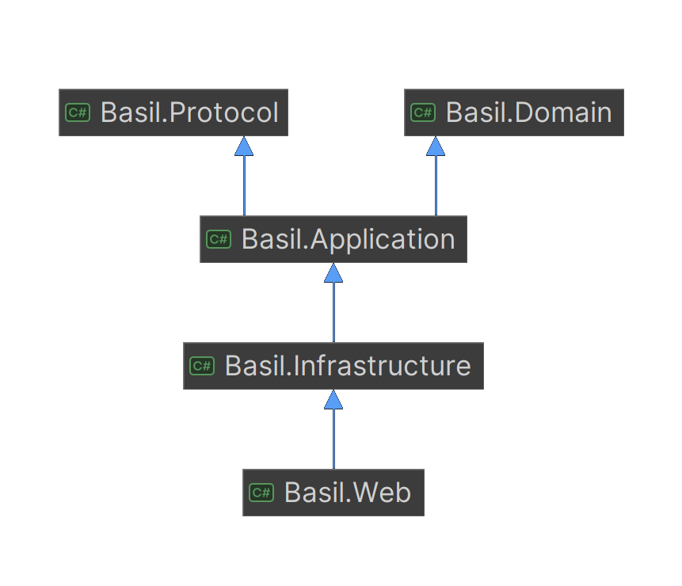

# Architecture

## Overview

Basil is one deployable process split into layers with a strictly enforced dependency direction. This page covers that layering and points to the rest of `docs/` for how each subsystem actually works.

## Why Clean Architecture for a single-process server?

Basil runs as a single process, but Clean Architecture keeps the core application independent of infrastructure concerns. Business rules never depend directly on SQLite, the filesystem, Bancho transport, or any other external technology, so those components stay replaceable without touching the rest of the codebase.

That separation pays off when infrastructure changes: swapping the database engine, replacing the beatmap storage backend, or adding a new transport protocol only touches the layer that owns it. It also gives Basil a path to supporting **osu!lazer** later, whose APIs and networking model differ from the legacy client: the application logic can stay put while only the integration layer changes.

## Layers

| Project | References | Purpose |
| --- | --- | --- |
| `Basil.Domain` | None | Pure C#: enums, records, value calculators |
| `Basil.Protocol` | None | Reads and writes the Bancho wire-format packets |
| `Basil.Application` | Domain, Protocol | Packet handlers, business-logic services, and the *ports* (interfaces) Infrastructure implements |
| `Basil.Infrastructure` | Application, Domain | SQLite, filesystem, and osu!lazer-ruleset-library implementations |
| `Basil.Web` | Application, Infrastructure, Protocol | The ASP.NET Core host: subdomain routing and the dependency-injection composition root |

**Dependency rule:** Domain and Protocol depend on nothing else in the solution. Application depends on Domain and Protocol only, never on Infrastructure or Web. Infrastructure implements Application's interfaces but is never referenced by Application. Web is the only project that sees all four others, since it's the one place concrete implementations get wired to their interfaces.

This isn't a convention that can quietly slip: `tests/Basil.ArchitectureTests` (using [NetArchTest](https://github.com/BenMorris/NetArchTest)) checks the dependency direction on every CI run and fails the build if it's violated.

## Layout

The largest directories are organized by feature, not by kind. The namespace matches the folder path, so an import tells you exactly where a file lives:

| Directory | Purpose |
| --- | --- |
| `Packets/` | One class per bancho client packet, grouped by feature (`Users/`, `Channels/`, `Spectating/`, `Multiplayer/`) |
| `Abstractions/` | The ports Infrastructure implements, grouped by domain concept |
| `Sessions/` | In-memory runtime state (`PlayerSession`, `ChannelSession`, `MatchSession`) and the registries tracking it |
| `Services/` | The actual business logic a packet handler or HTTP route delegates to, one directory per feature |

## Where to go from here

| Topic | Doc |
| --- | --- |
| How a client logs in | [`authentication.md`](authentication.md) |
| How packets get dispatched once logged in | [`bancho.md`](bancho.md) |
| Match creation, rounds, and the tournament report | [`multiplayer.md`](multiplayer.md) |
| Live match/spectator updates over HTTP | [`sse.md`](sse.md) |
| The JSON shape every `api.` host response follows | [`response-envelope.md`](response-envelope.md) |
| Schema, and SQLite/Dapper implementation notes | [`database.md`](database.md) |
| How a beatmap gets from a folder into the database | [`beatmap-ingestion.md`](beatmap-ingestion.md) |
| Chat, IRC, and BanchoBot's commands | [`chat.md`](chat.md) |
| Log sinks, scopes, and categories | [`logging.md`](logging.md) |
| Privilege flags | [`privileges.md`](privileges.md) |
| Running and deploying a server | [`run-deployment.md`](run-deployment.md) |
| What's deliberately out of scope | [`working-scopes.md`](working-scopes.md) |

## Adding a new feature

| Feature | How to add |
| --- | --- |
| A new bancho packet | A new class in the matching `Packets/*` subdirectory, registered in `DependencyInjection.AddApplication`, counted in `CompositionRootTests` |
| A new piece of persisted state | A new method on an existing (or new) interface under `Abstractions/*`, implemented in `Basil.Infrastructure/Persistence/Repositories/` |
| A new HTTP endpoint | A new route under the applicable host group file in `Basil.Web/Routing/Bancho/` or `Basil.Web/Routing/Api/` |
| A new IRC command | Dispatched in `TcpIrcConnection.HandleRegisteredCommandAsync`, calling existing Application-layer services |
| New chat routing logic | Added to `ChatDispatchService.SendPrivmsgAsync` (see [`chat.md`](chat.md)) |
| A new chat transport | Implement `IIrcConnection`; the new class receives an `IrcMessage` and encodes it into its own format |
