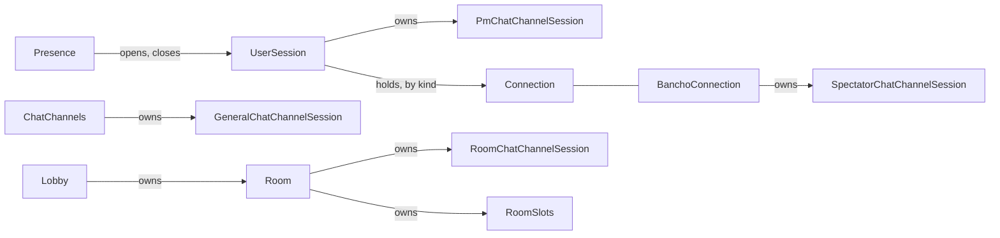
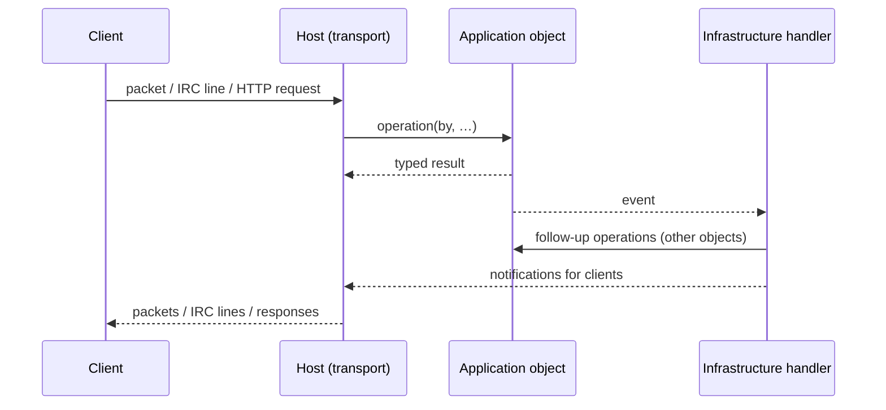

# Architecture

## Overview

Basil is a single deployable process built from several projects with a strictly enforced dependency
direction. The inner projects describe the business and the running server; the outer projects connect
it to storage, the network and the clients.

```text
Basil.Domain                  business model and its own validity          -> (nothing)
Basil.Protocol.Bancho         Bancho wire format                            -> (nothing)
Basil.Protocol.Irc            IRC wire format                               -> (nothing)

Basil.Application             the running server as an environment          -> Domain
                              (runtime objects, events, ports, operations)

Basil.Infrastructure          persistence, storage, media, background       -> Application, Protocol.*
                              services, event handlers, concrete providers
Basil.Host.Bancho / .Irc / .Api   transports                                -> Application, Infrastructure,
                                                                               their Protocol
Basil.Host                    entry point and composition root              -> everything
```

> **Pending migration.** `Basil.Domain` and `Basil.Application` have been reworked into the model
> described below. `Basil.Infrastructure`, the hosts and every test project still use the previous
> Application types and do not build, so solution-wide `dotnet build`/`dotnet test` and the
> architecture tests do not run until they are migrated. Verify with
> `dotnet build src/Basil.Application/Basil.Application.csproj`.

## Projects and responsibilities

### `Basil.Domain`

Business models that exist beyond a single run of the server (`User`, `Match`, `Round`, `Score`,
`Beatmap`, `Login`, chat channel models, …), each guarding its own validity. It holds no runtime-only
state and no events, and references no other Basil project.

### `Basil.Protocol.Bancho` and `Basil.Protocol.Irc`

The Bancho and IRC wire formats. They are independent of every other project, so encoding and decoding
can be tested without starting the server. Bancho packet layouts are wire contracts.

### `Basil.Application`

The running server, modelled as an **environment**: the objects that exist while the server runs and
the facts that happen to them. Other layers observe those facts and plug in; Application does not
script "do this, then notify that, then save this" flows. See [The Application environment](#the-application-environment).

### `Basil.Infrastructure`

Implementations of Application's ports (SQLite repositories, file storage, beatmap analysis), the
event handlers that react to Application's events (for example storing a round when it ends, or leaving
the room when a connection closes) and background services.

### `Basil.Host.Bancho`, `Basil.Host.Irc`, `Basil.Host.Api`

The transports. Each decodes its protocol, calls Application operations, and turns Application's
events into messages for its clients.

### `Basil.Host`

The entry point and composition root: configuration, logging, host and subdomain routing, and
dependency-injection registration of every other project.

## Dependency rule

Dependencies point inwards only:

* Domain and the protocols reference nothing;
* Application references only Domain;
* Infrastructure references Application and the protocols;
* each host references Application, Infrastructure and its own protocol;
* only `Basil.Host` references everything.

When Application needs something outside the process (storage, files, network, the clock), it declares
a port and an outer project implements it. Application never creates a `SqlConnection`, a
`FileStream` or an Infrastructure type. The rule is enforced by `tests/Basil.ArchitectureTests` and is
part of the build contract; a project reference that breaks it is an architectural change.

## The Application environment

### Why an environment

The same fact matters to several parts of the server: when a player leaves a room, the room's chat
channel must lose a member, the room may close, clients must be told and the match history may need a
write. If the operation that removes the player scripted all of that, every new reaction would mean
editing it, and a forgotten step would silently break a rule.

Instead, the object the action is performed on enforces its own rules and announces what happened.
Everything else reacts to the announcement.

### Principles

* **The acted-on object owns the interaction.** An actor only calls an operation. The object the
  operation acts on stores the resulting relation and emits the event: a connection joins a channel
  with `channel.Join(by)`, and the channel keeps its members and emits `MemberJoined`. Sessions and
  connections hold no channels, rooms or slots and emit no events.
* **Each object manages only what it owns.** `Presence` opens and closes connections and announces it;
  it does not touch rooms or channels. Their clean-up is done by Infrastructure handlers that receive
  the event and call the owning object's operation. Rules about an object's own state stay inside it:
  a room closes itself when empty and keeps its channel in step with its players.
* **Application emits events; it never consumes them.** Each runtime object publishes its own stream
  of events (`IEventPublisher<T>`). One operation emits one event carrying its whole consequence.
  Handlers, dispatchers and event-to-client routing live outside Application.
* **Identity follows the basis object.** `Room` is identified by its `Match`, a general chat channel by
  its name. Objects that can be recreated for the same user or name (connections, sessions, runtime
  channels) compare by reference, so a late clean-up carrying an old object never touches its
  replacement.
* **Operations check their own rules.** An operation with a permission rule takes its caller `by`,
  checks it inside the object, and returns a typed result instead of throwing.
* **Setters only assign and validate.** Anything with consequences is a method.

### Who owns what



Rooms, channels and the lobby hold connections, never sessions: membership is per client.

### Feature folders

`Basil.Application` is one project sliced by feature; namespace follows the folder.

| Folder | Holds |
|---|---|
| `Common/` | the event base type and `IEventPublisher` |
| `Users/` | login attempts, user, credential and admin-key repositories, `Registration` |
| `Sessions/` | `UserSession`, connections, `Presence`, `Gateway`, spectator channels |
| `Chat/` | the chat channel tree and `ChatChannels` |
| `Multiplayer/` | `Lobby`, `Room`, slots, room channels, results and events, the match repository |
| `Beatmaps/` | `BeatmapCatalog` and the beatmap storage and analysis ports |
| `Scores/` | `ScoreSubmission` and the score, replay and statistics ports |

`Sessions`, `Chat` and `Multiplayer` reference each other and form one cluster; their invariants rely
on `internal` members staying inside one assembly, which is why features are folders rather than
projects.

### Events

Events form a category tree so a consumer can subscribe to a whole category:

```text
Event
├── PresenceEvent       ConnectionOpened, ConnectionClosed, StatusChanged, StatsChanged, UserSilenced
├── ChatChannelEvent    channel lifecycle, membership, messages, spectating
├── LobbyEvent          RoomOpened, RoomClosed, EmptyRoomClosingSoon, lobby watchers
├── RoomEvent           settings, slots, membership, authority, access, rounds, countdown
└── BeatmapEvent        BeatmapsetImported
```

Events carry identities as references and changeable values as values captured when the event was
emitted (slot numbers, statuses), never a live slot.

### Ports

Ports exist only for what lies outside the process. Each repository contract is written for its model
(`IUserRepository`, `IMatchRepository`, `IScoreRepository`, …) and declares exactly the operations
Application needs, including creation that returns the stored model with its assigned id. Runtime
objects (sessions, channels, rooms) are concrete Application objects, not ports.

## A request end to end

> **Pending migration.** The hosts and Infrastructure are being moved onto this flow.



A packet handler never performs a SQL query or writes to another object's state; it calls one
operation and the rest follows from events.

## Adding features

### Adding a Bancho packet or an IRC command

Decode it in the host, call the Application operation of the object it acts on, and translate the
typed result into a reply. Do not move rules into the transport because the request originated there:
if the rule is missing, add it to the acted-on object. See [`bancho.md`](bancho.md) and
[`irc.md`](irc.md).

### Adding a reaction to something that happens

Subscribe an Infrastructure handler to the relevant event category and call the owning object's
operation. Do not add the reaction to the operation that caused the event.

### Adding persisted state

Add the operation to the model's repository contract in Application (or a new `IXxxRepository` for a
new model), implement it in Infrastructure and register it in the composition root. Keep database code
out of Application. See [`database.md`](database.md).

### Adding an HTTP endpoint

Add the route to the API host and delegate behaviour to Application. For the `api.` host, update the
OpenAPI contract with the route rather than maintaining a separate specification. See
[`response-envelope.md`](response-envelope.md), [`sse.md`](sse.md) and [`assets.md`](assets.md).

## Cross-cutting invariants

* Dependency direction is enforced by tests.
* Domain and the protocols remain dependency-free; Application references only Domain.
* Runtime objects are separate from persisted state; Domain holds no runtime state or events.
* The acted-on object stores the relation and emits the event; sessions and connections do neither.
* Application emits events and never consumes them.
* Every room operation holds the room's scope (`Room.EnterAsync`) across the complete transition.
* Privilege checks require every bit of the requirement.
* Channel names are stored without `#`.
* Privilege is named `Privilege`, never `Priv`.
* User-visible reply strings are centralized rather than duplicated.
* Performance points are not part of gameplay.

See [`working-scopes.md`](working-scopes.md) for features that are intentionally outside Basil's
scope.

## Where to go from here

| Topic | Documentation |
|---|---|
| Bancho packet dispatch | [`bancho.md`](bancho.md) |
| Authentication and login | [`../for-client/bancho/authentication.md`](../for-client/bancho/authentication.md) |
| Multiplayer and match state | [`multiplayer.md`](multiplayer.md) |
| Chat, sessions and connections | [`chat.md`](chat.md) |
| HTTP live updates | [`sse.md`](sse.md) |
| API response envelope | [`response-envelope.md`](response-envelope.md) |
| Database and persistence | [`database.md`](database.md) |
| Beatmap ingestion | [`beatmap-ingestion.md`](beatmap-ingestion.md) |
| IRC architecture | [`irc.md`](irc.md) |
| Logging | [`logging.md`](logging.md) |
| Privileges | [`privileges.md`](privileges.md) |
| Development workflow | [`development.md`](development.md) |
| Deployment | [`../for-technicians/deployment.md`](../for-technicians/deployment.md) |
| Project scope | [`working-scopes.md`](working-scopes.md) |
