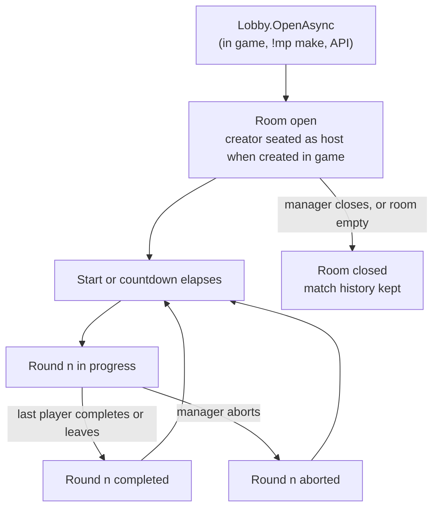
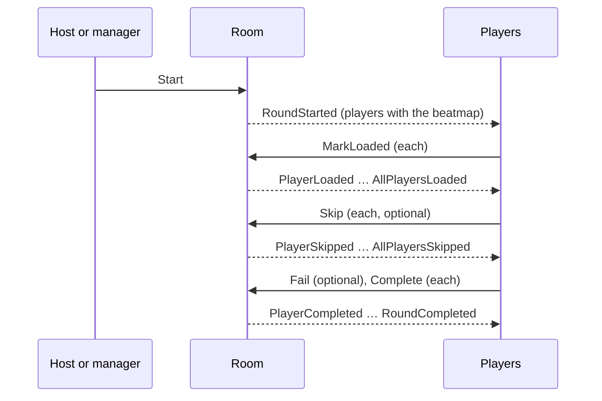

# Multiplayer and tournament match reports

## Overview

A multiplayer match in Basil has two representations:

* a live `Room` in `Basil.Application`, which exists only while the server runs and holds the slots,
  the host, the referees, the countdown and the round in progress;
* a persisted record in `Basil.Domain` (`Match`, `Round`, `Score`) that survives the room and is used
  to rebuild the match report after the room is gone.

The tournament match report is built from these sources rather than stored as a separate document.

> **Pending migration.** `Basil.Domain` and `Basil.Application` have been reworked; Infrastructure,
> the hosts and the tests have not been migrated yet. Sections that describe storage, the HTTP API or
> the report are marked where they still describe the previous wiring.

## Why the report is derived

A completed tournament match needs to retain which rounds were played, which beatmap and rules each
round used, which players submitted scores, the scores and team assignments, and the winner.

The live room cannot provide this after it closes. Storing a second complete copy of the match while
it runs would duplicate the room's state and create synchronization problems. Basil therefore stores
the facts needed to rebuild the report and derives the report when it is requested.

```text
Room (runtime)                    record (persisted)
  slots, host, referees,            Match
  countdown, round in progress      Rounds
            │                       Scores
            │ events                    │
            └──────────► stored ────────┘
                                        │
                                        ▼
                                  match report
```

There is no persisted report document that can become stale.

## Contract

> **Pending migration.** The API host still serves these routes from the previous model.

* `GET /matches/{matchId}` builds the report at read time.
* For an active match, the report combines persisted rounds and scores with the live room.
* For a closed match, the report is rebuilt entirely from persistent state.
* Every match sub-resource has a JSON endpoint and, where applicable, a `/live` SSE endpoint (see
  [`sse.md`](sse.md)).
* `POST /matches/{matchId}/abort` and `POST /matches/{matchId}/close` return the resulting match state.
* The winner is derived when the report is built.
* A match is identified by its persistent id; the Bancho room id is separate and short-lived.

## Match identity

### Persistent match id

`Match.Id` is assigned by storage when the room opens. API routes, chat commands, database
relationships and reports use it, and it stays valid after the room has closed.

### Bancho room id

The Bancho protocol identifies a room by a room id. The lobby hands out the lowest id not held by
another open room. The protocol carries it as an unsigned 16-bit value, so at most 65,535 rooms can be
open at once.

The room id is short-lived, reused once its room closes, and unrelated to the persistent id. Code must
not use it as the external identity of a match. A `Room` compares equal to another only when both play
the same `Match`.

## Match roles

Basil models three independent roles. They must not be collapsed into a single "owner" concept.

| Role | Held by | Lifetime | Grants |
|---|---|---|---|
| Creator | the `User` who created the match | the whole match | everything a referee may do, and adding or removing referees |
| Referee | a `User` in `Room.Referees` | until the creator removes them | the match-management operations |
| Host | a seated `BanchoConnection` | while that connection is seated | the in-client host operations |

The creator and the referees are the room's **managers** (`Room.IsManager`). Being the host does not
make a player a manager, and `!mp` commands are available only to managers.

### Creator

Whoever creates a room is its creator, however it was created: in game, with `!mp make` or
`!mp makeprivate`, or through the API when a creator is given. A room created through the API without
a creator has none.

The creator is stored on the match, ranks above the referees and is not part of the referee list. Only
the creator may add or remove referees, and nobody can kick or ban the creator.

### Referee

A referee keeps their authority after disconnecting or leaving their seat; only the creator removes
it. A room has at most `Room.MaxReferees` (8) referees in addition to its creator.

### Host

The host is a seated game client. A room created in game makes its creator the first host. When the
host leaves their slot, the next seated player by slot order becomes host; with nobody left, the room
has no host. An IRC connection can never be host because it cannot occupy a slot.

### Who may do what

| Operation | Allowed caller |
|---|---|
| Join, leave, change own slot, ready, report having the map, change own team, choose own freemod mods | the player themselves |
| Start a round, change settings, give or clear host, lock or unlock a slot, kick | the host or a manager |
| Abort a round, ban, unban, move a player, set a player's team, lock the room, start or cancel a countdown | a manager |
| Add or remove a referee | the creator |
| Invite | a seated player or a manager |
| Observe from osu!tourney | any osu!tourney client that is not playing in the room |
| Close the room | a manager |

Every operation with a rule takes its caller and checks the rule inside `Room`, returning a
`RoomResult` instead of throwing.

## Match lifecycle



### Opening a room

`Lobby.OpenAsync` opens a room for a new match:

* a creator who is silenced or restricted cannot open a room;
* a creator can have at most `Lobby.MaxRoomsPerCreator` (4) tournament rooms open;
* a room created in game is not a tournament room: it needs the creator's game client, seats it as the
  first host, and is refused with `AlreadyInRoom` when that client already plays in another room;
* a tournament room (`!mp make`, the API) seats its creator only when their game client is online and
  not in another room; otherwise it opens empty;
* the server's bot joins the room's chat channel;
* the lobby emits `RoomOpened` with the first host, if any.

The room's chat channel is named `mp_{room id}` and belongs to the room: it opens and closes with it.

### Closing a room

A manager closes a room with `Lobby.CloseAsync`. Closing aborts a round in progress, cancels the
countdown, removes every player and the room's channel, records the match's end time and emits
`RoomClosed`. Closing a room does not delete its match history.

## Joining and leaving

A player joins with `Room.Join`. The room refuses a player who is banned, silenced, restricted,
already playing in another room, observing this room, or giving a wrong password (moderators need no
password), and a full room. A joining player also joins the room's chat channel.

If the same user is still seated through a connection that has closed but was not yet cleaned up, the
room removes that seat as an ordinary leave, but only after the new join has passed every check. While
the old connection is still open the new one is refused with `AlreadySeated`.

A player who leaves, is kicked or is banned leaves the room's chat channel unless they are a manager:
managers stay in the channel so they can keep running the match.

## Rounds

A `Round` represents one beatmap played inside a match. It is created when a round starts, not when
the match is created.

A round is identified by its match and its number. Rounds are numbered from `1` within each match in
the order they start. An aborted round is still a round: it keeps its number, is marked as aborted, and
the next round takes the following number. The room assigns the number itself, so starting a round does
not wait for storage.

A round records the beatmap's content hash, the settings it was played with (mode, mods, team type, win
condition) and its start and end times.

### Round flow



* Players who reported not having the beatmap do not take part. A round with no player ends as soon as
  it starts.
* The last player to load or to ask to skip produces `AllPlayersLoaded` or `AllPlayersSkipped` instead
  of the per-player event, at most once per round.
* When a player stops playing because they left, were kicked, banned or had their slot locked, the room
  re-checks the round: if every remaining player has loaded or skipped, it announces that; if nobody is
  playing any more, the round ends.
* The round ends when the last player completes it (`RoundCompleted` carries that player's slot) or
  when the last remaining player leaves (`RoundCompleted` carries no slot). Players then return to not
  ready.
* A manager can abort a round; players go back to not ready and the round is marked aborted.

### Countdown

A manager can start a countdown (`!mp start <seconds>`, `!mp timer`) of up to one hour; the default is
30 seconds. It is announced at 60, 30, 10 and 5 seconds remaining when those are shorter than its
length. When it ends, the room emits `CountdownElapsed` and, if the countdown starts the round, starts
it. A new countdown replaces the running one. Starting or aborting a round, and closing the room, cancel
the countdown.

## Settings

The host or a manager changes settings with `Room.Configure`, which applies every changed field in one
step and emits a single `RoomSettingsChanged`. Nothing changes unless every field is valid, and settings
cannot change during a round.

* Selecting or clearing the beatmap sets ready players back to not ready. The osu! client clears the
  beatmap while the host is choosing another one; a round cannot start without a beatmap.
* The beatmap is a reference (MD5, id, name, mode) so a room can play a beatmap the server does not
  have.
* Changing the mode drops mods, the room's and the players', that the new mode does not allow.
* Turning freemod on moves the room's mods that are not speed-changing onto each player; turning it off
  gives the room the host's mods. Under freemod the room keeps only speed-changing mods.
* Changing the team type reassigns teams.
* The size counts usable slots (1 to 16), not a slot range: players may sit in any slot, so the room
  keeps enough empty slots unlocked to reach the size and locks the other empty ones.
* The password never appears in events; the event only says whether it changed.

While the room is locked (`!mp lock`), players cannot change slot or team; managers can still move them.

## Current round and score submission

The room's latest round is deliberately kept after the round ends, because score submission and the
Bancho connection are independent:

```text
Bancho connection           MATCH_COMPLETE ── round ends
Score submission (HTTP)     replay + score ── may arrive before or after MATCH_COMPLETE
```

If the latest round were forgotten when the round ended, a score that arrives shortly afterwards would
have no round to attach to. The latest round therefore changes only when the next round starts.

A score is attached to the latest round of the player's room only when it was played on that round's
beatmap. Two consecutive rounds on the same beatmap cannot be told apart this way; a late score then
attaches to the newer round. A score on a beatmap the server does not have is accepted only when it is
the beatmap of that latest round; otherwise it is rejected as `UnknownBeatmap`. An attached score is
announced by the room as `ScoreSubmitted`.

## Match mutation concurrency

`Room` is mutable shared state. Every operation runs inside the room's exclusive scope:

```csharp
await using var scope = await room.EnterAsync();
if (scope is null) return; // the room is closed
var result = room.Kick(by, player);
```

The scope is held across the complete state transition, whatever the entry point (Bancho packet, `!mp`
command, HTTP API). Do not hold it across long-lived or unrelated waits, and do not add a second
synchronization mechanism for the same state.

### Round-end persistence

> **Pending migration.** The previous implementation persisted round ends on an ordered background
> queue outside the room's lock. The reworked Application stores nothing itself: the round's history is
> stored from `RoundStarted`, `RoundCompleted` and `RoundAborted` outside Application. The ordering and
> retry rules below still apply to that consumer.

A database write can be slow enough (SQLite lock contention, retry and backoff) that doing it inside
the room's scope would block every other operation on that room. Round ends are therefore persisted
outside the scope, in the order they happened for each match. A round's start needs no synchronous
write: the room numbers rounds itself, so a score can reference the round by match and number at once.
A round end that cannot be written after every retry is logged with every fact needed to restore it by
hand.

## Empty-room lifecycle

What happens when a room has no seated player depends on how it was created:

* a room created in game closes as soon as its last player leaves;
* a tournament room stays open for `Lobby.EmptyTournamentRoomTimeout` (15 minutes) and then closes if
  it is still empty. The lobby emits `EmptyRoomClosingSoon` twice, carrying the closing time: when the
  room becomes empty (15 minutes left) and 5 minutes before it closes. Both are used to warn the room's
  referees. A player joining at any point cancels the countdown; if the room empties again, it starts
  over at 15 minutes.

A tournament room can start empty, for example when it is created over IRC or through the API, or when
its creator already plays in another room. The countdown then starts when the room opens. The creator
and the referees keep their authority while nobody is seated.

## Report generation

> **Pending migration.** Report construction lives in the API host and still reads the previous model.

For a closed match the report is built from persisted state:

```text
Matches → Rounds → Scores → report builder → complete tournament report
```

For an active match it combines the database history with the live room:

```text
Database history ──┐
                   ├──> report builder ──> report
Live room ─────────┘
```

The same endpoint therefore represents both a match being played and a finished one; clients need no
separate "live report" and "final report" APIs.

## Winner calculation

The winning side is derived from completed round scores:

* for a team round, scores are grouped by team and compared;
* for a non-team round, the highest individual score wins.

The winner is a projection of persisted score data rather than another mutable field, so a report
cannot become inconsistent because a stored winner was not updated.

```text
Scores
  ├── team round ──> aggregate by team ──> winning team
  └── individual ──> highest score ──────> winning player
```

## Invariants

* `Match.Id` is the stable external identity; the Bancho room id is short-lived and reused.
* A `Round` is identified by its match and its number; numbers start at `1` and an aborted round keeps
  its number.
* The latest round stays set after it ends, until the next round starts.
* A score attaches to the latest round only when it was played on that round's beatmap.
* Creator, referee and host are separate roles; the host is not a manager.
* Every room operation with a permission rule checks its caller inside `Room`.
* Every room mutation holds the room's scope across the complete transition.
* A connection's closed seat is replaced only by the same user's join, after that join passed its
  checks.
* A round ends when nobody is playing any more; a round nobody plays ends as soon as it starts.
* A room created in game closes when empty; an empty tournament room closes 15 minutes after it
  emptied, announced at 15 and at 5 minutes left.
* The report and the winner are derived, never stored as separate documents.
* Closing a room does not destroy its match history.
* Performance points play no part in multiplayer rules.

## Related code

* [`Basil.Application/Multiplayer/Room.cs`](../../src/Basil.Application/Multiplayer/Room.cs): the live room, its rules and operations
* [`Basil.Application/Multiplayer/Lobby.cs`](../../src/Basil.Application/Multiplayer/Lobby.cs): opening, closing and the empty-room lifecycle
* [`Basil.Application/Multiplayer/RoomSlots.cs`](../../src/Basil.Application/Multiplayer/RoomSlots.cs), [`RoomSlot.cs`](../../src/Basil.Application/Multiplayer/RoomSlot.cs): slots
* [`Basil.Application/Multiplayer/RoomSettingsChange.cs`](../../src/Basil.Application/Multiplayer/RoomSettingsChange.cs), [`BeatmapReference.cs`](../../src/Basil.Application/Multiplayer/BeatmapReference.cs): settings changes
* [`Basil.Application/Multiplayer/RoomResult.cs`](../../src/Basil.Application/Multiplayer/RoomResult.cs): operation outcomes
* [`Basil.Application/Multiplayer/Events/`](../../src/Basil.Application/Multiplayer/Events): lobby, room, round and countdown events
* [`Basil.Application/Scores/ScoreSubmission.cs`](../../src/Basil.Application/Scores/ScoreSubmission.cs): attaching scores to the latest round
* [`Basil.Domain/Multiplayer/`](../../src/Basil.Domain/Multiplayer): `Match`, `Round`, `MatchSettings`

## See also

* [`architecture.md`](architecture.md): the Application environment model
* [`chat.md`](chat.md): room chat channels
* [`sse.md`](sse.md): live SSE representations of match resources
* [`database.md`](database.md): `Matches`, `Rounds` and `Scores` persistence
