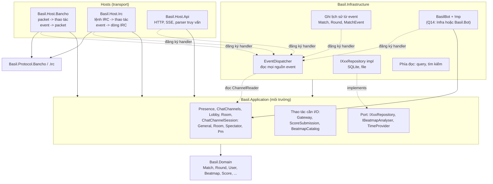
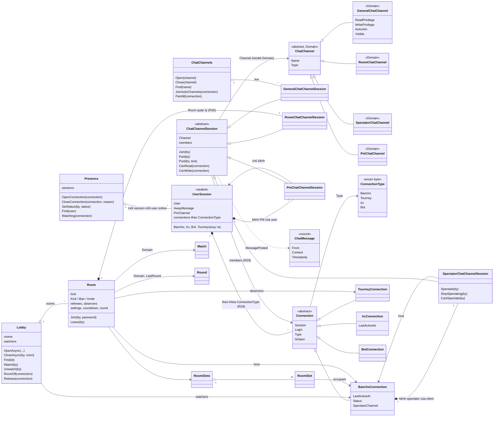
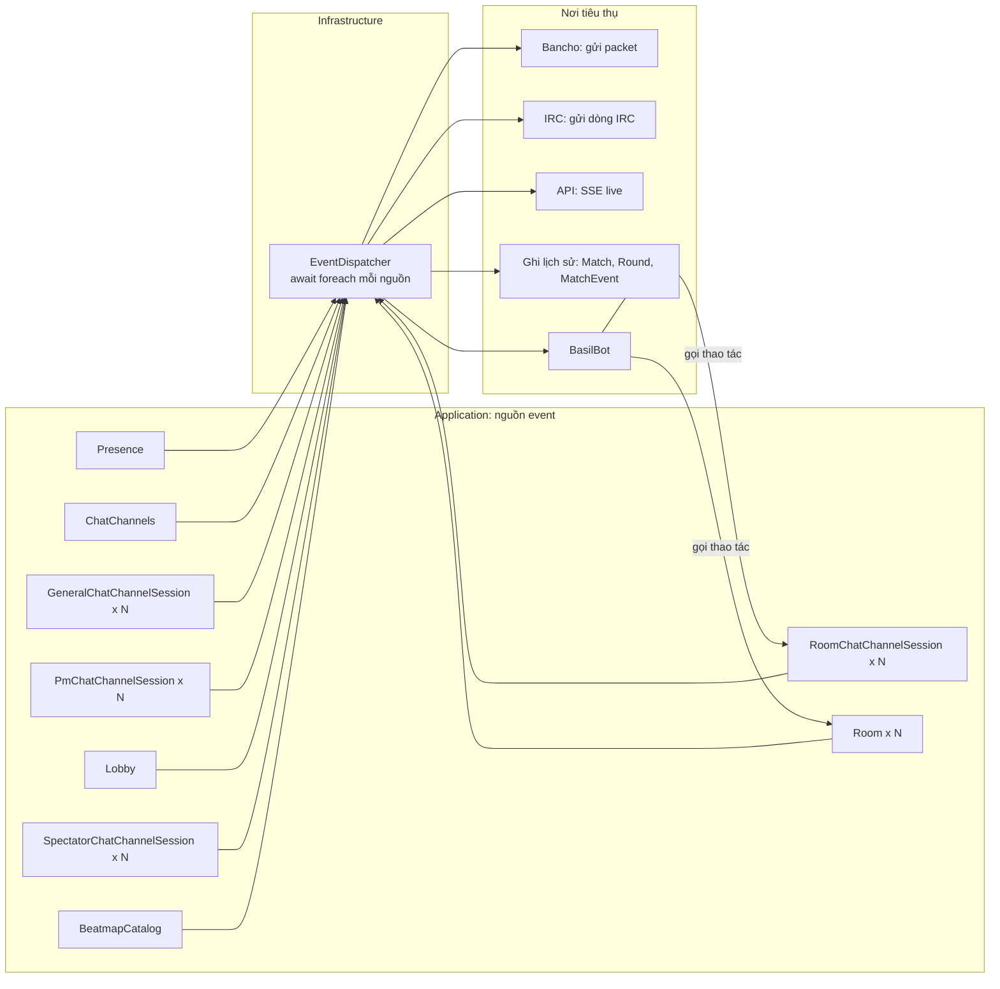
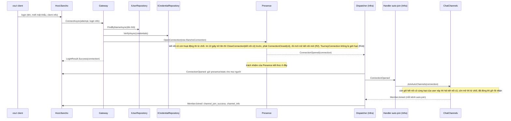
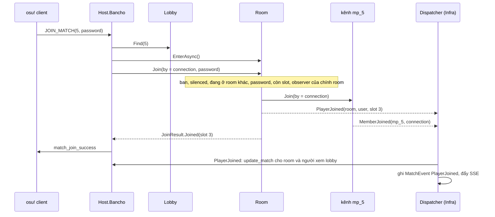
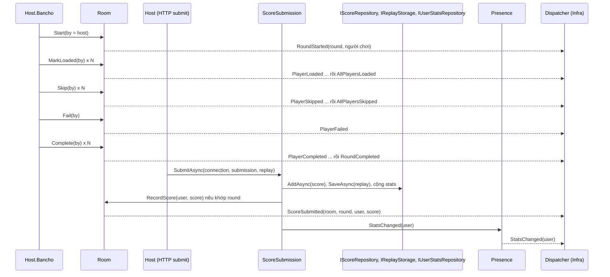

# Kế hoạch: Application là môi trường — theo phase

**Trạng thái: ĐANG THỰC THI qua OpenCode (từ 2026-10-01), quyết định đã chốt toàn bộ.** Viết
2026-09-30 trên `develop`, sau `plans/application-review-20260930.md`. Nền là cây làm việc sau
`plans/identity-wrapper-plan-20260930.md` (chưa commit), ghim ở `refs/basil/pre-phase0`.

**Phạm vi:** `Basil.Application` và những thay đổi `Basil.Domain` mà Application cần. **Chưa quan
tâm:** Host và Infrastructure (chỉ nhắc khi cần biết ai gọi thao tác hay ai nhận event).

**Cách đọc:** Phần A là bảng quyết định (đã chốt toàn bộ). Phần B là kiến trúc đích (sơ đồ Mermaid; mở bằng markdown
preview của VS Code/Rider hoặc trên GitHub). Phần C là các phase: mỗi phase sửa một nhóm, liệt kê
việc cần làm, cách triển khai và chỗ gọi phải sửa. Phụ lục D nối các lỗi trong review với phase; phụ lục E nối
mọi hành động nghiệp vụ (packet bancho.py, lệnh `!mp`, lệnh IRC, hành động hệ thống) với phase.

**Ký hiệu nguồn nghiệp vụ:**

| Ký hiệu | Nguồn |
|---|---|
| [wiki] | osu-wiki: `osu!_tournament_client/osu!tourney/Tournament_management_commands`, `Client/Interface/Multiplayer`, `BanchoBot`, `Community/Internet_Relay_Chat` |
| [bp] | bancho.py: `app/api/domains/cho.py` (46 handler), `app/packets.py`, `app/objects/{player,match,channel}.py`, `app/commands.py` |
| [Basil] | hành vi hiện có của Basil, không có ở hai nguồn trên |
| [ngoài] | ngoài phạm vi theo `docs/for-developers/working-scopes.md`; liệt kê để thấy độ phủ, không làm |

Luật chọn nguồn: theo nghiệp vụ thật của osu!. [wiki] khác [bp] thì theo [wiki]. Chỗ người dùng
quyết định khác osu! được ghi rõ.

---

## A. Quyết định

| # | Quyết định | Phase |
|---|---|---|
| — | Object bị tác động giữ quan hệ và phát event; tác nhân chỉ gọi. Application chỉ phát event; handler, dispatcher, event → notification ở ngoài Application. | mọi phase |
| Q1 | Contract repository viết riêng từng model (`IXxxRepository`); chỉ tách interface chung khi các repository có cùng thao tác, vẫn giữ `IXxxRepository`. Bỏ `ICreatable`, `IRepository`/`ISearchable`/`IStorage` generic. | 2 |
| Q2 | Registry thành object môi trường cụ thể trong Application (`Presence`, `ChatChannels`, `Lobby`), phát event mở/đóng. | 3, 4, 6 |
| Q3 | `Presence` phát `StatusChanged` (status là của `BanchoConnection`). | 3 |
| Q5 | Mỗi object một kênh event; object sở hữu phát event mở/đóng; complete writer khi object kết thúc. | 0 |
| Q6 | `IEventHandler`/`IEventDispatcher` rời Application. | 0 |
| Q8 | Lịch sử (Match, Round, MatchEvent) lưu từ event ở ngoài Application; ngoại lệ: tạo item cần id do nơi lưu cấp. | 2, 6, 8 |
| Q9 | `!mp move` vào slot có người thì từ chối. | 7 |
| Q10 | Host rời thì chuyển cho người kế tiếp theo thứ tự slot [wiki][bp]. | 6 |
| Q13 | Event mang giá trị chụp lúc phát cho phần có thể đổi, tham chiếu cho định danh; không mang `RoomSlot` sống. | mọi phase |
| Q14 | Bot và lệnh chat (`!mp`, `!roll`, …) rời Application; bot hành động qua `BotConnection`. | 0 |
| C2 | Tên kênh lưu không có `#`. | 4 |
| R1 | Room tournament trống: đóng sau **15 phút** (osu! là 30 [wiki]); có người vào lại thì hủy đếm. Room thường trống: đóng ngay [wiki][bp]. | 6 |
| R2 | Đăng nhập khi user còn kết nối cũ cùng loại, với loại chỉ được một cái (`Bancho`, `Irc`, `Bot`): cũ im từ 10 giây trở lên thì đóng cũ rồi mở mới, còn hoạt động thì từ chối [bp]. | 3 |
| R3 | Mốc thông báo countdown 60/30/10/5 giây; `!mp timer` mặc định 30 giây [wiki]. | 8 |
| R4 | `!mp make` tối đa 4 room mỗi người tạo [wiki]. | 6 |
| R5 | Referee tối đa 8; chỉ creator thêm/bớt; referee không quản lý referee khác [wiki]. | 6 |
| R6 | Người tạo luôn là `Creator` (trong game, `!mp make`/`makeprivate`, API nếu chỉ định; API không chỉ định thì không có creator). Creator ghi trên `Match`, quyền cao hơn referee, không nằm trong danh sách referee. Tạo trong game: creator là host đầu. `!mp make`: creator có client game online và chưa ở room nào thì vào slot và làm host; đang ở room khác thì không chuyển, không làm host. `!mp` chỉ cho creator và referee; host không có quyền `!mp` chỉ vì là host. | 6 |
| R7 | Token người chơi trong `!mp`: tên (`_` thay khoảng trắng) hoặc `#<userid>` [wiki]. | ngoài Application (bot) |
| R8 | Riêng tư = lịch sử trận chỉ creator và người tham gia xem [wiki]. `MatchData.IsVisible` thành `IsPrivate`; `Room.IsPrivate` suy biến từ `Match`; `Round` dùng chung qua `Match`. Riêng tư không chặn vào room. | 1, 6 |
| R9 | Relay tần số cao (frame spectate, điểm trong lúc chơi) không phải event. | 5, 8 |
| R10 | Đổi cài đặt room (một hay nhiều trường) = một event `RoomSettingsChanged`. | 7 |
| R11 | Room giữ tham chiếu map (md5 + id + tên + mode + `Beatmap?`); chơi được map server không có. | 7, 9 |
| R12 | Kênh room tên `mp_{Room.Id}`. | 6 |
| R13 | Room tự giữ khóa của nó. | 6 |
| R14 | Query và tìm kiếm rời Application. | 0 |
| R15 | Kết nối mở/đóng lan tới room, kênh, lobby **qua event**; `Presence` chỉ lo phần của nó. Bên quản lý gặp kết nối thứ hai cùng loại của cùng user thì hỏi kết nối cũ (`IsOpen`): còn mở thì từ chối, đã đóng thì gỡ cũ rồi nhận mới. Thao tác dọn chạy lại được mà không gây hại. | 3, 4, 6 |
| R16 | osu!tourney: `TourneyConnection`, nhiều cái mỗi user, chỉ quan sát, cần quyền donator và không bị restrict [bp]. | 3, 6 |
| R17 | Bot: `UserSession` thường trực với `BotConnection`; room thêm bot vào kênh `mp_` khi mở. | 3, 6 |
| R18 | `PlayCount` tăng cả khi fail [bp]. | 9 |
| R19 | Mỗi kết nối (một lần đăng nhập) và `UserSession` (một lần online) so bằng theo tham chiếu; tra `UserSession` theo `User` qua `Presence`. Kênh runtime cũng so theo tham chiếu (tên như `mp_5` được dùng lại); chỉ `GeneralChatChannel` so theo `Name`. `Login` đổi thành class so bằng theo tham chiếu, thêm `Login.Client?` (null cho IRC và bot). | 1, 3 |
| R20 | PM là kênh: gửi PM = `Post` vào `PmChatChannelSession` của người nhận. | 4 |
| R21 | `PmChatChannelSession` là phần của `UserSession` (một kênh mỗi user); nhận PM: Bancho, IRC, bot; osu!tourney không nhận. | 4 |
| R22 | Record Domain `ChatMessage(From, Content, Timestamp)` (R32); event `MessagePosted(channel, message, truncated)`. | 1, 4 |
| R23 | **Tên và cây kênh** (người dùng chốt). Quy ước tên: model Domain là `X`, model runtime là `XSession`; không thêm hậu tố kiểu "Definition". Bỏ `IChannel`. **Domain** (`Basil.Domain.Chat`): lớp trừu tượng `ChatChannel` (`Name`, `Topic`, theo quy ước IRC; tránh trùng `Channel` của C#) với `GeneralChatChannel` (chat chung, đổi tên từ `ChatChannel` Domain hiện tại: `ReadPrivilege`, `WritePrivilege`, `AutoJoin`, `Visible`, so bằng theo `Name`), `RoomChatChannel` (kênh của room; Room mới là nơi xử lý, `Match` chỉ là bản ghi), `SpectatorChatChannel`, `PmChatChannel`; record `ChatMessage`. **Runtime** (Application): lớp trừu tượng `ChatChannelSession` (giữ model `ChatChannel`, thành viên, `Join`/`Part`/`Post`, `CanRead`/`CanWrite`, event; so bằng theo tham chiếu) với `GeneralChatChannelSession`, `RoomChatChannelSession`, `SpectatorChatChannelSession`, `PmChatChannelSession`. Bỏ `DisplayName`: transport tự ánh xạ theo loại kênh (`#multiplayer`, `#spectator` [bp]). | 1, 4 |
| R24 | `SpectatorChatChannelSession` (tên `spec_{hostUserId}`, không auto-join [bp]) là phần của `BanchoConnection`, thay `SpectatorStream`; host vào kênh khi có người xem đầu, rời khi người xem cuối rời [bp]. | 4, 5 |
| R25 | So `ClientPrivileges` đủ mọi bit (`Has`); yêu cầu rỗng thì ai cũng qua. Mọi chỗ so quyền. | 4 |
| R26 | Ai được vào kênh (kể cả `/join` IRC) theo osu!: public theo quyền; room: người ngồi, creator, referee, observer; spectator: host và người xem; PM: không join theo tên. | 4, 5, 6 |
| R27 | `UserSession` (sealed) = một user online, giữ `User`, `AwayMessage`, `PmChannel` (kiểu `PmChatChannelSession`) và **các kết nối dưới dạng field con** (người dùng chốt: session giữ kết nối, không phải session kế thừa theo loại kết nối), lưu theo khóa `ConnectionType` (R29). Bốn lớp kết nối kế thừa lớp trừu tượng `Connection` (R29: `Session`, `Login`, `IsOpen`, `Type`) và thêm phần riêng (`BanchoConnection`: `Status`, `LastActiveAt`, `UtcOffset`, `SpectatorChannel` kiểu `SpectatorChatChannelSession`). Room, kênh, lobby giữ kết nối. Event `ConnectionOpened(connection, cameOnline)`, `ConnectionClosed(connection, reason, wentOffline)`. | 3 |
| R28 | **API thao tác của room.** **Phương án A** (người dùng chốt, xem A1): thao tác có luật quyền là method nhận người gọi `by`, room tự kiểm quyền, trả kết quả có kiểu; cài đặt gộp vào `Configure(by, change)`, một event. Đi kèm luật setter R31. | 6, 7, 8 |
| R29 | **Kiểu chung và cách lưu kết nối** (người dùng chốt). **Lớp trừu tượng `Connection`** (`Session`, `Login`, `IsOpen`, `Type`) với `Type` kiểu `enum ConnectionType : byte { Bancho, Tourney, Irc, Bot }`; bốn lớp con. **`AllowsMany` là extension method của enum**: `ConnectionType.AllowsMany()` trả `true` chỉ với `Tourney`. `UserSession` **lưu kết nối theo khóa `ConnectionType`**: loại một cái giữ tối đa 1, loại nhiều giữ N. Lấy theo loại: `session[ConnectionType.X]`; truy cập có kiểu (`Bancho`, `Irc`, `Bot`, `Tourneys`) suy ra từ bảng đó. | 3, 4 |
| R30 | `ChatChannels` **chỉ quản lý `GeneralChatChannelSession`** (người dùng chốt). `RoomChatChannelSession` do `Room` quản lý: room mở kênh khi mở, đóng khi đóng, tự quyết ai vào; tìm kênh `mp_{id}` theo tên đi qua `Lobby.Find(id)`. `SpectatorChatChannelSession`, `PmChatChannelSession` do chủ của chúng quản lý như trước. `ChatChannelOpened`/`ChatChannelClosed` chỉ còn cho kênh public; kênh của room, kết nối, session được biết tới qua `RoomOpened`, `ConnectionOpened`. | 4, 6 |
| R31 | **Setter và method** (người dùng chốt). **Setter chỉ gán giá trị và kiểm hợp lệ** (sai thì ném exception); không phát event, không đổi thứ khác. Thay đổi nào kéo theo hệ quả (phát event, đổi trường khác, kiểm quyền, gộp nhiều trường) phải đi qua **method riêng**, và setter đặt visibility phù hợp (`private`/`internal`) để bên ngoài không gán thẳng được. Thay cho luật cũ "setter của property suy biến phát event". | mọi phase |
| R32 | **Thống nhất tên** (người dùng chốt). **Một khái niệm, một tên**, ở mọi model, tham số, event và API. Bảng tên ở A2; phase 1 đổi tên Domain theo bảng, các phase sau đặt tên mới theo bảng. | 1, mọi phase |

### A1. R28 — các lựa chọn cho API thao tác của room (đã chốt A)

Ba yêu cầu cần thỏa: (1) room tự kiểm quyền theo người gọi (bất biến Authority); (2) một thao tác
đổi nhiều trường chỉ ra một event (R10); (3) người dùng thích đổi thông tin bằng setter trực tiếp.

**A. Method nhận `by` (kế hoạch đang viết theo cách này)**

```csharp
await using var scope = await room.EnterAsync();
var result = room.Configure(by, new RoomSettingsChange(Name: "Finals", Mods: GameMods.DoubleTime));
if (result is ConfigureResult.NotAuthorized) { /* trả lời người gọi */ }
room.Move(by, target, 3);
room.Kick(by, target);
```

Được: quyền nằm trong room; kết quả có kiểu; nhiều trường một event. Mất: không còn setter.

**B. Setter, bên gọi tự kiểm quyền**

```csharp
if (!room.IsManager(user) && room.Host != connection) return NotAuthorized;  // mỗi nơi gọi tự kiểm
room.Name = "Finals";              // phát một event
room.Mods = GameMods.DoubleTime;   // phát thêm một event
```

Được: API giống hiện tại. Mất: luật quyền rải ở mọi nơi gọi (đúng lỗi A5 trong review: một packet
quên kiểm là lọt); hai trường thành hai event (trái R10); giá trị sai chỉ báo được bằng exception.

**C. Setter trên scope có người gọi**

```csharp
await using var scope = await room.EnterAsync(by);   // scope biết ai đang thao tác
scope.Settings.Name = "Finals";                      // setter; scope kiểm quyền của `by`
scope.Settings.Mods = GameMods.DoubleTime;
scope.Move(target, 3);                               // thao tác khác vẫn là method, không cần truyền `by`
// DisposeAsync: phát MỘT RoomSettingsChanged gộp các trường đã đổi
```

Được: giữ setter trực tiếp; quyền vẫn trong room; gộp event tự nhiên theo scope (dùng luôn khóa
của R13). Mất: setter không trả kết quả, nên thiếu quyền hay giá trị sai phải ném exception có mã
lỗi; event phát khi đóng scope chứ không phải lúc gán.

**D. Lệnh dạng record**

```csharp
var result = room.Execute(by, new ChangeSettings(Name: "Finals", Mods: GameMods.DoubleTime));
var result = room.Execute(by, new MovePlayer(target, 3));
```

Được: một điểm vào, dễ ghi log, kết quả có kiểu. Mất: nhiều record; bên trong room thành một
`switch` lớn, dễ quay lại kiểu xử lý tuyến tính.

**Đã chốt: A**, kèm luật setter R31. (Trước đó: nếu setter trực tiếp là ưu tiên cao hơn thì C, chấp nhận exception cho lỗi quyền
và giá trị sai.)

### A2. Bảng tên thống nhất (R32)

Một khái niệm dùng đúng một tên ở mọi model, tham số, event và API. Bảng dưới là đề xuất cho các
tên đang lệch nhau trong code (lấy từ grep Domain và Application); sửa bảng nếu bạn muốn tên khác.

| Khái niệm | Tên dùng | Thay cho (tên hiện tại) |
|---|---|---|
| Thời điểm một sự việc / bản ghi xảy ra | `Timestamp` | `Login.OccurredAt`, `MatchEvent.OccurredAt`, `IMatchRecord.OccurredAt`, `Score.OccuredAt` (sai chính tả), `UserSession.LoginTime`; `ChatMessage` dùng luôn `Timestamp` |
| Một khoảng đã/đang diễn ra: đầu và cuối | `StartedAt` / `EndedAt` | `Round.OccurredAt` → `StartedAt`, `Match.CreatedAt` → `StartedAt`, `Countdown.StartedAt` (giữ) |
| Mốc ở tương lai: bắt đầu và kết thúc | `StartsAt` / `EndsAt` | `Countdown.EndAt`, `MenuBanner.Begins`/`Expires`, `User.SilenceEnd` → `SilenceEndsAt` |
| Vòng đời của bản ghi lưu trữ | `CreatedAt` / `UpdatedAt` / `DeletedAt` | `Beatmapset.LastUpdate`, `Relationship.Since`; `Beatmapset.CreatedAt`, `MenuBanner.CreatedAt`, `User.DeletedAt` giữ |
| Lần hoạt động gần nhất | `LastActiveAt` | `UserSession.LastActive` |
| Người gọi một thao tác | `by` | — (dùng từ đầu cho mọi thao tác có luật quyền) |

`Round` vừa là một khoảng (`StartedAt`/`EndedAt`) vừa là một bản ghi của trận (`IMatchRecord`):
`IMatchRecord.Timestamp` của round trả về `StartedAt`.

---

## B. Kiến trúc đích

### B1. Phụ thuộc giữa các layer



Luật phụ thuộc:

- Application chỉ phụ thuộc Domain (và abstraction logging/DI/TimeProvider của .NET).
- Application **không biết** client, packet, IRC, SSE, localizer, cấu hình host, đường dẫn file.
- Mọi mũi tên đi **vào** Infrastructure hoặc Application, không có mũi tên từ Infrastructure ra
  Host. Host, bot và phần ghi lịch sử tự đăng ký handler với dispatcher (interface handler thuộc
  Infrastructure); dispatcher không biết tên Host nào.
- Mọi thứ phản ứng với event nằm ngoài Application và **gọi ngược** vào thao tác của Application
  khi cần đổi state (bot `!mp start`).

### B2. Mô hình sở hữu (ai giữ quan hệ)

Mũi tên luôn đi **từ object bị tác động tới tác nhân**. Session không có mũi tên đi ra (trừ tới
dữ liệu Domain của chính nó).



Hệ quả:

- **`UserSession` là một user đang online; mỗi kết nối là một lần đăng nhập từ một nơi** (R27).
  `UserSession` giữ phần dùng chung (`AwayMessage`, `PmChannel`) và **giữ các kết nối dưới dạng
  field con** lưu theo khóa `ConnectionType` (R29), có truy cập có kiểu `Bancho`, `Irc`, `Bot`, `Tourneys`. Bốn lớp kết nối kế thừa lớp trừu tượng
  `Connection` có `Type` (`ConnectionType`, R29). `UserSession` và kết nối
  không giữ quan hệ tới room, kênh, lobby hay người đang xem; `PmChannel` và `SpectatorChannel` là
  **phần sở hữu** (tạo và chết cùng chủ), không phải quan hệ tới nơi mình tham gia.
- **Ai quản lý kênh nào** (R30): `ChatChannels` chỉ quản lý kênh public; `Room` quản lý `RoomChatChannelSession`
  của nó; `UserSession` giữ `PmChatChannelSession`; `BanchoConnection` giữ `SpectatorChatChannelSession`.
- Bỏ khỏi kết nối game (so với `GameSession` cũ): `Slot`, `Room`, `Spectating`, `Spectators`,
  `Channels`, `Join/Part`, `JoinRoom/LeaveRoom`, `Spectate/StopSpectating`, `Notify`, thuộc tính
  `Connection` kiểu `IClientConnection` (transport), kênh event.
- Bốn loại kết nối: `BanchoConnection` (client osu!, một cái mỗi user, R2), `TourneyConnection`
  (osu!tourney, chỉ quan sát, nhiều cái mỗi user, R16), `IrcConnection`, `BotConnection` (thường
  trực, R17).
- `Presence` không biết `Lobby`, `ChatChannels` (không có mũi tên từ `Presence` tới chúng). Kết nối
  mở/đóng lan tới các bên quản lý **qua event** (R15, B5.1 và B5.5).
- **Kết nối (một `Login`) và `UserSession` (một lần online) so bằng theo tham chiếu** (R19). Mọi thao tác nhận kết nối (`Release`, `PartAll`,
  `Leave`) chỉ tác động đúng kết nối đó, nên handler dọn kết nối cũ không thể gỡ nhầm kết nối mới.
  "User này đã ở đây chưa" là phép kiểm riêng, so `Session.User`.
- Mỗi bên quản lý giữ luật **kết nối thứ hai cùng loại của cùng một user**. Khi thấy kết nối mới
  của một user mà mình đang giữ kết nối cũ cùng loại, bên quản lý **hỏi danh tính kết nối cũ**
  (`connection.IsOpen`, do `Presence` đặt khi đóng):
  - kết nối cũ **còn mở**: từ chối kết nối mới (`Room.Join` trả `AlreadySeated`, `channel.Join`
    trả `AlreadyMember`, `Lobby.Watch` bỏ qua);
  - kết nối cũ **đã đóng** (handler dọn dẹp chưa tới hoặc bị lỗi): tự gỡ kết nối cũ như một lần
    rời bình thường (phát `PlayerLeft`/`MemberParted`), rồi nhận kết nối mới.

  Nhờ vậy bên quản lý không phụ thuộc cứng vào việc handler dọn dẹp đã chạy. Handler tới sau thì
  không còn gì để dọn, nên mọi thao tác dọn phải chạy lại được mà không gây hại.
  `BanchoConnection` và `IrcConnection` của cùng user là hai loại khác nhau nên vẫn cùng ở một
  kênh được.
- Câu hỏi về tác nhân là truy vấn trên object bị tác động: `lobby.RoomOf(connection)`,
  `channels.Of(connection)`, `presence.Watching(connection)`. Object môi trường giữ chỉ mục ngược
  nếu cần tốc độ; chỉ mục đó là của nó, không nằm trên session hay kết nối.

### B3. Luồng event



Khám phá nguồn động:

1. Dispatcher đọc các nguồn gốc (singleton): `Presence`, `ChatChannels`, `Lobby`,
   `BeatmapCatalog`.
2. Mỗi nguồn mới được biết qua event của chủ nó (R30):
   - `ChatChannels` phát `ChatChannelOpened` (kênh public) → đọc `channel.Events`;
   - `Lobby` phát `RoomOpened(room)` → đọc `room.Events` và `room.Channel.Events`;
   - `Presence` phát `ConnectionOpened(connection, cameOnline)` → nếu `cameOnline` thì đọc
     `session.PmChannel.Events`; nếu là `BanchoConnection` thì đọc `connection.SpectatorChannel.Events`.
3. Object kết thúc (room đóng, kênh đóng) thì complete writer → vòng đọc tự thoát.

---

### B4. Cây event đích

```text
Event
├─ PresenceEvent        ConnectionOpened, ConnectionClosed, StatusChanged, StatsChanged, UserSilenced
├─ ChatChannelEvent         ChatChannelOpened, ChatChannelClosed
│  ├─ ChatChannelMembershipEvent   MemberJoined, MemberParted
│  ├─ MessageEvent             MessagePosted(channel, ChatMessage, truncated) — mọi loại kênh, kể cả PM
│  └─ SpectatorEvent           SpectatorJoined, SpectatorLeft, SpectatorCantSpectate (chỉ SpectatorChatChannelSession)
├─ LobbyEvent           RoomOpened, RoomClosed, LobbyWatcherJoined, LobbyWatcherLeft
├─ RoomEvent
│  ├─ RoomSettingsEvent        RoomSettingsChanged (mọi thay đổi cài đặt, kể cả size), RoomLockChanged
│  ├─ RoomSlotEvent            SlotLockChanged, SlotStatusChanged, SlotTeamChanged, SlotModsChanged, PlayerMoved
│  ├─ RoomMembershipEvent      PlayerJoined, PlayerLeft, PlayerKicked, ObserverJoined, ObserverLeft
│  ├─ RoomAuthorityEvent       HostChanged, RefereeAdded, RefereeRemoved
│  ├─ RoomAccessEvent          PlayerBanned, PlayerUnbanned, PlayerInvited
│  ├─ RoundEvent               RoundStarted, PlayerLoaded, AllPlayersLoaded, PlayerSkipped,
│  │                           AllPlayersSkipped, PlayerFailed, PlayerCompleted, RoundCompleted,
│  │                           RoundAborted, ScoreSubmitted
│  └─ CountdownEvent           CountdownStarted, CountdownTick, CountdownCancelled, CountdownElapsed
└─ BeatmapEvent         BeatmapsetImported
```

Luật cho payload (Q13): định danh là tham chiếu (`Room`, `User`, `ChatChannelSession`), phần có thể đổi
là giá trị chụp lúc phát (số slot, trạng thái, danh sách người bị đẩy ra, host mới). Không mang
`RoomSlot` sống.

`RoomClosed` nằm ở `LobbyEvent` (Lobby là object bị tác động khi đóng room). Room vẫn complete
writer của nó sau khi đóng.

---

### B5. Các luồng tương tác chính

#### B5.1 Đăng nhập (Bancho)



Dispatcher xử lý event của **một nguồn theo đúng thứ tự** và chạy xong mọi handler của event này
rồi mới sang event sau. Vì `Presence` phát `ConnectionClosed(cũ)` trước `ConnectionOpened(mới)`, các
handler dọn kết nối cũ luôn chạy xong trước handler auto-join của kết nối mới.

#### B5.2 Vào room qua Bancho (`JOIN_MATCH`)



#### B5.3 Referee IRC không ngồi trong room gõ `!mp start 10`

```mermaid
sequenceDiagram
    participant Ref as IRC referee
    participant Irc as Host.Irc
    participant L as Lobby
    participant RC as kênh mp_5
    participant D as Dispatcher (Infra)
    participant Bot as BasilBot
    participant R as Room

    Ref->>Irc: PRIVMSG mp_5 (có dấu thăng) "!mp start 10"
    Irc->>L: Find(5) (tên mp_5, bỏ dấu thăng; kênh room tìm qua Lobby, R30)
    Irc->>RC: Post(by = ircConnection, text)
    RC-->>D: MessagePosted(mp_5, referee, text)
    D->>Bot: MessagePosted
    Bot->>L: RoomOf(kênh mp_5)
    Bot->>R: EnterAsync()
    Bot->>R: StartCountdown(by = referee, 10 giây, startsRound)
    Note over R: room tự kiểm tra quyền quản lý của referee, sai thì trả NotAuthorized
    R-->>D: CountdownStarted(room, 10 giây)
    Bot->>RC: Post(by = botConnection, "Match starts in 10 seconds")
    Note over R: 10 giây sau, trong khóa của chính room
    R-->>D: CountdownElapsed rồi RoundStarted
```

Room được xác định **theo kênh nơi lệnh được gửi**, không theo slot của người gửi (sửa C3).
Tác nhân `by` là referee (người gõ lệnh), không phải bot: bot chỉ chuyển lệnh, room tự kiểm tra
quyền. Bot gửi câu trả lời vào kênh bằng `BotConnection` (R17).

#### B5.4 Một round tới lúc nộp score



#### B5.5 Ngắt kết nối hoặc bị silence

```mermaid
sequenceDiagram
    participant Host as Host (Bancho/IRC)
    participant GW as Gateway
    participant PR as Presence
    participant S as SpectatorChatChannelSession, PmChatChannelSession
    participant D as Dispatcher (Infra)
    participant HC as Handler dọn dẹp (Infra)
    participant L as Lobby
    participant R as Room
    participant CH as ChatChannels

    Host->>GW: DisconnectAsync(connection, reason)
    GW->>PR: CloseConnection(connection, reason)
    PR->>S: dọn phần sở hữu: người xem rời SpectatorChatChannelSession của kết nối rồi đóng kênh đó; kết nối cuối của user thì đóng PmChatChannelSession và UserSession
    S-->>D: SpectatorLeft, MemberParted, ChatChannelClosed
    PR-->>D: ConnectionClosed(connection, reason)
    Note over PR: trách nhiệm của Presence kết thúc ở đây
    D->>Host: ConnectionClosed: báo logout cho mọi người
    D->>HC: ConnectionClosed
    HC->>L: Release(connection)
    L->>R: EnterAsync() rồi Leave(connection)
    R-->>D: PlayerLeft(user, slot, host mới)
    Note over R,L: room thường trống thì đóng ngay, room tournament trống thì đếm 15 phút (R1)
    L-->>D: LobbyWatcherLeft (nếu đang xem lobby)
    HC->>CH: PartAll(connection)
    CH-->>D: MemberParted (mỗi kênh)
```

`Presence` chỉ đóng kết nối của nó và báo `ConnectionClosed`. Việc dọn ở room và kênh là
trách nhiệm của từng bên quản lý, được handler ở Infrastructure gọi khi nhận event (R15). Thêm một
loại "nơi tham gia" mới thì thêm một handler, không sửa `Gateway` hay `Presence`.

Trong lúc chưa dọn xong, nếu kết nối mới của cùng user tới, bên quản lý hỏi danh tính kết nối cũ
(B2): kết nối cũ còn mở thì từ chối kết nối mới; kết nối cũ đã đóng thì tự gỡ kết nối cũ rồi nhận kết nối
mới. Handler dọn dẹp tới sau không còn gì để làm.

Silence [bp]: handler nhận `UserSilenced` rồi gọi `Lobby.Release` cho người bị silence, nhưng không
đóng kết nối.

---

## C. Các phase

### Cách chạy các phase

- Làm theo thứ tự 0 → 10. Mỗi phase là một nhóm commit; **cuối mỗi phase build xanh**:

  ```bash
  dotnet build src/Basil.Domain/Basil.Domain.csproj
  dotnet build src/Basil.Application/Basil.Application.csproj
  ```

  Mỗi phase có mục **"Chỗ gọi phải sửa"**, lấy từ grep code hiện tại, để phase đó build được.
  Một thứ chỉ bị xóa ở phase mà chỗ gọi cuối cùng của nó được viết lại.
- Giữa hai phase, một tính năng có thể tạm vắng (ví dụ spectate bị gỡ ở phase 3, trả lại ở phase
  5). Chấp nhận được vì Host và Infrastructure chưa build.
- Mỗi phase kết thúc bằng rà soát theo `AGENTS.md` Final verification bước 7: mọi member mới trả
  lời được "ai bị tác động?"; session và kết nối không giữ quan hệ, không phát event; Application
  không tiêu thụ event.
- **Không dựng test project** (người dùng chốt 2026-10-01). Mục **"Test cần có"** của mỗi phase chỉ
  là ghi chú hành vi, dùng khi test project được migrate sau này; không agent nào viết test.
- Giao việc: theo `CLAUDE.md` và mục [Điều phối OpenCode](#điều-phối-opencode) bên dưới.
- Mỗi phase cập nhật `DependencyInjection.cs` cho object môi trường nó thêm hoặc bỏ (`Presence` ở
  phase 3, `ChatChannels` ở phase 4, `Lobby` đổi ở phase 6, bỏ `RoomCountdowns` ở phase 8).

### Điều phối OpenCode

**Vai trò.** Người điều phối (Claude) thiết kế, viết prompt, review và quyết định nhận hay không.
Agent OpenCode chỉ cài đặt đúng spec: không chọn thiết kế, không đổi tên, không thêm member ngoài
spec. Chỗ nào spec còn phải chọn thì người điều phối chốt trước khi giao, không để agent chọn.

**Chạy.** Mọi task chạy trên server người dùng theo dõi, từ thư mục repo:

```bash
opencode run --server http://127.0.0.1:4096 -m opencode-go/<model> --auto \
  --title "basil phase <N> <task>" "<prompt>"
```

Sửa tiếp cùng task: thêm `--session <id>` (giữ ngữ cảnh), không mở session mới.

**Thứ tự.** Phase tuần tự 0 → 10; phase sau chỉ bắt đầu khi phase trước đã được nhận. Trong một
phase, task chia theo tập file; hai task chạy song song chỉ khi tập file không giao nhau và task này
không cần chữ ký task kia tạo ra (Domain trước Application khi Application dùng type Domain mới).

**Chọn model** (hạn mức OpenCode Go, xem `CLAUDE.md`):

| Loại việc | Model | Phase |
|---|---|---|
| Xóa file, sửa chỗ gọi, đổi tên theo bảng | `deepseek-v4-flash`, `minimax-m3` (trải đều) | 0, 1, 2 |
| Viết model và thao tác mới theo spec | `kimi-k2.7-code`, `glm-5.2` | 3, 4, 5, 6, 7, 8, 9 |
| Task hỏng hai lượt sửa | đổi sang model còn lại trong nhóm trên | — |

Không dùng model hiếm (`kimi-k3`, `glm-5.3`, `grok-4.x`, `qwen3.8-max`, `deepseek-v4-pro`,
`mimo-v2.5-pro`) trừ khi cả hai model nhóm trên đều hỏng cùng task.

**Prompt mỗi task** gồm đủ các phần, không tham chiếu "xem plan" thay cho spec:

1. Mệnh lệnh: làm đúng spec; không đổi gì ngoài danh sách; không commit, không chạy lệnh git đổi
   trạng thái; giữ tab, LF, file-scoped namespace, BOM hiện có của từng file.
2. Phạm vi: danh sách file được tạo/sửa/xóa; chỉ `src/Basil.Domain` và `src/Basil.Application`;
   không đụng `docs/`, `plans/`, `tests/`, Infrastructure, Host, Protocol, `AGENTS.md`.
3. Spec: chữ ký đầy đủ (code C#), luật, event, kết quả trả về, chỗ gọi phải sửa, lấy từ phase.
4. Luật bất biến áp cho task (trích `AGENTS.md` "Domain and Application" phần liên quan): object bị
   tác động giữ quan hệ và phát event; session/kết nối không giữ quan hệ, không phát event;
   Application không tiêu thụ event; setter chỉ gán và kiểm hợp lệ (R31); tên theo bảng A2 (R32).
5. XML doc: không viết hay sửa doc ngoài câu spec đưa (CS1591 đã tắt). Warning mới do `cref` trỏ
   tới type bị xóa hay đổi tên: đổi `<see cref="X" />` thành `<c>X</c>`, không viết lại câu.
6. Kiểm tra agent phải tự chạy tới khi đạt: hai lệnh build, grep của phase; cuối cùng in danh sách
   file đã đổi và dòng tổng kết build.

**Review trước khi nhận.** Trước mỗi phase ghim trạng thái cây làm việc vào `refs/basil/pre-phase<N>`
(cây tạm từ index riêng, `git commit-tree`, `git update-ref`; không đổi branch, index hay file).
Sau mỗi task:

1. `git diff refs/basil/pre-phase<N>` cùng file mới chưa track: chỉ các file trong phạm vi task.
2. Build lại không incremental cả Domain và Application: 0 error, không warning mới.
3. Grep của phase rỗng.
4. Đọc từng hunk theo `AGENTS.md` Final verification bước 7 và R31/R32: mỗi quan hệ, member, event
   trả lời được "ai bị tác động?"; không `UserSession.Channels`, không `Join(…)` trên session, không
   session/kết nối phát event, không handler trong Application, không setter phát event.
5. Không thêm thứ ngoài spec (member, file, abstraction, comment kể lịch sử).

Sai thì gửi lại cùng session, nêu từng chỗ sai và cách sửa đúng. Tối đa hai lượt sửa mỗi task; vẫn
sai thì đổi model một lần. Còn sai, hoặc hết hạn mức OpenCode: dừng và đề xuất chuyển sang subagent
Sonnet/Haiku, trừ khi người dùng đã nói "triển khai liên tục" (khi đó tự chuyển và làm tiếp).

**Sau khi nhận phase:** báo người dùng kết quả (file đổi, grep, build, điểm cần họ biết). Không
commit trừ khi người dùng yêu cầu.

### Tổng quan

| Phase | Nhóm | Kết quả |
|---|---|---|
| 0 | Ranh giới | Application chỉ còn môi trường và event; handler, notification, bot, cấu hình, query ra ngoài |
| 1 | Domain | `Login`, `ChatMessage`, `MatchData.IsPrivate` theo quyết định mới |
| 2 | Repository | Contract `IXxxRepository`, bỏ port generic |
| 3 | Session và kết nối | `UserSession` giữ 4 loại kết nối làm field con, `Presence`, `Gateway` |
| 4 | Kênh | Domain `ChatChannel` và runtime `ChatChannelSession` (4 loại mỗi bên), `ChatChannels` (chỉ kênh chung), PM, quyền kênh |
| 5 | Spectate | `SpectatorChatChannelSession` với hành vi xem |
| 6 | Lobby và room: thành viên, quyền | `Lobby`, khóa room, vào/ra, kick/ban/invite/referee/observer, mức quyền |
| 7 | Room: slot và cài đặt | thao tác slot, cài đặt một event, tham chiếu map |
| 8 | Room: round và countdown | tiến trình round đầy đủ, countdown trong room |
| 9 | Score, beatmap, tài khoản | `ScoreSubmission`, `BeatmapCatalog`, đăng ký |
| 10 | Rà soát cuối | đối chiếu review, `AGENTS.md`, dọn còn sót |

**Định danh (áp dụng từ phase 1).** Chỉ những gì có định danh bền mới so bằng theo giá trị:
`GeneralChatChannel` theo `Name` (kênh cấu hình), `Room` theo `Match`. Object runtime có thể sinh lại với
cùng tên hay cùng user **so bằng theo tham chiếu**: mỗi kết nối (một `Login`), `UserSession` (một
lần online; tra theo `User` qua `Presence`), mọi kênh runtime (`mp_5` được dùng lại khi id room
được cấp lại; `spec_`, PM sinh lại sau khi đăng nhập lại). Lý do giống R19: một handler tới muộn
mang object cũ không được bằng object mới. "User này đã ở đây chưa" luôn là phép so `User` riêng.

---

### Phase 0 — Ranh giới: Application chỉ còn môi trường và event

**Mục tiêu:** bỏ khỏi Application mọi thứ không thuộc về nó. Các file bị xóa còn trong lịch sử git
và được viết lại ở Infrastructure/bot khi tới lượt.

**Việc cần làm và cách triển khai**

1. **Bỏ handler và dispatcher (Q6):** `Sessions/SessionEventHandlers.cs`,
   `Chat/ChannelEventHandlers.cs`, `Multiplayer/RoomEventHandlers.cs`,
   `Multiplayer/RoundEventHandlers.cs`, `Common/Events/IEventHandler.cs`,
   `Common/Events/IEventDispatcher.cs`. Luật môi trường đang nằm trong handler (room trống thì
   đóng) được làm lại ở phase 6.
2. **Bỏ notification:** `Common/Notifications/*`, `Sessions/PresenceNotifications.cs`,
   `Sessions/SpectatorNotifications.cs`, `Chat/ChannelNotifications.cs`,
   `Chat/ChatDeliveryNotifications.cs`, `Multiplayer/RoomNotifications.cs`,
   `Sessions/IClientConnection.cs`.
3. **Bỏ bot, lệnh chat, và `Messaging` (Q14):** `Chat/ChatCommands.cs`, `Chat/BotReplies.cs`,
   `Multiplayer/Commands/*`, `Multiplayer/MpReplies.cs`, `Common/ILocalizer.cs`,
   `Chat/Messaging.cs`. `Messaging` chỉ gửi notification và gọi lệnh; luật của nó (silence, rỗng,
   quyền ghi, 2000 ký tự) được làm lại trong `channel.Post` ở phase 4.
4. **Bỏ cấu hình và query (R14):** `Common/Configuration/**`, `Common/Queries/**`,
   `Beatmaps/BeatmapQuery*.cs`, `Beatmaps/BeatmapsetQuery*.cs`, `Users/UserQuery*.cs`,
   `Chat/FaqQuery.cs`, `Chat/ChannelQuery.cs`, `Common/Persistence/ISearchable.cs` (chỉ bot dùng).
5. **Bỏ port và type không dùng:** `Beatmaps/IMirrorClient.cs`, `Users/IPasswordHasher.cs`,
   `Users/RegisterAttempt.cs` (đăng ký làm lại ở phase 9).
6. **Nền event (Q5):** giữ `Common/Events/Event.cs`, `IEventPublisher<T>`. Luật "object kết thúc
   thì `Writer.Complete()`" được áp dụng ở các phase tạo object (3, 4, 6).

**Chỗ gọi phải sửa**

- `DependencyInjection.cs`: bỏ đăng ký handler, lệnh, `Messaging`.
- `Sessions/UserSession.cs`: bỏ `Connection` và `Notify`.
- `Sessions/Gateway.cs`: bỏ tham số `IClientConnection connection` của `ConnectAsync` và dòng gán
  `Connection`.
- `Multiplayer/RoomCountdowns.cs`: bỏ `NotifyRoom` (tick) — ghi `// TODO(phase 8): CountdownTick`.
- `Scores/ScoreSubmission.cs`: bỏ `session.Notify(...)` — ghi `// TODO(phase 9): StatsChanged`.

**Giữ lại tới phase sau:** `Users/UserSafeName.cs` (Gateway còn dùng, bỏ ở phase 2).

**Kiểm tra:** build xanh; `grep -rln --include=*.cs --exclude-dir=obj "Notification\|Notify(\|IEventHandler\|IEventDispatcher\|ILocalizer\|Configuration\|Query<\|Messaging" src/Basil.Application`
rỗng (trừ dòng `TODO(phase`).

---

### Phase 1 — Domain

**Mục tiêu:** Domain có đúng các model mà các phase sau dựa vào. Phần kênh của Domain
(`IChannel`, `ChatChannel` hiện tại) đổi cùng cây kênh ở phase 4 để khỏi phải sửa tạm hai lần.

**Việc cần làm và cách triển khai**

1. **`Login` (R19).** `Basil.Domain/Auth/Login.cs`: `record` thành `sealed class` (so bằng theo
   tham chiếu). Tách `Version` + `Fingerprint` thành `sealed record ClientInfo(ClientVersion
   Version, ClientFingerprint Fingerprint)`; `Login.Client` kiểu `ClientInfo?` (null cho IRC và
   bot). Giữ `User`, `Ip` (bot dùng loopback); `OccurredAt` đổi thành `Timestamp` (R32).
2. **`ChatMessage` (R22).** `Basil.Domain/Chat/ChatMessage.cs`: `public sealed record
   ChatMessage(User From, string Content, DateTimeOffset Timestamp)`.
3. **Riêng tư (R8).** `MatchData.IsVisible` thành `IsPrivate` (mặc định `false`).
4. **Quyền (R25).** `ClientPrivileges.Has` đã đúng luật đủ mọi bit; không đổi.
5. **Thống nhất tên (R32, bảng A2)** trong Domain: `Login.OccurredAt`, `MatchEvent.OccurredAt`,
   `IMatchRecord.OccurredAt` → `Timestamp`; `Score.OccuredAt` → `Timestamp`; `Round.OccurredAt` →
   `StartedAt` (`IMatchRecord.Timestamp` của round trả `StartedAt`); `MatchData.CreatedAt` →
   `StartedAt`; `Beatmapset.LastUpdate` → `UpdatedAt`; `User.SilenceEnd` → `SilenceEndsAt`;
   `MenuBanner.Begins`/`Expires` → `StartsAt`/`EndsAt`; `Relationship.Since` → `CreatedAt`.
6. **Luật setter (R31)** trong Domain: setter chỉ gán và kiểm hợp lệ. Rà các model Domain, chỗ nào
   setter làm thêm việc khác thì tách thành method.

**Chỗ gọi phải sửa**

- `Sessions/Gateway.cs:61`: dựng `Login` mới với `ClientInfo`.
- Theo mục 5: `Sessions/GameSession.cs:30` (`Login.Timestamp`), `Multiplayer/Room.cs:363`
  (`StartedAt`), `Multiplayer/Lobby.cs:35` (`StartedAt`), `Beatmaps/BeatmapCatalog.cs:36` (`UpdatedAt`),
  `Basil.Domain/Scores/Submission.cs:118` (`Score.Timestamp`), `Multiplayer/Countdown.cs:48`
  (`EndAt` → `EndsAt`).
- `Multiplayer/Room.cs:64-70`: `IsVisible` thành `IsPrivate`; `Multiplayer/Events/RoomSettingsEvents.cs:14`
  `RoomVisibilityChanged` thành `RoomPrivacyChanged(Room, bool IsPrivate)` (gộp vào
  `RoomSettingsChanged` ở phase 7).

**Kiểm tra:** build xanh; `grep -rnE --include=*.cs --exclude-dir=obj "\b(IsVisible|OccurredAt|OccuredAt|LastUpdate|SilenceEnd|EndAt)\b|\.(Since|Begins|Expires)\b" src/Basil.Domain src/Basil.Application` rỗng (các tên `Since`/`Begins`/`Expires` chỉ khớp khi là member, để khỏi dính chữ thường trong comment).

**Test cần có:** hai `Login` cùng mọi trường vẫn khác nhau; `Has` đúng với yêu cầu rỗng, một bit,
nhiều bit.

---

### Phase 2 — Repository

**Mục tiêu:** Application dùng contract riêng từng model, đúng các thao tác nó gọi (Q1).

**Việc cần làm và cách triển khai**

1. **Tạo contract**, mỗi cái trong thư mục feature của nó:

   ```csharp
   // Users/
   public interface IUserRepository
   {
       ValueTask<User?> FindByNameAsync(string name, CancellationToken ct = default); // tự chuẩn hóa tên
       Task<User> AddAsync(UserData data, CancellationToken ct = default);           // đăng ký
   }
   public interface ICredentialRepository            // đã có, giữ
   {
       Task<bool> VerifyAsync(Credentials credentials, CancellationToken ct = default);
       Task SaveAsync(Credentials credentials, CancellationToken ct = default);
   }
   public interface IAdminKeyRepository
   {
       Task<bool> VerifyAsync(string key, CancellationToken ct = default); // chưa đặt key thì luôn đúng
   }
   // Multiplayer/
   public interface IMatchRepository
   {
       Task<Match> AddAsync(MatchData data, CancellationToken ct = default);
   }
   // Scores/
   public interface IScoreRepository
   {
       Task<Score> AddAsync(ScoreData data, CancellationToken ct = default);
   }
   public interface IUserStatsRepository             // đổi khóa từ int sang User
   {
       ValueTask<UserStats> LoadAsync(User user, GameMode mode, CancellationToken ct = default);
       Task SaveAsync(UserStats stats, CancellationToken ct = default);
   }
   public interface IReplayStorage
   {
       Task SaveAsync(Score score, Stream content, CancellationToken ct = default);
   }
   // Beatmaps/
   public interface IBeatmapRepository
   {
       Task SaveAsync(Beatmap beatmap, CancellationToken ct = default);
   }
   public interface IBeatmapsetRepository
   {
       ValueTask<Beatmapset?> GetAsync(int id, CancellationToken ct = default);
       Task SaveAsync(Beatmapset set, CancellationToken ct = default);
   }
   public interface IBeatmapArchiveStorage
   {
       Task SaveAsync(Beatmapset set, Stream content, CancellationToken ct = default);
   }
   ```

   Chưa tách interface chung: mỗi contract chỉ 1–3 method. Tách khi phía cài đặt lặp thật.
   `IUserRepository.AddAsync` và `IAdminKeyRepository` chỉ được dùng ở phase 9 (đăng ký).
2. **Xóa:** `Common/Persistence/{IRepository, ICreatable, IStorage}.cs`, `Users/UserSafeName.cs`.

**Chỗ gọi phải sửa**

- `Sessions/Gateway.cs`: `IRepository<string, User>` + `UserSafeName.Of` thành
  `IUserRepository.FindByNameAsync(attempt.Username)`.
- `Multiplayer/Lobby.cs`: `ICreatable<MatchData, Match>` thành `IMatchRepository`; bỏ
  `IRepository<int, Match>` và lời gọi `SaveAsync` khi đóng room (Q8: lưu từ event).
- `Beatmaps/BeatmapCatalog.cs`: sang `IBeatmapsetRepository`, `IBeatmapRepository`,
  `IBeatmapArchiveStorage`.
- `Scores/ScoreSubmission.cs`: sang `IScoreRepository`, `IReplayStorage`, `IUserStatsRepository`
  mới (khóa `User`).

**Kiểm tra:** build xanh; `grep -rn --include=*.cs --exclude-dir=obj "IRepository<\|ICreatable\|IStorage<\|UserSafeName" src/Basil.Application` rỗng.

---

### Phase 3 — Session và kết nối

**Mục tiêu:** mô hình R27; `Presence` là nơi duy nhất quản lý người online; session và kết nối
không giữ quan hệ, không phát event.

**Việc cần làm và cách triển khai**

1. **Kiểu mới** trong `Sessions/`:

   ```csharp
   public enum ConnectionType : byte { Bancho, Tourney, Irc, Bot }

   public static class ConnectionTypeExtensions
   {
       // true: một user được giữ nhiều kết nối loại này cùng lúc (chỉ osu!tourney, R16)
       public static bool AllowsMany(this ConnectionType type) => type is ConnectionType.Tourney;
   }

   public abstract class Connection               // một lần đăng nhập; so bằng tham chiếu
   {
       public UserSession Session { get; internal set; }         // gán khi Presence đưa kết nối vào session
       public Login Login { get; }
       public abstract ConnectionType Type { get; }
       public bool IsOpen { get; internal set; }                  // chỉ Presence đổi (R31)
   }

   public sealed class BanchoConnection : Connection            // Type = Bancho
   {
       public DateTimeOffset LastActiveAt { get; set; }         // bên nhận packet cập nhật; dùng cho R2
       public int UtcOffset { get; }                             // múi giờ client gửi lúc login (từ GameSession cũ)
       public PlayerStatus Status { get; internal set; }        // đổi qua Presence.SetStatus (phát event)
       // SpectatorChannel (kiểu SpectatorChatChannelSession) thêm ở phase 4
   }
   public sealed class TourneyConnection : Connection { }      // Type = Tourney
   public sealed class IrcConnection : Connection               // Type = Irc
   {
       public DateTimeOffset LastActiveAt { get; set; }
   }
   public sealed class BotConnection : Connection { }          // Type = Bot

   public sealed class UserSession                // một lần online của một user; so bằng tham chiếu
   {
       public User User { get; }
       public string? AwayMessage { get; set; }                  // chỉ gán, không hệ quả
       // Kết nối lưu theo khóa ConnectionType (R29)
       private readonly ConcurrentDictionary<ConnectionType, ConcurrentSet<Connection>> _connections;
       public IReadOnlySet<Connection> this[ConnectionType type] { get; }   // tập rỗng nếu chưa có
       public IEnumerable<Connection> Connections { get; }
       public BanchoConnection? Bancho => (BanchoConnection?)this[ConnectionType.Bancho].SingleOrDefault();
       public IrcConnection? Irc => (IrcConnection?)this[ConnectionType.Irc].SingleOrDefault();
       public BotConnection? Bot => (BotConnection?)this[ConnectionType.Bot].SingleOrDefault();
       public IEnumerable<TourneyConnection> Tourneys => this[ConnectionType.Tourney].Cast<TourneyConnection>();

       // Presence gọi; connection.Type.AllowsMany() quyết định giữ 1 hay N
       internal AddResult Add(Connection connection);
       internal void Remove(Connection connection);
       // PmChannel (kiểu PmChatChannelSession) thêm ở phase 4
   }
   ```

   `PlayerStatus` giữ nguyên, thành `BanchoConnection.Status`. `Connection.Session` gán lúc
   `Presence.OpenConnection` đưa kết nối vào session (kết nối được dựng trước khi biết session nào;
   session được tạo khi user có kết nối đầu tiên). `GameSession.PresenceVisibility` bỏ: bộ lọc
   presence là tùy chọn của transport (`RECEIVE_UPDATES`).
2. **`Presence`** (thay `ISessionRegistry`), nguồn event `PresenceEvent`:

   | Thao tác | Ai gọi | Điều kiện | Thất bại | Event |
   |---|---|---|---|---|
   | `OpenConnection(connection)` | `Gateway` sau khi xác thực | loại một cái (`Type.AllowsMany()` là `false`: `Bancho`, `Irc`, `Bot`): user còn kết nối cũ cùng loại thì R2 (im ≥ 10 giây: đóng cũ trước với lý do `Replaced`; còn hoạt động: từ chối); loại nhiều (`Tourney`): cần quyền donator và không restrict (R16); kết nối đầu của user thì tạo `UserSession`; gán kết nối vào field con tương ứng của session | `AlreadyOnline`, `NoTourneyPermission` | `ConnectionOpened(connection, cameOnline)` |
   | `CloseConnection(connection, reason)` | `Gateway`: `LOGOUT` (bỏ qua nếu < 1 giây sau login [bp]), `QUIT` IRC, mất kết nối, im quá 300 giây [bp] | đặt `IsOpen = false`; dọn phần sở hữu (từ phase 4–5); kết nối cuối thì bỏ `UserSession`; complete writer không áp dụng (kết nối không có kênh event) | — | `ConnectionClosed(connection, reason, wentOffline)` |
   | `SetStatus(by, status)` | `CHANGE_ACTION` [bp] | chỉ `BanchoConnection`; relax/autopilot đổi mode [bp]: [ngoài] | — | `StatusChanged` |
   | `StatsChanged(user)` | ScoreSubmission (phase 9) | — | — | `StatsChanged` |
   | `Silence(user, until)` | quản trị (nếu có) | [bp] người bị silence rời room (bên ngoài gọi `Lobby.Release`, phase 6) | — | `UserSilenced` |
   | `Find(user)`, `Sessions` | mọi nơi | truy vấn | — | — |

   Bot (R17): `Presence.OpenConnection(new BotConnection(...))` lúc khởi động; không bao giờ đóng.
3. **`Gateway`** chỉ còn: xác thực (`IUserRepository`, `ICredentialRepository`), dựng `Login` và
   kết nối đúng loại (Bancho, osu!tourney theo client stream, IRC), gọi `Presence.OpenConnection`/
   `CloseConnection`. Không gọi kênh, room, lobby. `Users/LoginResult.cs` chuyển vào `Sessions/`.
4. **Xóa:** `Sessions/UserSession.cs` cũ (abstract), `Sessions/GameSession.cs`,
   `Sessions/IrcSession.cs`, `Sessions/ISessionRegistry.cs`.

**Chỗ gọi phải sửa**

- `Sessions/Gateway.cs`: viết lại theo mục 3 (bỏ `ISessionRegistry`, `IChannelRegistry`,
  `IRoomRegistry`, auto-join và dọn room khi ngắt kết nối).
- `Sessions/SessionEvents.cs`: `StatusChanged` chuyển sang `PresenceEvent` mới; spectator event bị
  xóa cùng spectate (làm lại ở phase 5 dưới `ChatChannelEvent`);
  `MemberJoined`/`MemberParted` đổi thành viên sang `Connection` (chuyển file ở phase 4).
- `Chat/ChannelSession.cs` (hiện tại): thành viên kiểu `Connection`; `Add`/`Remove` internal thành
  `Join(connection)`/`Part(connection)` public (luật đầy đủ ở phase 4); `CanRead(Connection)`.
- `Multiplayer/Room.cs`, `RoomSlot.cs`, `RoomSlots.cs`: `GameSession` thành `BanchoConnection`;
  bỏ dòng `session.Slot = …` trong `Occupy`/`Clear`/`MoveTo`; thêm `Room.Join(connection)`/
  `Room.Leave(connection)` giữ hành vi của `JoinRoom`/`LeaveRoom` cũ (luật đầy đủ ở phase 6).
- `Multiplayer/Events/*.cs`: `GameSession` thành `BanchoConnection`.
- `Multiplayer/Lobby.cs`: `member.Part(room.Channel)` thành `room.Channel.Part(member)`; thêm
  `RoomOf(connection)` (quét room theo slot, thay bằng chỉ mục ở phase 6).
- `Scores/ScoreSubmission.cs`: `GameSession` thành `BanchoConnection`; `session.Room` thành
  `lobby.RoomOf(connection)`.
- Spectate (`Spectating`, `Spectators`, `Spectate`, `StopSpectating`) bị bỏ; trả lại ở phase 5.

**Kiểm tra:** build xanh; `grep -rn --include=*.cs --exclude-dir=obj "GameSession\|IrcSession\|ISessionRegistry" src/Basil.Application`
rỗng; `UserSession` và các kết nối không có field kiểu room, kênh, lobby, kết nối khác.

**Test cần có:** R2; nhiều `TourneyConnection` cùng user; `cameOnline`/`wentOffline` đúng; đóng kết
nối thì `IsOpen = false`; online lại sau khi offline hẳn thì `UserSession` mới khác cái cũ.

---

### Phase 4 — Kênh

**Mục tiêu:** cây kênh R23, PM là kênh (R20, R21), tin nhắn là `ChatMessage` (R22), quyền theo R25,
R26.

**Việc cần làm và cách triển khai**

1. **Model Domain của kênh (R23)** trong `Basil.Domain/Chat/` (xóa `IChannel.cs`):

   ```csharp
   public abstract class ChatChannel                    // kênh chat: Name, Topic (quy ước IRC)
   {
       public abstract string Name { get; }             // không có '#'
       public abstract string Topic { get; }
   }
   public sealed class GeneralChatChannel : ChatChannel  // kênh chung cấu hình sẵn; so bằng theo Name
   {                                                     // (đổi tên từ ChatChannel Domain hiện tại)
       public ClientPrivileges ReadPrivilege { get; set; }
       public ClientPrivileges WritePrivilege { get; set; }
       public bool AutoJoin { get; set; }
       public bool Visible { get; set; }
   }
   public sealed class RoomChatChannel : ChatChannel  // kênh của một room: Name mp_{roomId}, Topic = tên room
   public sealed class SpectatorChatChannel : ChatChannel    // kênh của người được xem: spec_{hostUserId}
   public sealed class PmChatChannel : ChatChannel           // kênh PM của một user: Name = tên user
   ```

   Bỏ `DisplayName` (transport tự ánh xạ theo loại kênh). Chỉ `GeneralChatChannel` so bằng theo
   `Name`; ba loại còn lại so bằng theo tham chiếu (tên được dùng lại).
2. **Model runtime** trong Application (thay `ChannelSession` bọc `IChannel` hiện tại):

   ```csharp
   public abstract class ChatChannelSession : IEventPublisher<ChatChannelEvent>  // so bằng tham chiếu
   {
       public ChatChannel Channel { get; }              // model Domain; Name, Topic suy ra từ đây
       public IReadOnlySet<Connection> Members { get; }
       public abstract bool CanRead(Connection connection);
       public abstract bool CanWrite(Connection connection);
       public JoinResult Join(Connection by);
       public PartResult Part(Connection by);
       public PostResult Post(Connection by, string text);   // ChatMessage.From = by.Session.User
       internal void Kick(Connection connection);      // chủ kênh dùng
   }
   public sealed class GeneralChatChannelSession : ChatChannelSession      // quyền theo Has (R25)
   public sealed class PmChatChannelSession : ChatChannelSession           // chủ là UserSession
   // RoomChatChannelSession (Multiplayer/) — quyền do Room quyết (phase 6)
   // SpectatorChatChannelSession (Sessions/) — hành vi xem ở phase 5
   ```

3. **Luật từng loại kênh (R26):**

   | Loại | Tên (không `#`) | Tạo / đóng | Đọc được | Ghi được |
   |---|---|---|---|---|
   | `GeneralChatChannelSession` | tên cấu hình | `ChatChannels`, lúc khởi động | đủ mọi bit `ReadPrivilege` | đủ mọi bit `WritePrivilege` |
   | `RoomChatChannelSession` | `mp_{Room.Id}` | cùng `Room` | người ngồi, creator, referee, observer (observer có từ phase 6) | như đọc |
   | `SpectatorChatChannelSession` | `spec_{hostUserId}` | cùng `BanchoConnection` | host và người đang xem | như đọc |
   | `PmChatChannelSession` | tên chủ kênh | cùng `UserSession` | các kết nối nhận PM của chủ | mọi kết nối online không bị silence |

4. **Thao tác chung của kênh:**

   | Thao tác | Ai gọi | Quyền | Điều kiện | Thất bại | Event |
   |---|---|---|---|---|---|
   | `channel.Join(by)` | `CHANNEL_JOIN` [bp], `JOIN` IRC; chủ kênh | `CanRead` | user đã có kết nối cùng loại trong kênh: hỏi `IsOpen` của kết nối cũ, còn mở thì từ chối, đã đóng thì gỡ cũ rồi nhận (R15); `highlight`/`userlog` là kênh phía client [bp] | `NoPermission`, `AlreadyMember` | `MemberJoined` |
   | `channel.Part(by)` | `CHANNEL_PART` [bp], `PART` IRC | chính mình | là member [bp]; gọi lại khi đã rời thì không làm gì | `NotMember` | `MemberParted` |
   | `channel.Kick(connection)` | chủ kênh | — | — | — | `MemberParted(kicked: true)` |
   | `channel.Post(by, text)` | `SEND_PUBLIC_MESSAGE` [bp], `PRIVMSG` IRC, bot | `CanWrite` | không silence [bp]; không rỗng [bp]; là member (trừ `PmChatChannelSession`) [bp]; quá 2000 ký tự thì cắt [bp] | `Silenced`, `Empty`, `NotMember`, `NoWritePermission` | `MessagePosted(channel, ChatMessage, truncated)` |

5. **`ChatChannels`** (thay `IChannelRegistry`) **chỉ quản lý kênh chung** (`GeneralChatChannelSession`,
   R30). Kênh room do `Room` quản lý (phase 6); kênh spectator và PM do chủ của chúng quản lý.

   | Thao tác | Ai gọi | Điều kiện | Event |
   |---|---|---|---|
   | `Open(channel)` / `Close(channel)` | khởi động (từ cấu hình) | tên không trùng | `ChatChannelOpened` / `ChatChannelClosed` (complete writer của kênh) |
   | `Find(name)` | người gọi join/post theo tên | chỉ kênh chung; kênh `mp_{id}` tìm qua `Lobby.Find(id)`; `SpectatorChatChannelSession`, `PmChatChannelSession` không tìm theo tên (R26) | — |
   | `JoinAutoChannels(connection)` | bên ngoài khi nhận `ConnectionOpened` (R15) | kênh chung có `AutoJoin` và đọc được; trừ `lobby` [bp] | `MemberJoined` (từ mỗi kênh) |
   | `PartAll(connection)` | bên ngoài khi nhận `ConnectionClosed` (R15) | rời mọi kênh chung; chạy lại không hại | `MemberParted` |

6. **PM (R20, R21):** `UserSession.PmChannel` (kiểu `PmChatChannelSession`) tạo cùng session.
   `Presence.OpenConnection` thêm kết nối vào kênh PM (trừ `TourneyConnection`); `CloseConnection`
   bỏ ra; bỏ session thì đóng kênh. Gửi PM: `presence.Find(to)?.PmChannel.Post(by, text)`; không
   có session thì `TargetOffline`; người nhận bị silence thì `TargetSilenced` [bp]. Trả lời vắng
   mặt: sau khi nhận tin, chủ kênh có `AwayMessage` thì kênh PM của người gửi nhận một
   `ChatMessage` từ chủ kênh [bp]. `SET_AWAY_MESSAGE`/`AWAY` IRC đặt `UserSession.AwayMessage`. Chặn
   PM / chỉ bạn bè, mail offline: [ngoài].
7. **`BanchoConnection.SpectatorChannel`** (kiểu `SpectatorChatChannelSession`): tạo cùng kết nối,
   `Presence` đóng khi đóng kết nối (hành vi xem ở phase 5).

**Chỗ gọi phải sửa**

- Domain: xóa `Chat/IChannel.cs`; `Chat/ChatChannel.cs` hiện tại (kênh cấu hình) đổi tên thành
  `GeneralChatChannel : ChatChannel`, bỏ `DisplayName`; thêm `ChatChannel` trừu tượng,
  `RoomChatChannel`, `SpectatorChatChannel`, `PmChatChannel`.
- `Chat/ChannelSession.cs` (hiện tại): thay bằng cây `ChatChannelSession`.
- `Multiplayer/RoomChannel.cs` (hiện tại): thành `RoomChatChannelSession : ChatChannelSession`
  giữ `RoomChatChannel`; `Room` tạo `new RoomChatChannelSession(...)` thay `new ChannelSession {
  Channel = new RoomChannel(this) }`.
- `Multiplayer/Lobby.cs`: bỏ `IChannelRegistry` (room tự quản lý kênh của nó, R30).
- `Sessions/SessionEvents.cs`: `ChatChannelEvent`, `MemberJoined`, `MemberParted` chuyển sang
  `Chat/ChatChannelEvents.cs`.
- Xóa `Chat/IChannelRegistry.cs`.

**Kiểm tra:** build xanh; `grep -rnwE --include=*.cs --exclude-dir=obj "IChannel|IChannelRegistry|DisplayName|ChannelSession" src/Basil.Domain src/Basil.Application` rỗng (`-w`: chỉ khớp nguyên từ, không khớp `ChatChannelSession`).

**Test cần có:** quyền đủ mọi bit; `AlreadyMember` khi kết nối cũ còn mở và tự gỡ khi đã đóng;
IRC không join được kênh spectator, kênh PM; PM tới cả Bancho và IRC của người nhận, không tới
osu!tourney; trả lời vắng mặt; tin 2001 ký tự bị cắt; kênh `mp_5` mới không bằng kênh `mp_5` cũ.

---

### Phase 5 — Spectate

**Mục tiêu:** hành vi xem nằm trên `SpectatorChatChannelSession` (R24); người xem chính là thành viên kênh.

**Việc cần làm và cách triển khai**

1. `SpectatorChatChannelSession : ChatChannelSession` thêm:

   | Thao tác | Ai gọi | Quyền | Điều kiện | Thất bại | Event |
   |---|---|---|---|---|---|
   | `Spectate(by)` | `START_SPECTATING` [bp] | chính mình, là `BanchoConnection` hoặc `TourneyConnection` | host còn mở [bp]; không tự xem mình [Basil]; `by` chưa xem kênh nào khác; người xem đầu tiên thì host vào kênh trước [bp] | `TargetOffline`, `Self`, `AlreadySpectating` | `SpectatorJoined` |
   | `StopSpectating(by)` | `STOP_SPECTATING` [bp]; ngắt kết nối | chính mình | đang xem [bp]; người xem cuối rời thì host rời kênh [bp]; chạy lại không hại | `NotSpectating` | `SpectatorLeft` |
   | `CantSpectate(by)` | `CANT_SPECTATE` [bp] | chính mình | đang xem | `NotSpectating` | `SpectatorCantSpectate` |

   "Đang xem người khác thì rời kênh cũ trước" [bp] là hai thao tác trên hai kênh khác nhau, nên
   bên gọi làm theo thứ tự: `presence.Watching(by)?.StopSpectating(by)` rồi
   `host.SpectatorChannel.Spectate(by)`. Một kênh không đi đổi kênh khác.
2. `Presence.Watching(connection)`: kênh spectator mà kết nối đang xem. Đây là truy vấn quét các
   `SpectatorChannel` của các `BanchoConnection` đang online (số lượng nhỏ), không giữ chỉ mục riêng
   phải đồng bộ.
3. `Presence.CloseConnection` (phần sở hữu): kết nối bị đóng đang xem ai thì rời kênh đó; kênh
   spectator của nó thì cho mọi người xem rời rồi đóng kênh [bp].
4. Frame spectate: không phải event (R9); người relay đọc `Members` của kênh.

**Chỗ gọi phải sửa:** `Sessions/SpectatorChatChannelSession.cs` (tạo ở phase 4) thêm hành vi xem;
`Presence.CloseConnection` thêm phần dọn ở mục 3; event `SpectatorJoined`/`SpectatorLeft`/
`SpectatorCantSpectate` thêm vào `Chat/ChatChannelEvents.cs`.

**Kiểm tra:** build xanh; `SpectatorChatChannelSession` không có danh sách người xem riêng ngoài
`Members`.

**Test cần có:** host chỉ ở trong kênh khi có người xem; đổi sang xem host khác; host ngắt kết nối
thì mọi người xem rời và kênh đóng.

---

### Phase 6 — Lobby và room: thành viên, quyền

**Mục tiêu:** `Lobby` là nơi duy nhất quản lý room; room tự giữ khóa, luật vào/ra, quyền và kênh
của nó.

> **R28 = A, luật setter R31.** Thao tác có luật quyền là method nhận `by`; setter của room chỉ gán
> và kiểm hợp lệ, để `private`/`internal`.

**Việc cần làm và cách triển khai**

1. **Khóa trong room (R13).** `Room.EnterAsync()` trả scope độc quyền (`SemaphoreSlim` của room);
   room đã đóng thì trả `null`. Xóa `Multiplayer/IRoomRegistry.cs` (`IRoomRegistry`, `IRoomScope`).
2. **`Lobby`** (nguồn event `LobbyEvent`):

   | Thao tác | Ai gọi | Điều kiện | Thất bại | Event |
   |---|---|---|---|---|
   | `OpenAsync(creator?, creatorConnection?, name, password, isTournament, isPrivate, settings)` | `CREATE_MATCH` [bp]; `!mp make`/`makeprivate` [wiki]; API | người tạo không restricted/silence [bp]; `!mp make` tối đa 4 room/người (R4); còn id room (1..65535); tạo `Match` qua `IMatchRepository.AddAsync`; mở `RoomChatChannelSession` `mp_{id}` (R12) và thêm bot (R17); chỗ ngồi và host theo R6: bên gọi truyền `creatorConnection` (`BanchoConnection` của creator nếu đang online; `CREATE_MATCH` luôn có), Lobby cho ngồi và làm host nếu kết nối đó chưa ở room nào (Lobby tự biết qua chỉ mục của nó) | `Silenced`, `AlreadyInRoom`, `TooManyRooms`, `NoRoomId` | `RoomOpened(room)` (mang host và slot ban đầu) |
   | `CloseAsync(by, room)` | `!mp close` [wiki] | quản lý; trong khóa room: kết thúc round đang chạy, hủy countdown, cho thành viên kênh rời, đóng kênh, complete writer của room | `NotAuthorized` | `RoomClosed(room, evicted)` |
   | Luật room trống | `Room` báo khi người cuối rời | room thường: đóng ngay; room tournament: đếm 15 phút (R1, `TimeProvider`), có người vào thì hủy đếm | — | `RoomClosed` |
   | `Watch(by)` / `Unwatch(by)` | `JOIN_LOBBY` / `PART_LOBBY` [bp] | chỉ `BanchoConnection` | — | `LobbyWatcherJoined` / `LobbyWatcherLeft` |
   | `Release(connection)` | bên ngoài khi nhận `ConnectionClosed` hoặc `UserSilenced` (R15) | rời room đang ngồi (trong khóa room), bỏ observer, bỏ xem lobby; chạy lại không hại | — | event của room, `LobbyWatcherLeft` |
   | `Find(id)`, `RoomOf(connection)`, `RoomOf(channel)` | mọi nơi | truy vấn; chỉ mục của `Lobby` | — | — |

3. **Mức quyền trong room.** Thao tác có luật quyền nhận `by` (kết nối) và trả `NotAuthorized`:
   - **Quản lý** = creator (R6) hoặc referee. `Room.IsManager(user)`.
   - **Host** = kết nối đang giữ host.
   - **Host hoặc quản lý**: thao tác host làm được từ client và quản lý làm được qua `!mp`.
   - **Chính mình**: tác nhân làm với chỗ của chính nó.
   - **Creator**: thêm/bớt referee; không ai kick/ban được creator.

   **Cổng `!mp`** nằm ở bot (ngoài Application): bot kiểm `room.IsManager(user)` một lần trước mọi
   lệnh con; không đủ thì từ chối cả bộ `!mp`. Không có cổng này thì host dùng được `!mp start` qua
   đường "host hoặc quản lý" (R6).
4. **Thành viên và quyền của room:**

   | Thao tác | Ai gọi | Quyền | Điều kiện | Thất bại | Event |
   |---|---|---|---|---|---|
   | `Join(by, password)` | `JOIN_MATCH` [bp] | chính mình, `BanchoConnection` | user đã ngồi bằng kết nối khác: hỏi `IsOpen` (R15); không bị ban; không silence/restricted [bp]; chưa ở room khác [bp]; password đúng, staff bỏ qua [bp]; còn slot mở [bp]; không là observer của chính room [bp]; riêng tư không chặn (R8) | `AlreadySeated`, `Banned`, `Silenced`, `InAnotherRoom`, `WrongPassword`, `Full`, `IsObserver` | `PlayerJoined(room, user, slotIndex)`; chia team nếu team mode; vào `RoomChatChannelSession`; bỏ xem lobby [bp] |
   | `Leave(by)` | `PART_MATCH` [bp]; `Lobby.Release` | chính mình | chạy lại không hại | `NotInRoom` | `PlayerLeft(user, slotIndex, newHost)`; host chuyển cho người kế tiếp (Q10); rời `RoomChatChannelSession` trừ khi còn là creator/referee/observer; kiểm lại round (phase 8); trống thì luật room trống |
   | `Kick(by, user)` | `!mp kick` [wiki]; host khóa slot có người [bp] | host hoặc quản lý | không kick creator/referee | `NotAuthorized`, `NotInRoom`, `IsManager` | `PlayerKicked(user, slotIndex, newHost)` |
   | `Ban(by, user)` / `Unban(by, user)` | `!mp ban`/`unban` [wiki] | quản lý | không ban creator/referee | `NotAuthorized`, `IsManager`, `NotBanned` | `PlayerBanned(user, evictedFromSlot)` / `PlayerUnbanned` |
   | `Invite(by, user)` | `MATCH_INVITE` [bp]; `!mp invite` [wiki] | người đang ngồi hoặc quản lý | người được mời online, không phải bot [bp]; chưa ở trong room | `NotAuthorized`, `TargetOffline`, `AlreadyInRoom` | `PlayerInvited(room, by, user)` |
   | `AddReferee(by, user)` / `RemoveReferee(by, user)` | `!mp addref`/`removeref` [wiki] | creator | tối đa 8 (R5); creator không nằm trong danh sách | `NotAuthorized`, `TooManyReferees`, `AlreadyReferee`, `NotReferee`, `IsCreator` | `RefereeAdded` / `RefereeRemoved` |
   | `SetHost(by, connection?)` | `MATCH_TRANSFER_HOST` [bp]; `!mp host`/`clearhost` [wiki] | host hoặc quản lý | người nhận đang ngồi | `NotAuthorized`, `NotInRoom` | `HostChanged(host)` |
   | `ObserverJoin(by)` / `ObserverLeave(by)` | `TOURNAMENT_JOIN/LEAVE_MATCH_CHANNEL` [bp] | chính mình, `TourneyConnection` | không đang chơi trong room [bp] | `NotAuthorized`, `IsPlayer`, `NotObserver` | `ObserverJoined` / `ObserverLeft`; vào/rời `RoomChatChannelSession` |

5. **Kênh của room do room quản lý (R30).** `Room.Channel` (kiểu `RoomChatChannelSession`, giữ model
   Domain `RoomChatChannel`) được room tạo khi mở và đóng khi đóng; không đăng ký vào `ChatChannels`.
   Tìm kênh `mp_{id}` theo tên: `Lobby.Find(id)?.Channel`. `CanRead`/`CanWrite` hỏi room (người
   ngồi, creator, referee, observer; sửa C27). Topic = tên room. Bot vào kênh khi room mở (R17).
6. **`Room.IsPrivate`** suy biến từ `Match.Value.IsPrivate` (R8), đặt lúc mở room.

**Chỗ gọi phải sửa**

- `Multiplayer/RoomCountdowns.cs`: `IRoomRegistry.EnterAsync(roomId)` thành `lobby.Find(roomId)`
  rồi `room.EnterAsync()` (tạm, bỏ hẳn ở phase 8).
- `Multiplayer/Lobby.cs`: bỏ `IRoomRegistry`; tự giữ room và chỉ mục.

**Kiểm tra:** build xanh; `grep -rn --include=*.cs --exclude-dir=obj "IRoomRegistry\|IRoomScope" src/Basil.Application` rỗng; mọi
thao tác có luật quyền đều có `by`.

**Test cần có:** R6 (tạo trong game; `!mp make` khi chưa ở room / đang ở room khác; API không
creator); R1 (thường đóng ngay, tournament 15 phút, vào lại thì hủy); Q10; kênh room không đọc được
bởi người ngoài; kết nối cũ đã đóng bị gỡ khi user vào lại; creator không bị kick/ban; tối đa 4
room, 8 referee.

---

### Phase 7 — Room: slot và cài đặt

**Mục tiêu:** mọi thao tác slot và cài đặt kiểm quyền, giữ bất biến, một thao tác một event.

> **R28 = A, luật setter R31.** Thuộc tính của room và slot chỉ có setter gán + kiểm hợp lệ, và setter
> để `private`/`internal`; mọi thay đổi có hệ quả (event, đổi thứ khác, kiểm quyền) đi qua method.

**Việc cần làm và cách triển khai**

1. **Slot:**

   | Thao tác | Ai gọi | Quyền | Điều kiện | Thất bại | Event |
   |---|---|---|---|---|---|
   | `ChangeSlot(by, index)` | `MATCH_CHANGE_SLOT` [bp] | chính mình | slot đích mở và trống [bp]; room không khóa [wiki]; không trong round | `SlotNotOpen`, `RoomLocked`, `InProgress` | `PlayerMoved(user, from, to)` |
   | `Move(by, user, index)` | `!mp move` (đánh số từ 1) [wiki] | quản lý | slot đích trống, không khóa (Q9, sửa C5) | `NotAuthorized`, `SlotNotOpen`, `NotInRoom` | `PlayerMoved` |
   | `ToggleSlotLock(by, index)` | `MATCH_LOCK` [bp] | host hoặc quản lý | không khóa slot của chính người gọi [bp]; khóa slot có người thì người đó bị kick [bp] | `NotAuthorized`, `OwnSlot` | `SlotLockChanged(index, locked, evicted)` |
   | `SetLocked(by, locked)` | `!mp lock`/`unlock` [wiki] | quản lý | khóa thì người chơi không đổi được slot, team (sửa C24) | `NotAuthorized` | `RoomLockChanged` |
   | `SetReady(by, ready)` | `MATCH_READY`/`NOT_READY` [bp] | chính mình | đang ngồi; không trong round | `NotInRoom`, `InProgress` | `SlotStatusChanged` |
   | `SetHasMap(by, has)` | `MATCH_HAS_BEATMAP`/`NO_BEATMAP` [bp] | chính mình | đang ngồi | `NotInRoom` | `SlotStatusChanged` |
   | `ToggleTeam(by)` | `MATCH_CHANGE_TEAM` [bp] | chính mình | room dùng team; không khóa [wiki]; không trong round | `NoTeams`, `RoomLocked`, `InProgress` | `SlotTeamChanged` |
   | `SetTeam(by, user, team)` | `!mp team` [wiki] | quản lý | room dùng team | `NotAuthorized`, `NoTeams`, `NotInRoom` | `SlotTeamChanged` |
   | `SetPlayerMods(by, mods)` | `MATCH_CHANGE_MODS` khi freemod [bp] | chính mình | chỉ mod không đổi tốc độ [wiki][bp]; hợp lệ với mode | `NotFreemod`, `SpeedModNotAllowed`, `InvalidMods` | `SlotModsChanged` |

   `RoomSlot` chỉ còn đọc từ ngoài (bỏ setter công khai và các `ThrowIf*` công khai); bỏ
   `RoomSlots.Move` static.
2. **Cài đặt: một thao tác (R10).** Thay các setter phát event (`Name`, `Mods`, `Freemods`,
   `TeamType`, `WinCondition`, `Password`, `Beatmap`, `Mode`, `IsPrivate`, `Slots.Resize`) bằng method
   dưới. Các thuộc tính đó giữ setter `private` chỉ gán và kiểm hợp lệ (R31); `Configure` gọi chúng rồi
   làm phần hệ quả (chia lại team, chuyển mod, unready, phát event):

   ```csharp
   public sealed record RoomSettingsChange(          // trường null = không đổi
       string? Name = null, BeatmapReference? Beatmap = null, GameMode? Mode = null,
       GameMods? Mods = null, bool? Freemods = null, GameTeamType? TeamType = null,
       GameWinCondition? WinCondition = null, string? Password = null, int? Size = null);

   public ConfigureResult Configure(Connection by, RoomSettingsChange change);
   ```

   Quyền: host hoặc quản lý. Một lần gọi phát **một** `RoomSettingsChanged(room, change)` (không
   mang giá trị password). Nguồn gọi: `MATCH_CHANGE_SETTINGS`, `MATCH_CHANGE_PASSWORD`,
   `MATCH_CHANGE_MODS` của host [bp]; `!mp name`, `password`, `map`, `mods`, `set`, `size` [wiki].
   Luật đi kèm: đổi map thì Ready về NotReady [bp]; bật freemod thì mod không đổi tốc độ chuyển
   xuống slot, tắt thì room lấy mod của host [bp]; đổi team type thì chia lại team [bp]; size 1–16
   đếm theo số slot dùng được [Basil]; đang trong round thì từ chối (`InProgress`).
3. **Tham chiếu map (R11).** `Multiplayer/BeatmapReference.cs`: `sealed record
   BeatmapReference(Md5 Hash, int Id, string Name, GameMode Mode, Beatmap? Known)`.
   `Room.Beatmap` đổi sang kiểu này. Người gọi tự tra `Known`; map server không có vẫn chọn được.

**Chỗ gọi phải sửa:** `Multiplayer/Events/RoomSettingsEvents.cs` gộp thành `RoomSettingsChanged`;
`Room.Start` đọc `Beatmap.Hash` từ `BeatmapReference`.

**Kiểm tra:** build xanh; `RoomSlot` không còn setter công khai; `grep -rn --include=*.cs --exclude-dir=obj "RoomNameChanged\|ModsChanged\|FreemodsChanged\|RoomPrivacyChanged" src/Basil.Application` rỗng.

**Test cần có:** `!mp move` vào slot có người bị từ chối; khóa room chặn đổi slot/team; freemod
bật/tắt chuyển mod đúng; một `Configure` nhiều trường chỉ một event; chọn map server không có.

---

### Phase 8 — Room: round và countdown

**Mục tiêu:** room mô phỏng đủ một round (sửa C1) và tự giữ countdown (sửa C6).

**Việc cần làm và cách triển khai**

1. **Round:**

   | Thao tác | Ai gọi | Quyền | Điều kiện | Thất bại | Event |
   |---|---|---|---|---|---|
   | `Start(by)` | `MATCH_START` [bp]; `!mp start` [wiki] | host hoặc quản lý | chưa có round chạy; đã chọn map; hủy countdown đang chạy | `NotAuthorized`, `InProgress`, `NoBeatmap` | `RoundStarted(round, participants)`; slot có map thành Playing [bp] |
   | (nội bộ) bắt đầu khi countdown hết giờ | chính room, trong khóa của nó | — | như trên, không kiểm quyền | — | `CountdownElapsed` rồi `RoundStarted` |
   | `MarkLoaded(by)` | `MATCH_LOAD_COMPLETE` [bp] | chính mình | đang chơi | `NotPlaying` | `PlayerLoaded`; người cuối thì `AllPlayersLoaded` (mang slot người cuối) |
   | `Skip(by)` | `MATCH_SKIP_REQUEST` [bp] | chính mình | đang chơi | `NotPlaying` | `PlayerSkipped`; người cuối thì `AllPlayersSkipped` [wiki][bp] |
   | `Fail(by)` | `MATCH_FAILED` [bp] | chính mình | đang chơi | `NotPlaying` | `PlayerFailed` |
   | `Complete(by)` | `MATCH_COMPLETE` [bp] | chính mình | đang chơi | `NotPlaying` | `PlayerCompleted`; người cuối thì `RoundCompleted` (slot về NotReady, `EndedAt`) [bp] |
   | `Abort(by)` | `!mp abort` [wiki] | quản lý | round đang chạy | `NotAuthorized`, `NotInProgress` | `RoundAborted`; Playing/Complete về NotReady [bp] |
   | `RecordScore(user, score)` | ScoreSubmission (phase 9) | — | round của score là round mới nhất | `RoundMismatch` | `ScoreSubmitted(round, user, score)` |

   Người đang chơi rời room: bỏ khỏi danh sách cần hoàn thành; nếu còn lại đều xong thì
   `RoundCompleted`. Room đóng giữa round: round kết thúc như abort (sửa C11). Điểm trong lúc chơi
   không phải event (R9).
2. **Countdown trong room** (thay `RoomCountdowns`):

   | Thao tác | Ai gọi | Quyền | Điều kiện | Thất bại | Event |
   |---|---|---|---|---|---|
   | `StartCountdown(by, length, startsRound)` | `!mp start <giây>` / `!mp timer [giây]` (mặc định 30) [wiki] | quản lý | countdown mới thay cũ [bp] | `NotAuthorized`, `OutOfRange` | `CountdownStarted`; mốc 60/30/10/5 (R3) thì `CountdownTick`; hết giờ thì `CountdownElapsed` |
   | `CancelCountdown(by)` | `!mp aborttimer` [wiki] | quản lý | có countdown | `NotAuthorized`, `NoCountdown` | `CountdownCancelled` |

   `Start`, `Abort`, đóng room tự hủy countdown. Hẹn giờ dùng `TimeProvider`; lỗi trong callback
   được ghi log, không nuốt im lặng. Giữ `Countdown` làm chi tiết nội bộ của room.

**Chỗ gọi phải sửa:** xóa `Multiplayer/RoomCountdowns.cs`; `Lobby.CloseAsync` gọi hủy countdown
qua room.

**Kiểm tra:** build xanh; `grep -rn --include=*.cs --exclude-dir=obj "RoomCountdowns" src/Basil.Application` rỗng; mỗi event round
có nơi phát (`grep -rn --include=*.cs --exclude-dir=obj "new RoundCompleted(\|new AllPlayersLoaded(\|new AllPlayersSkipped(" src/Basil.Application` có kết quả).

**Test cần có:** round tự kết thúc khi người cuối xong; người cuối chưa xong rời thì round kết thúc;
countdown bị hủy khi đóng room và khi start ngay; mốc thông báo đúng R3.

---

### Phase 9 — Score, beatmap, tài khoản

**Mục tiêu:** các thao tác có I/O trả kết quả có kiểu và phát event.

**Việc cần làm và cách triển khai**

1. **`ScoreSubmission.SubmitAsync`**: trả `ScoreRejection?` (enum, thay chuỗi). Map server không có
   (R11): nhận chỉ khi md5 client gửi trùng md5 map của round mới nhất trong room của người nộp;
   ngoài room thì `UnknownBeatmap`. Lưu score (`IScoreRepository.AddAsync`), replay
   (`IReplayStorage`), stats (`IUserStatsRepository`; `PlayCount` tăng cả khi fail, R18). Gọi
   `room.RecordScore` trong khóa room (`ScoreSubmitted`) và `Presence.StatsChanged(user)`. Thông tin
   client dùng `ClientInfo`, không dùng tuple chuỗi.
2. **`BeatmapCatalog.ImportAsync`**: `IBeatmapAnalyser.Analyze` nhận nội dung (`Stream`/bytes)
   thay đường dẫn file; lưu archive trước metadata; bỏ difficulty không còn trong bản mới; phát
   `BeatmapsetImported` (`BeatmapCatalog : IEventPublisher<BeatmapEvent>`).
3. **Đăng ký trong game** (`Users/Registration`): `RegisterAsync(name, passwordHash, adminKey)`
   dùng `IAdminKeyRepository`, `IUserRepository.AddAsync`, `ICredentialRepository.SaveAsync`;
   thất bại `NameTaken`, `InvalidName`, `WrongAdminKey`.

**Test cần có:** score trên map server không có (trong room khớp round / ngoài room); `PlayCount`
khi fail; archive lưu trước metadata.

**Chỗ gọi phải sửa:** `Basil.Domain/Scores/Submission.cs` (`Validate` nhận `ClientInfo` thay tuple
chuỗi, trả lý do từ chối có kiểu); `Beatmaps/IBeatmapAnalyser.cs` (nhận nội dung); xóa
`// TODO(phase 9)` ở `ScoreSubmission`.

**Kiểm tra:** build xanh; `grep -rn --include=*.cs --exclude-dir=obj "TODO(phase" src/Basil.Application` rỗng; `ScoreSubmission` không
còn trả `string?`.

---

### Phase 10 — Rà soát cuối

1. Đối chiếu phụ lục D và E: mọi mục đã xử lý hoặc có lý do để lại.
2. `AGENTS.md` Final verification bước 7 cho toàn bộ Application.
3. Cập nhật `AGENTS.md` mục "Application feature folders" theo cấu trúc mới; bỏ ghi chú
   "migration in progress" phần Application.
4. Cập nhật trạng thái `plans/application-review-20260930.md`.

---

## D. Phụ lục: mục trong review được xử lý ở đâu

Số mục theo `plans/application-review-20260930.md`.

| Phase | Mục trong review |
|---|---|
| 0 | B1 handler, B2 interface handler/dispatcher, B3 notification, B4 bot và lệnh, B6 cấu hình, B7 parser, B10 port không dùng, E4 tên trùng, F3–F8 query, FAQ, MD5 trong query, `QueryOptions`. Đi cùng bot/parser bị xóa, sửa khi viết lại bot/phía đọc: C4 banlist, C16 FAQ, C17–C19 parser, C22–C23 lệnh `!mp`, phần lệnh của mục H |
| 1 | C29 nghĩa riêng tư; tên thời gian lệch nhau (R32) |
| 2 | F1 `ICreatable`, F2 `UserSafeName`, B5 persistence xen vào thao tác |
| 3 | A2 session phát event, A3 slot trên session, A9 auto-join trong Gateway, A10 phân nhánh loại session, C14 đăng nhập lại (R2), C30 osu!tourney nhiều phiên, D1 online/offline, mục H: `LoginResult` nằm sai thư mục, `LastActiveAt` không ai đọc |
| 4 | A1 kênh trên session, C2 chat room không tới, C15 PM, C26 writer không complete (kênh), D2 tin nhắn, D6 kênh mở/đóng, E3 xếp category |
| 5 | A4 spectate hai phía |
| 6 | mục H: `Lobby.Observers` sai tên; A5 luật vào room, A6 kênh room theo người chơi, A7 room trống, A11 định danh bằng id, B8 registry là port, C3 quyền `!mp` (phần room), C7 thành viên kênh room, C8/C9 host và lời mời, C10 race đóng room, C12 host rời, C13 tạo room, C27 ai cũng đọc kênh room, C28 silence, D3 room mở, E1 khám phá nguồn |
| 7 | mục H: `Room.Url` lộ password, `Room.Settings { private get; init; }`, `ThrowIf*` công khai, `RoomSlots.Move` static, field công khai của `RoomSlot(s)`; A12 một thao tác một event (cài đặt), C5 move vào slot có người, C24 khóa room, C25 trạng thái slot, D8 thao tác người chơi, E2/E5 event mang slot sống và đường đổi state kép |
| 8 | A8 countdown ngoài room, C1 round không kết thúc, C6 countdown theo id, C11 đóng giữa round, D4 tiến trình round, D5 countdown |
| 9 | B9 port beatmap lộ file, C20 score, C21 import beatmap, D7 beatmap import |
| ngoài Application | C3 phần xác định room theo kênh nơi gõ lệnh (bot), R7 token người chơi (bot), R9 relay frame |

---

## E. Phụ lục: độ phủ nghiệp vụ

Mỗi hành động có thể xảy ra, lấy từ nguồn, được nối với phase xử lý hoặc đánh dấu [ngoài] / không
phải thao tác Application.

### E1. 46 packet client mà bancho.py xử lý [bp]

| Packet | Phase | Packet | Phase |
|---|---|---|---|
| `PING` | không phải thao tác (transport) | `MATCH_CHANGE_MODS` | 7 |
| `CHANGE_ACTION` | 3 (`SetStatus`) | `MATCH_LOAD_COMPLETE` | 8 |
| `SEND_PUBLIC_MESSAGE` | 4 (`Post`) | `MATCH_NO_BEATMAP` | 7 |
| `LOGOUT` | 3 (`CloseConnection`) | `MATCH_NOT_READY` | 7 |
| `REQUEST_STATUS_UPDATE` | truy vấn (đọc `Presence`) | `MATCH_FAILED` | 8 |
| `START_SPECTATING` | 5 | `MATCH_HAS_BEATMAP` | 7 |
| `STOP_SPECTATING` | 5 | `MATCH_SKIP_REQUEST` | 8 |
| `SPECTATE_FRAMES` | 5 (relay, không event — R9) | `CHANNEL_JOIN` | 4 |
| `CANT_SPECTATE` | 5 | `MATCH_TRANSFER_HOST` | 6 |
| `SEND_PRIVATE_MESSAGE` | 4 (`PmChatChannelSession.Post`) | `TOURNAMENT_MATCH_INFO_REQUEST` | truy vấn (đọc `Lobby`) |
| `PART_LOBBY` | 6 (`Unwatch`) | `TOURNAMENT_JOIN_MATCH_CHANNEL` | 6 (`ObserverJoin`) |
| `JOIN_LOBBY` | 6 (`Watch`) | `TOURNAMENT_LEAVE_MATCH_CHANNEL` | 6 (`ObserverLeave`) |
| `CREATE_MATCH` | 6 (`OpenAsync`) | `FRIEND_ADD` | [ngoài] |
| `JOIN_MATCH` | 6 (`Join`) | `FRIEND_REMOVE` | [ngoài] |
| `PART_MATCH` | 6 (`Leave`) | `MATCH_CHANGE_TEAM` | 7 |
| `MATCH_CHANGE_SLOT` | 7 | `CHANNEL_PART` | 4 |
| `MATCH_READY` | 7 | `RECEIVE_UPDATES` | tùy chọn của transport |
| `MATCH_LOCK` | 7 | `SET_AWAY_MESSAGE` | 4 (`UserSession.AwayMessage`) |
| `MATCH_CHANGE_SETTINGS` | 7 (`Configure`) | `USER_STATS_REQUEST` | truy vấn |
| `MATCH_START` | 8 | `MATCH_INVITE` | 6 |
| `MATCH_SCORE_UPDATE` | 8 (relay, không event — R9) | `MATCH_CHANGE_PASSWORD` | 7 (`Configure`) |
| `MATCH_COMPLETE` | 8 | `USER_PRESENCE_REQUEST` | truy vấn |
| `TOGGLE_BLOCK_NON_FRIEND_DMS` | [ngoài] (cần bạn bè) | `USER_PRESENCE_REQUEST_ALL` | truy vấn |

Packet có trong enum nhưng bancho.py không xử lý: `ERROR_REPORT`, `BEATMAP_INFO_REQUEST`,
`IRC_ONLY` — không phải thao tác Application.

### E2. Lệnh `!mp` chính thức [wiki]

Lệnh được bot (ngoài Application) phân tích rồi gọi thao tác dưới đây. Cổng quyền `!mp` ở bot (R6).

| Lệnh | Thao tác | Phase |
|---|---|---|
| `make`, `makeprivate` | `Lobby.OpenAsync` | 6 |
| `name`, `password`, `map`, `mods`, `set`, `size` | `Room.Configure` | 7 |
| `invite` | `Room.Invite` | 6 |
| `lock`, `unlock` | `Room.SetLocked` | 7 |
| `move` | `Room.Move` | 7 |
| `host`, `clearhost` | `Room.SetHost` | 6 |
| `settings`, `listrefs` | truy vấn | — |
| `start` (có/không giây), `timer`, `aborttimer` | `Room.Start`, `StartCountdown`, `CancelCountdown` | 8 |
| `abort` | `Room.Abort` | 8 |
| `team` | `Room.SetTeam` | 7 |
| `kick`, `ban` | `Room.Kick`, `Room.Ban` | 6 |
| `addref`, `removeref` | `Room.AddReferee`, `RemoveReferee` | 6 |
| `close` | `Lobby.CloseAsync` | 6 |
| `unban`, `join` (có trong Basil, không có trong [wiki]) | `Room.Unban`, `Room.Join` | 6 |
| `randpw` [bp], `force` [bp], scrim, mappool, `pick` [bp] | — | [ngoài] |

### E3. Lệnh IRC [wiki]

| Lệnh | Thao tác | Phase |
|---|---|---|
| `PASS`/`NICK`/`USER` (đăng nhập) | `Gateway` + `Presence.OpenConnection(IrcConnection)` | 3 |
| `QUIT` | `Presence.CloseConnection` | 3 |
| `JOIN #…` / `PART #…` | `channel.Join(by)` / `channel.Part(by)` (quyền theo R26); kênh chung tìm qua `ChatChannels.Find`, kênh `#mp_<id>` qua `Lobby.Find(id)?.Channel` (R30) | 4, 6 |
| `PRIVMSG #…` / `PRIVMSG nick` | `channel.Post(by, text)` / `presence.Find(user)?.PmChannel.Post(by, text)` | 4 |
| `AWAY` | `UserSession.AwayMessage` | 4 |
| `/me` | `Post` (định dạng do transport) | 4 |
| `/ignore` | [ngoài] (chặn người dùng) | — |

### E4. Hành động của hệ thống và quản trị

| Hành động | Phase |
|---|---|
| Kết nối im quá 300 giây bị đóng [bp] | 3 (`CloseConnection`, người gọi là tác vụ nền ngoài Application) |
| Silence [bp] | 3 (`UserSilenced`), 6 (`Lobby.Release`) |
| Restrict / unrestrict [bp] | [ngoài] |
| Relax / autopilot đổi mode [bp] | [ngoài] (không có pp) |
| Room tournament trống 15 phút | 6 |
| Countdown hết giờ | 8 |
| Nộp score qua HTTP | 9 |
| Upload `.osz` | 9 |
| Đăng ký trong game | 9 |
| Bot khởi động | 3 |
