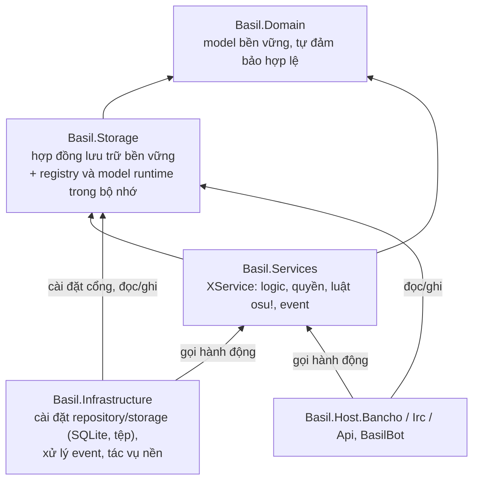
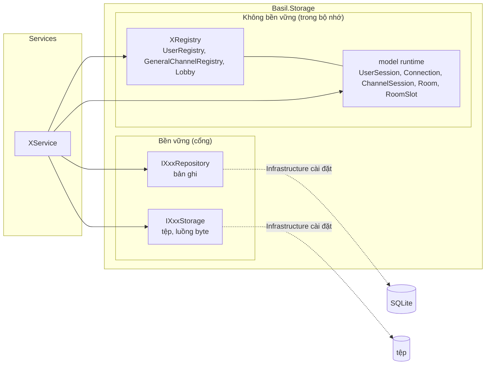
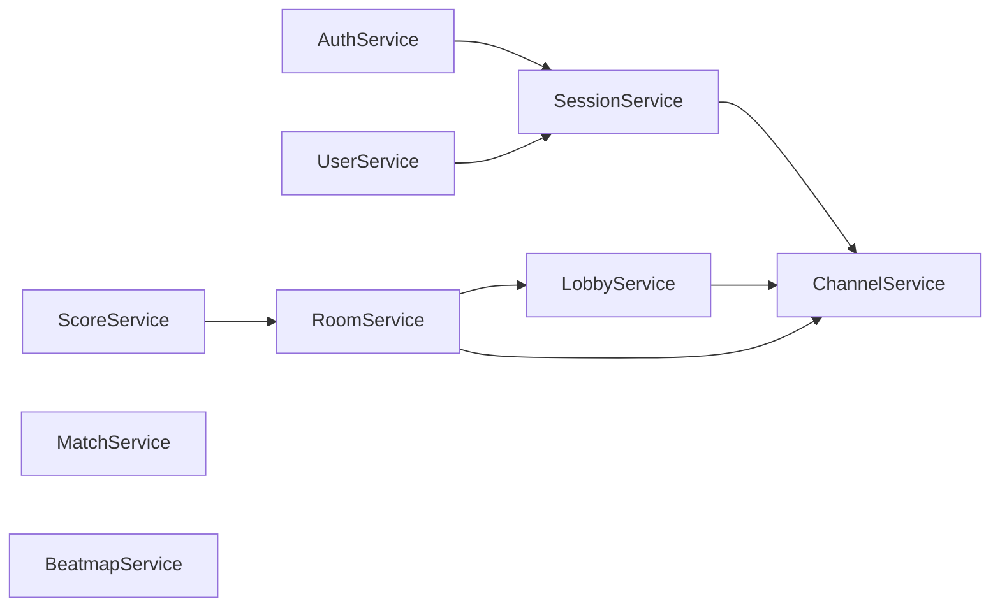
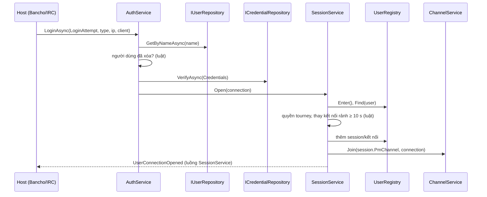
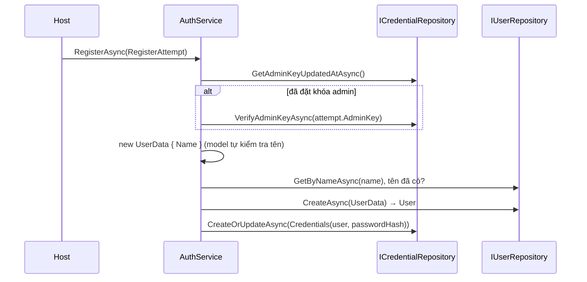
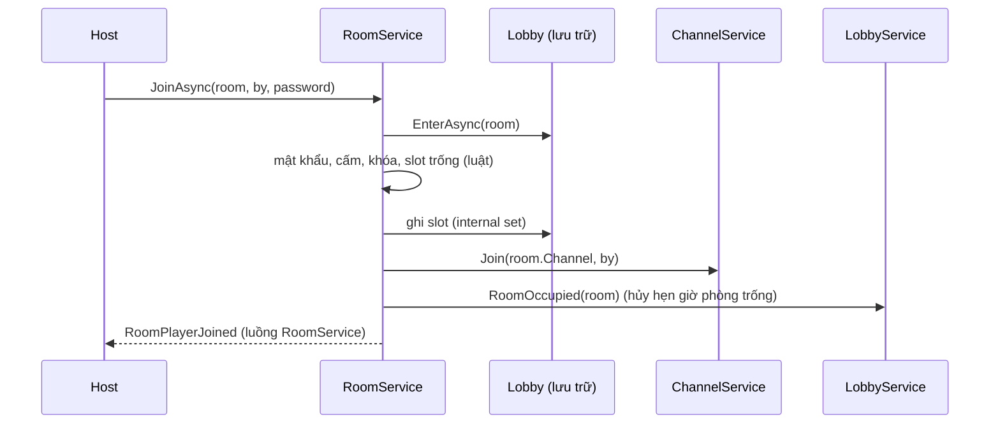

# Kế hoạch: tách Application thành lớp Lưu trữ và lớp Services

Ngày: 2026-10-01. Trạng thái: **đã duyệt hướng, chưa sửa code**. Bàn giao cho một session agent tuần sau, khi
OpenCode sẵn sàng; xem [mục 11](#11-bàn-giao).

Kế hoạch này thay phần "đối tượng runtime tự thực thi hành vi" của
[`application-environment-plan-20260930.md`](application-environment-plan-20260930.md). Các quyết định khác của kế hoạch
đó (đặt tên X / XSession / XRegistry, cây event, quy ước tên kênh, TimeProvider, nhận diện theo tham chiếu) vẫn giữ.

## 0. Tóm tắt

* `Basil.Application` tách thành hai project:
	* **`Basil.Storage`**: nơi lưu trữ. Gồm hợp đồng lưu trữ bền vững (`IXxxRepository`, `IXxxStorage`) và lưu trữ không
	  bền vững trong bộ nhớ (các `XRegistry` cùng các model runtime chúng giữ). Chỉ chứa dữ liệu, tra cứu và kiểm soát
	  truy cập đồng thời. Không có luật nghiệp vụ, không phát event.
	* **`Basil.Services`**: các `XService`, nơi thực thi toàn bộ logic. Phụ thuộc vào `Basil.Storage`. Mỗi service là
	  một luồng event.
* Model (Domain và runtime) chỉ là biểu diễn. Model tự đảm bảo **nó hợp lệ** (giá trị field đúng miền). Service đảm bảo
  **nó có ý nghĩa** (không bị chỉnh sửa, đúng quyền, đúng thời điểm, đúng luật osu!).
* `Gateway` và `Registration` gộp thành `AuthService` (đăng nhập, đăng ký, khóa admin) cộng
  `SessionService` (vòng đời kết nối). `RegisterAttempt : LoginAttempt` mang `AdminKey` kiểu `Md5`.
* Repository dùng động từ `Create`, `CreateOrUpdate`, `Get`, `List`, `Delete`. `Save` chỉ dùng cho Storage (tệp, luồng
  byte). Mọi repository có đọc theo định danh, liệt kê và tìm kiếm có phân trang.
* Services chỉ là nơi thực hiện **hành động** (thao tác có luật, hệ quả hoặc event). Tầng ngoài (Infrastructure, các
  host, bot) truy cập lớp lưu trữ trực tiếp như bình thường: đọc, liệt kê, tìm kiếm, và ghi bản ghi bền vững khi việc
  ghi không kèm luật hay hệ quả. Trạng thái runtime chỉ đổi qua Services.

## 1. Vì sao phải đổi

Hiện trạng vi phạm triết lý ở gần như mọi mặt:

| Vấn đề                                     | Ví dụ hiện tại                                                                                                                                                                       |
|--------------------------------------------|--------------------------------------------------------------------------------------------------------------------------------------------------------------------------------------|
| Hành vi thực thi trên model runtime        | `Room.Join/Configure/Start/...` (≈1050 dòng), `ChannelSession.Join/Post`, `SpectatorChannelSession.Spectate`, `RoomSlots.Seat/Resize`, `RoomSlot.Occupy/MoveTo`                      |
| Nơi lưu trữ chứa logic                     | `UserRegistry.OpenConnection` (luật thay kết nối sau 10 giây rảnh, quyền tourney), `Lobby.OpenAsync` (luật mở phòng, hẹn giờ phòng trống), `GeneralChannelRegistry.JoinAutoChannels` |
| Object mang tên model nhưng là logic       | `Gateway` (đăng nhập), `Registration` (dịch vụ riêng, không nhất quán)                                                                                                               |
| Model Domain chứa kiểm tra ý nghĩa         | `Submission.Validate` (chống sửa điểm), `ClientFingerprint.MatchWith`, `MatchSettings.SwitchMode`, getter `UserData.Privilege` trả `None` khi đã xóa                                 |
| Repository chỉ ghi                         | `IScoreRepository` chỉ có `AddAsync`, `IReplayStorage` chỉ có `SaveAsync`, `IMatchRepository` chỉ có `AddAsync`                                                                      |
| Động từ sai                                | `Save` trên repository (`ICredentialRepository.SaveAsync`, `IBeatmapRepository.SaveAsync`...)                                                                                        |
| Khóa admin là `string`, nằm ngoài xác thực | `IAdminKeyRepository.VerifyAsync(string)`                                                                                                                                            |

## 2. Kiến trúc mới

### 2.1 Các lớp



Chiều phụ thuộc: `Domain ← Storage ← Services ← Infrastructure, Hosts`. Infrastructure cài đặt các cổng bền vững. Tầng
ngoài dùng lớp lưu trữ trực tiếp và gọi Services khi cần một hành động:

| Việc                                                                                                                             | Đi đâu                                                           |
|----------------------------------------------------------------------------------------------------------------------------------|------------------------------------------------------------------|
| Đọc, liệt kê, tìm kiếm (bản ghi, tệp, registry, model runtime)                                                                   | lớp lưu trữ, trực tiếp                                           |
| Ghi bản ghi bền vững không kèm luật hay hệ quả (admin đổi tên, đổi quốc gia, khóa/ẩn beatmap)                                    | repository, trực tiếp                                            |
| Hành động có luật, hệ quả hoặc event (đăng nhập, đăng ký, im lặng, vào phòng, post, nộp điểm, nhập beatmap, xóa set kèm archive) | service                                                          |
| Đổi trạng thái runtime (session, kênh, phòng)                                                                                    | service; setter runtime là `internal`, tầng ngoài không ghi được |

Luật hiển thị khi đọc (beatmap ẩn, trận riêng tư, người đã xóa) do bên gọi đặt trong tiêu chí truy vấn (`IncludeHidden`,
`IncludePrivate`, `IncludeDeleted`) theo quyền của người hỏi. Architecture tests kiểm tra:
không project nào ngoài `Basil.Services` ghi vào model runtime.

### 2.2 Model: biểu diễn và tự đảm bảo hợp lệ

| Thuộc model (hợp lệ)                                                                                                                                 | Thuộc service (ý nghĩa)                                                           |
|------------------------------------------------------------------------------------------------------------------------------------------------------|-----------------------------------------------------------------------------------|
| Tên người dùng đúng luật osu!, tên trận không rỗng, `Round.Number > 0`, enum đã định nghĩa, mod hợp lệ với mode                                      | Bài nộp không bị chỉnh sửa (checksum, dấu vân tay máy, phiên bản client)          |
| Value type tự parse và in ra định dạng của mình (`Md5`, `ClientVersion`, `ClientFingerprint`, `GameMods.FromModString`, `Submission.Parse`)          | So khớp dấu vân tay hai máy (`MatchWith`) để phát hiện gian lận                   |
| Giá trị suy ra thuần từ dữ liệu của chính nó (`HitCounts.CalculateAccuracy`, `Room.Name => Match.Name`, `Beatmap.IsVisible()` gộp cờ của map và set) | Ai được làm gì (quyền, creator/referee/host), người bị xóa thì không có quyền     |
|                                                                                                                                                      | Khi nào (đang im lặng, thời gian chờ, hẹn giờ)                                    |
|                                                                                                                                                      | Hệ quả của thay đổi (đổi mode thì bỏ mod không hợp lệ, rời phòng thì chuyển host) |

Model runtime trong `Basil.Storage` chỉ có thuộc tính, tập quan hệ và tra cứu. Thuộc tính có
`internal set`, tập quan hệ có thao tác thêm/bớt `internal`. `Basil.Storage` khai báo
`[assembly: InternalsVisibleTo("Basil.Services")]`, nên chỉ Services thay đổi được trạng thái runtime. Host và
Infrastructure chỉ đọc.

### 2.3 Lớp lưu trữ hoạt động thế nào



**Bền vững.** Hai loại cổng, cài đặt nằm ở Infrastructure:

* **Repository** lưu bản ghi model Domain. Động từ:

  | Động từ | Nghĩa |
    |---|---|
  | `CreateAsync(XData) → X` | thêm bản ghi mới; kho cấp định danh và trả về model có định danh |
  | `CreateOrUpdateAsync(X)` | ghi model đã có định danh: thêm nếu chưa có, ghi đè nếu đã có |
  | `GetAsync(id) → X?`, `GetByYAsync(y) → X?` | đọc một bản ghi theo định danh hoặc khóa duy nhất |
  | `ListAsync(XQuery, PageRequest) → Page<X>` | liệt kê và tìm kiếm; truy vấn rỗng nghĩa là liệt kê tất cả |
  | `DeleteAsync(X)` | xóa hẳn |

  Xóa mềm không phải động từ của kho: service đặt `DeletedAt` rồi gọi `CreateOrUpdateAsync`.
* **Storage** lưu nội dung nhị phân gắn với một model: `SaveAsync(x, Stream)`, `OpenAsync(x) → Stream?`,
  `DeleteAsync(x)`.

Kho chỉ lọc theo tiêu chí tường minh trong `XQuery` (ví dụ `IncludeHidden`, `IncludeDeleted`,
`IncludePrivate`). Bên gọi (host hoặc service) đặt giá trị các cờ đó theo quyền của người hỏi. Chuẩn hóa khóa tra cứu
(tên người dùng không phân biệt hoa thường và khoảng trắng) vẫn là việc của kho.

Phân trang dùng chung: `PageRequest(int Offset, int Limit)` và `Page<T>(IReadOnlyList<T> Items, int Total)`. Không dựng
lại hệ truy vấn tổng quát cũ (`Query<T>`, `SortOptions`, `ComparisonOperator`). Mỗi model có một record tiêu chí riêng
với đúng các field mà API và web osu! cần.

**Không bền vững.** Mỗi `XRegistry` là một tập trong bộ nhớ giữ các model runtime đang sống:

| Registry                 | Giữ                                                                                                                                                   | Tra cứu                                                |
|--------------------------|-------------------------------------------------------------------------------------------------------------------------------------------------------|--------------------------------------------------------|
| `UserRegistry`           | `UserSession` theo `User`; mỗi session giữ các `Connection` và `PmChannelSession` của nó; mỗi `BanchoConnection` giữ `SpectatorChannelSession` của nó | `Find(User)`, `Sessions`, `FindSpectating(Connection)` |
| `GeneralChannelRegistry` | `GeneralChannelSession` theo tên                                                                                                                      | `Find(name)`, `All`                                    |
| `Lobby`                  | `Room` theo room id, cùng tập `Watchers`; mỗi `Room` giữ `RoomSlots`, `RoomChannelSession`, `Referees`, `Banned`, `Observers`                         | `Find(id)`, `Rooms`, `RoomOf(BanchoConnection)`        |

Phần sở hữu (kênh PM của session, kênh spectator của kết nối, kênh và slot của phòng) nằm trong bản ghi của chủ và sống
chết theo chủ. Registry cấp định danh khi thêm (room id nhỏ nhất còn trống), giống kho bền vững cấp id.

Registry cung cấp **phạm vi độc quyền** cho thao tác đọc-rồi-ghi, như transaction của cơ sở dữ liệu:

* `Lobby.EnterAsync(Room) → IAsyncDisposable?`: khóa một phòng. Trả `null` khi phòng đã đóng. Thay
  `Room.EnterAsync()` hiện tại.
* `Lobby.Enter()`: khóa ngắn khi cấp room id và đếm phòng theo creator.
* `UserRegistry.Enter()`: khóa ngắn khi mở và đóng kết nối.

Lớp lưu trữ **không bao giờ**: quyết định luật, phát event, gọi service, tự hẹn giờ. Nó chỉ giữ handle hẹn giờ do
service tạo (`Room.CountdownTimer`, `Room.ClosingTimer`) để service hủy về sau.

### 2.4 Lớp Services hoạt động thế nào

`XService` là nơi tập trung mọi hành động liên quan đến X. Service phụ thuộc vào lớp lưu trữ để truy cập dữ liệu.
Service không bọc lại thao tác đọc hay ghi đơn thuần: không có `ScoreService.GetAsync` chuyển tiếp sang
`IScoreRepository.GetAsync`. Quy tắc:

1. **Không giữ trạng thái**, trừ luồng event của chính nó. Mọi trạng thái nằm trong lớp lưu trữ.
2. **Mỗi service một luồng event**: `RoomService : IEventPublisher<RoomEvent>`. Infrastructure đăng ký một số luồng cố
   định lúc khởi động, không phải dò từng phòng hay kênh mới mở. Thứ tự chỉ được đảm bảo trong một luồng.
3. **Event vẫn thuộc object bị tác động.** `ChannelMemberJoined` vẫn mang kênh và nằm trong nhóm
   `ChannelEvent`. Service phát nó vì service đó sở hữu loại object bị tác động. Session và connection vẫn không giữ
   kênh, phòng hay quan hệ nào.
4. **Đối tượng bị tác động sở hữu tương tác**, viết lại cho kiến trúc mới: quan hệ lưu trên bản ghi của object bị tác
   động (`Room.Slots`, `ChannelSession.Members`). Thao tác nằm ở service của loại object đó
   (`ChannelService.Join(channel, by)`, `RoomService.JoinAsync(room, by, password)`). Actor chỉ gọi.
5. **Gọi chéo service chỉ để giữ bất biến của chính mình.** Phòng giữ thành viên kênh phòng khớp với người chơi, nên
   `RoomService` gọi `ChannelService.Join`. Phản ứng với sự việc của loại khác đi qua event do Infrastructure xử lý. Ví
   dụ: `UserConnectionClosed` thì Infrastructure gọi `RoomService.ReleaseAsync`,
   `LobbyService.Unwatch`, `ChannelService.PartAll`. Đồ thị phụ thuộc giữa các service không có chu trình.
6. **Quyền kiểm tra trong service** của object bị tác động, nhận actor `by`.
7. **Giữ phạm vi độc quyền** của phòng suốt một lần chuyển trạng thái, như quy tắc đồng thời hiện tại.

| Service          | Thay cho                                                                                                                                                                                                                | Phụ thuộc                                                                                   | Luồng event                                              |
|------------------|-------------------------------------------------------------------------------------------------------------------------------------------------------------------------------------------------------------------------|---------------------------------------------------------------------------------------------|----------------------------------------------------------|
| `AuthService`    | `Gateway.ConnectAsync`, `Registration`, quản lý khóa admin                                                                                                                                                              | `IUserRepository`, `ICredentialRepository`, `SessionService`                                | không                                                    |
| `SessionService` | `UserRegistry.OpenConnection/CloseConnection/SetStatus`, `Gateway.Disconnect`, gán `AwayMessage`, `LastActiveAt`                                                                                                        | `UserRegistry`, `ChannelService`                                                            | `UserEvent` (kết nối mở/đóng, đổi trạng thái)            |
| `UserService`    | `UserRegistry.Silence`; xóa mềm người dùng (đặt `DeletedAt`, đóng kết nối đang mở)                                                                                                                                      | `IUserRepository`, `UserRegistry`, `SessionService`                                         | `UserEvent` (`UserSilenced`)                             |
| `ChannelService` | `ChannelSession.Join/Part/Post/Close/CanRead/CanWrite`, `PmChannelSession` (trả lời away), `SpectatorChannelSession.Spectate/StopSpectating/CantSpectate`, `GeneralChannelRegistry.Open/Close/JoinAutoChannels/PartAll` | `GeneralChannelRegistry`, `UserRegistry`                                                    | `ChannelEvent`                                           |
| `LobbyService`   | `Lobby.OpenAsync/CloseAsync/Watch/Unwatch`, vòng đời phòng trống                                                                                                                                                        | `Lobby`, `IMatchRepository`, `UserRegistry`, `ChannelService`, `RoomRules`                  | `LobbyEvent`                                             |
| `RoomService`    | mọi thao tác của `Room`, `RoomSlots.Seat/Vacate/Resize`, `RoomSlot.Occupy/MoveTo/...`, `Countdown`, `Lobby.ReleaseAsync`                                                                                                | `Lobby`, `ChannelService`, `LobbyService`                                                   | `RoomEvent`                                              |
| `MatchService`   | ghi lịch sử round theo thứ tự                                                                                                                                                                                           | `IMatchRepository`, `IRoundRepository`                                                      | không                                                    |
| `ScoreService`   | `ScoreSubmission`, `Submission.Validate`, `ClientFingerprint.MatchWith`                                                                                                                                                 | `IScoreRepository`, `IReplayStorage`, `IUserStatsRepository`, `Lobby`, `RoomService`        | `ScoreEvent` (`ScoreSubmitted`, thay `UserStatsChanged`) |
| `BeatmapService` | `BeatmapCatalog`; xóa set cùng beatmap và archive                                                                                                                                                                       | `IBeatmapRepository`, `IBeatmapsetRepository`, `IBeatmapArchiveStorage`, `IBeatmapAnalyser` | `BeatmapsetEvent`                                        |

Đồ thị phụ thuộc giữa các service:



`LobbyService` không gọi `RoomService`. Hai thao tác của sảnh cần luật phòng: `OpenAsync` xếp creator làm host đầu tiên,
`CloseAsync` kiểm tra `by` là creator hoặc referee. Luật đó nằm trong lớp tĩnh
`internal static class RoomRules` ở `Basil.Services/Multiplayer` (`IsManager(room, user)`, chọn slot trống đầu tiên, xếp
người chơi vào slot). `LobbyService` và `RoomService` cùng dùng, không chép luật. Đóng phòng đuổi mọi người chơi trực
tiếp trên lớp lưu trữ và phát `LobbyRoomClosed(room, evicted)` như hiện nay. Dọn kết nối khỏi phòng (`ReleaseAsync`)
chuyển sang `RoomService`, vì đó là thao tác rời phòng.

Mỗi thao tác ở mục 4 chỉ gọi service mà đồ thị trên cho phép: `SessionService` và `LobbyService` gọi
`ChannelService` (kênh PM, kênh spectator, kênh phòng, bot vào kênh phòng); `RoomService` gọi
`ChannelService` và `LobbyService.RoomEmptied/RoomOccupied`; `ScoreService` gọi
`RoomService.RecordScoreAsync`; `UserService` gọi `SessionService.Close` khi xóa người dùng đang online.
`MatchService`, `BeatmapService` không gọi service nào.

`UserEvent` có hai nguồn: `SessionService` (kết nối) và `UserService` (im lặng). Đăng ký "cả nhóm
`UserEvent`" nghĩa là đọc cả hai luồng.

### 2.5 Các quy trình mẫu

**Đăng nhập.**



**Đăng ký.**



**Vào phòng.**



**Nộp điểm.** `ScoreService.SubmitAsync` tìm phòng và round của người chơi qua `Lobby.RoomOf`, kiểm tra bài nộp
(checksum, vân tay, phiên bản), gọi `IScoreRepository.CreateAsync`, `IReplayStorage.SaveAsync`, cập nhật
`IUserStatsRepository`, gọi `RoomService.RecordScoreAsync`, rồi phát `ScoreSubmitted`.

**Đóng kết nối.** `SessionService.Close` rời kênh PM, ngừng xem, đóng kênh spectator của kết nối, bỏ session khi người
dùng offline, rồi phát `UserConnectionClosed`. Infrastructure nhận event và gọi
`RoomService.ReleaseAsync`, `LobbyService.Unwatch`, `ChannelService.PartAll`. Các thao tác dọn này chạy lại nhiều lần
vẫn an toàn.

## 3. Hợp đồng lưu trữ mới

| Cổng                     | Hiện tại                                                    | Mới                                                                                                                                                                                    |
|--------------------------|-------------------------------------------------------------|----------------------------------------------------------------------------------------------------------------------------------------------------------------------------------------|
| `IUserRepository`        | `FindByNameAsync`, `AddAsync`                               | `CreateAsync(UserData)`, `GetAsync(id)`, `GetByNameAsync(name)`, `ListAsync(UserQuery, PageRequest)`, `CreateOrUpdateAsync(User)`                                                      |
| `ICredentialRepository`  | `VerifyAsync`, `SaveAsync`                                  | `VerifyAsync(Credentials)`, `CreateOrUpdateAsync(Credentials)`, `VerifyAdminKeyAsync(Md5)`, `GetAdminKeyUpdatedAtAsync()`, `CreateOrUpdateAdminKeyAsync(Md5)`, `DeleteAdminKeyAsync()` |
| `IAdminKeyRepository`    | `VerifyAsync(string)`, `GetLastChangedAsync`, `UpdateAsync` | **bỏ**, gộp vào `ICredentialRepository`                                                                                                                                                |
| `IMatchRepository`       | `AddAsync`                                                  | `CreateAsync(MatchData)`, `CreateOrUpdateAsync(Match)`, `GetAsync(id)`, `ListAsync(MatchQuery, PageRequest)`                                                                           |
| `IRoundRepository`       | (chưa có)                                                   | `CreateOrUpdateAsync(Round)`, `ListAsync(Match)`                                                                                                                                       |
| `IScoreRepository`       | `AddAsync`                                                  | `CreateAsync(ScoreData)`, `GetAsync(id)`, `ListAsync(ScoreQuery, PageRequest)`                                                                                                         |
| `IReplayStorage`         | `SaveAsync`                                                 | `SaveAsync(Score, Stream)`, `OpenAsync(Score)`                                                                                                                                         |
| `IUserStatsRepository`   | `LoadAsync`, `UpdateAsync`                                  | `GetAsync(User, GameMode)`, `CreateOrUpdateAsync(UserStats)`                                                                                                                           |
| `IBeatmapRepository`     | `SaveAsync`, `RetainAsync`                                  | `CreateOrUpdateAsync(Beatmap)`, `GetAsync(id)`, `GetByHashAsync(Md5)`, `ListAsync(Beatmapset)`, `ListAsync(BeatmapQuery, PageRequest)`, `RetainAsync(Beatmapset, keep)`                |
| `IBeatmapsetRepository`  | `GetAsync`, `SaveAsync`                                     | `GetAsync(id)`, `CreateOrUpdateAsync(Beatmapset)`, `ListAsync(BeatmapsetQuery, PageRequest)`, `DeleteAsync(Beatmapset)`                                                                |
| `IBeatmapArchiveStorage` | `SaveAsync`                                                 | `SaveAsync(Beatmapset, Stream)`, `OpenAsync(Beatmapset)`, `DeleteAsync(Beatmapset)`                                                                                                    |
| `IBeatmapAnalyser`       | (trong Application)                                         | chuyển sang `Basil.Services`: nó là cổng tính toán, không phải lưu trữ                                                                                                                 |

Tiêu chí truy vấn, chỉ gồm các field mà API và web osu! hiện dùng:

* `UserQuery(string? Name, bool IncludeDeleted)`: danh sách admin và `/users/search`.
* `MatchQuery(bool? Ended, bool IncludePrivate)`: `/matches?status=`.
* `ScoreQuery(User? Player, Md5? BeatmapHash, Match? Match)`: `/scores`, bảng điểm theo beatmap.
* `BeatmapQuery(string? Text, GameMode? Mode, bool IncludeHidden)`: `/beatmapsets/search`, `osu-search.php`.
* `BeatmapsetQuery(string? Text, bool IncludeHidden)`: `/beatmapsets`.

`UserStats` chưa có bản ghi thì `GetAsync` trả bản ghi rỗng (như `LoadAsync` hiện nay). Lần ghi đầu vì vậy có thể là
thêm mới, nên phương thức ghi là `CreateOrUpdateAsync` chứ không phải `UpdateAsync` mà bạn vừa đổi. Nếu Infrastructure
tạo sẵn dòng stats cho mọi mode khi tạo người dùng thì `UpdateAsync` đúng và giữ nguyên.

Model đầu vào xác thực, nằm ở `Basil.Services/Auth`:

```csharp
public record LoginAttempt(string Username, Md5 PasswordHash);
public sealed record RegisterAttempt(string Username, Md5 PasswordHash, Md5? AdminKey)
    : LoginAttempt(Username, PasswordHash);
```

Luật khóa admin nằm ở `AuthService`: chưa đặt khóa thì chấp nhận; đã đặt thì `AdminKey` phải có và khớp. Kho chỉ so
khớp. Host tự băm MD5 khóa nhận từ client nếu client gửi bản rõ, giống mật khẩu.

## 4. Chuyển logic: hiện tại → chỗ mới

### 4.1 Domain

| Hiện tại                                                                                                                                                                                                                        | Mới                                                                                                                                                                                                                                                                                                                              |
|---------------------------------------------------------------------------------------------------------------------------------------------------------------------------------------------------------------------------------|----------------------------------------------------------------------------------------------------------------------------------------------------------------------------------------------------------------------------------------------------------------------------------------------------------------------------------|
| `Submission.Validate(...)`                                                                                                                                                                                                      | `ScoreService` (riêng tư)                                                                                                                                                                                                                                                                                                        |
| `ClientFingerprint.MatchWith`                                                                                                                                                                                                   | `ScoreService` (riêng tư)                                                                                                                                                                                                                                                                                                        |
| `MatchSettings.SwitchMode`                                                                                                                                                                                                      | `RoomService.Configure`. Setter `Mode` thành `public` và từ chối mode mà `Mods` hiện tại không hợp lệ, nên model không bao giờ giữ cặp sai. Service gán `Mods = Mods.RemoveInvalidMods(newMode)` trước (tập con của tập mod hợp lệ vẫn hợp lệ với mode cũ, vì luật chỉ bỏ bit khi hai mod cùng có mặt), rồi gán `Mode = newMode` |
| getter `UserData.Privilege` trả `None` khi `DeletedAt` có giá trị                                                                                                                                                               | thuộc tính thường; `AuthService` từ chối người đã xóa, service khác kiểm tra `DeletedAt` khi cần                                                                                                                                                                                                                                 |
| Kiểm tra field trong setter/init, `Parse`/`ToString` của value type, `Submission.Parse`, `CalculateAccuracy`, `IsLocked()`, `IsVisible()`, `MenuBanner.IsCurrent`, `ClientPrivileges.Has`, `GameMods.IsValid/RemoveInvalidMods` | **giữ** (hợp lệ, định dạng, giá trị suy ra thuần)                                                                                                                                                                                                                                                                                |
| `Geolocation.ParseIpAddress(headers)`                                                                                                                                                                                           | ngoài phạm vi: đọc header HTTP là việc của host; chuyển khi migrate host                                                                                                                                                                                                                                                         |

### 4.2 Users và Sessions

| Hiện tại                                                               | Lưu trữ (`Basil.Storage`)                                                                                    | Logic (`Basil.Services`)                                                                          |
|------------------------------------------------------------------------|--------------------------------------------------------------------------------------------------------------|---------------------------------------------------------------------------------------------------|
| `Gateway.ConnectAsync`                                                 |                                                                                                              | `AuthService.LoginAsync`                                                                          |
| `Gateway.Disconnect` (bỏ qua logout trong 1 giây)                      |                                                                                                              | `SessionService.Close`                                                                            |
| `Registration.RegisterAsync`                                           |                                                                                                              | `AuthService.RegisterAsync(RegisterAttempt)`                                                      |
| `UserRegistry.OpenConnection/CloseConnection/SetStatus`                | `UserRegistry`: `Sessions`, `Find`, `FindSpectating` (đổi tên từ `Watching`), thêm/bớt `internal`, `Enter()` | `SessionService.Open/Close/SetStatus`                                                             |
| `UserRegistry.Silence`                                                 |                                                                                                              | `UserService.SilenceAsync` (ghi `SilenceEndsAt` qua `IUserRepository`; hiện chỉ đổi trong bộ nhớ) |
| `UserRegistry.ReportStatsChanged`                                      |                                                                                                              | bỏ; `ScoreService` phát `ScoreSubmitted`                                                          |
| `UserSession.AwayMessage { set; }`, `Connection.LastActiveAt { set; }` | `internal set`                                                                                               | `SessionService.SetAway`, `SessionService.MarkActive`                                             |
| `BanchoConnection(login, utcOffset, time)`                             | constructor `internal`, không cần `TimeProvider`                                                             | `AuthService` tạo                                                                                 |
| `ConnectionType.AllowsMany()` (chỉ Tourney được nhiều kết nối)         | `ConnectionType` chỉ còn enum                                                                                | `SessionService` (riêng tư)                                                                       |

### 4.3 Chat

| Hiện tại                                                                        | Lưu trữ                                                                                    | Logic                                                 |
|---------------------------------------------------------------------------------|--------------------------------------------------------------------------------------------|-------------------------------------------------------|
| `ChannelSession.Join/Part/Post/Close`                                           | `ChannelSession`: `Channel`, `Name`, `Members`, `IsClosed`, thêm/bớt thành viên `internal` | `ChannelService.Join/Part/Post/Close`                 |
| `CanRead/CanWrite`, `PostRequiresMembership`, `AcceptsMessages` (mọi loại kênh) |                                                                                            | `ChannelService` (riêng tư, theo loại kênh)           |
| `PmChannelSession` trả lời away                                                 | `PmChannelSession.Owner`                                                                   | `ChannelService.Post`                                 |
| `SpectatorChannelSession.Spectate/StopSpectating/CantSpectate`                  | `SpectatorChannelSession.Host`, `Spectators`                                               | `ChannelService.Spectate/StopSpectating/CantSpectate` |
| `GeneralChannelRegistry.Open/Close/JoinAutoChannels/PartAll`                    | `GeneralChannelRegistry`: `All`, `Find`, thêm/bớt `internal`                               | `ChannelService`                                      |

### 4.4 Multiplayer

| Hiện tại                                                                            | Lưu trữ                                                                                                                                              | Logic                                                                                                   |
|-------------------------------------------------------------------------------------|------------------------------------------------------------------------------------------------------------------------------------------------------|---------------------------------------------------------------------------------------------------------|
| `Lobby.OpenAsync/CloseAsync`, `RoomEmptied/RoomOccupied`, hẹn giờ                   | `Lobby`: `Rooms`, `Find`, `RoomOf`, `Watchers`, `Add(Func<int, Room>)` cấp id, `Remove`, `Enter()`, `EnterAsync(room)`                               | `LobbyService.OpenAsync/CloseAsync/RoomEmptied/RoomOccupied`                                            |
| `Lobby.Watch/Unwatch`                                                               | thêm/bớt `Watchers` `internal`                                                                                                                       | `LobbyService.Watch/Unwatch`                                                                            |
| `Lobby.ReleaseAsync`                                                                |                                                                                                                                                      | `RoomService.ReleaseAsync`                                                                              |
| `Room.Join ... RecordScore` (≈30 thao tác), `PassHostFrom`, các hàm riêng của round | `Room`: dữ liệu, thuộc tính chuyển tiếp, `Password`, `CountdownEndsAt`, `CountdownTimer`, `ClosingTimer`, cờ đã báo AllLoaded/AllSkipped, `IsClosed` | `RoomService` (một phương thức cho mỗi thao tác)                                                        |
| `Room.IsManager`, `Room.SeatCreator`                                                |                                                                                                                                                      | `RoomRules` (dùng chung cho `LobbyService` và `RoomService`); `RoomService.IsManager` công khai cho bot |
| `Room.EnterAsync()`                                                                 | `Lobby.EnterAsync(room)`                                                                                                                             |                                                                                                         |
| `RoomSlots.Seat/Vacate/Resize`, `RoomSlot.Occupy/Clear/MoveTo/Set*`                 | `RoomSlots`: `Find`, `At`, chỉ mục; `RoomSlot`: thuộc tính `internal set`                                                                            | `RoomService` (riêng tư)                                                                                |
| `Countdown`                                                                         |                                                                                                                                                      | `Basil.Services/Multiplayer/Countdown`                                                                  |
| `RoomSettingsChange`, `RoomResult`, các event                                       |                                                                                                                                                      | `Basil.Services/Multiplayer`                                                                            |
| `Room.UrlEmbed` (định dạng chat)                                                    |                                                                                                                                                      | chuyển sang bot khi migrate bot; `Room.Url` giữ                                                         |

Ghi lịch sử round giữ thiết kế đã có trong `multiplayer.md`: ghi ngoài phạm vi khóa phòng, theo thứ tự trong từng trận,
có thử lại. Infrastructure đọc `RoomRoundStarted/Completed/Aborted` từ luồng
`RoomService` và gọi `MatchService.RecordRoundAsync` trên hàng đợi có thứ tự. Đóng trận ghi `EndedAt` qua
`LobbyService` → `IMatchRepository.CreateOrUpdateAsync`.

### 4.5 Scores và Beatmaps

| Hiện tại                      | Logic mới                                                           |
|-------------------------------|---------------------------------------------------------------------|
| `ScoreSubmission.SubmitAsync` | `ScoreService.SubmitAsync`                                          |
| `Room.RecordScore`            | `RoomService.RecordScoreAsync`                                      |
| `BeatmapCatalog.ImportAsync`  | `BeatmapService.ImportAsync`                                        |
| (chưa có)                     | `BeatmapService.DeleteAsync` (xóa set, beatmap và archive cùng lúc) |

Đọc điểm, mở replay, tìm beatmap, mở archive, khóa/ẩn beatmap: tầng ngoài gọi thẳng `IScoreRepository`,
`IReplayStorage`, `IBeatmapRepository`, `IBeatmapsetRepository`, `IBeatmapArchiveStorage`.

## 5. Các quy tắc AGENTS.md phải viết lại

| Quy tắc hiện tại                                                                      | Quy tắc mới                                                                                                                   |
|---------------------------------------------------------------------------------------|-------------------------------------------------------------------------------------------------------------------------------|
| Domain giữ model bền vững và tự đảm bảo hợp lệ                                        | Giữ. Bổ sung: model đảm bảo nó hợp lệ, service đảm bảo nó có ý nghĩa (bảng 2.2)                                               |
| Application giữ object runtime và event chúng phát                                    | `Basil.Storage` giữ model runtime và registry (chỉ dữ liệu); `Basil.Services` giữ logic và event                              |
| "Application models an environment": object sở hữu trạng thái tự thi hành luật của nó | Service của loại object đó thi hành luật trong cùng thao tác, không dựa vào hook có thể chưa cài                              |
| Đối tượng bị tác động sở hữu tương tác: lưu quan hệ **và phát event**                 | Lưu quan hệ trên bản ghi của object bị tác động; thao tác ở service của nó; event thuộc nhóm của nó (mục 2.4, quy tắc 4)      |
| Mỗi object quản lý cái nó sở hữu, phản ứng qua event                                  | Mỗi service quản lý loại của nó; phản ứng qua event ở Infrastructure; gọi chéo chỉ để giữ bất biến của mình                   |
| Mỗi object runtime là một nguồn event qua `Channel<T>` riêng                          | Mỗi service là một nguồn event; lớp lưu trữ không phát event                                                                  |
| Setter chỉ gán và kiểm tra; thay đổi có hệ quả là phương thức trên object             | Setter Domain gán và kiểm tra hợp lệ; setter runtime là `internal set` chỉ gán; thay đổi có hệ quả là phương thức của service |
| `Room.EnterAsync()`, phòng sở hữu khóa của nó                                         | `Lobby.EnterAsync(room)`; registry sở hữu phạm vi độc quyền                                                                   |
| Thao tác có luật quyền kiểm tra quyền trong `Room`                                    | Kiểm tra trong `RoomService`                                                                                                  |
| Sessions/Chat/Multiplayer phải cùng một assembly vì `internal`                        | Cụm đó nằm chung trong `Basil.Storage`; Services ghi qua `InternalsVisibleTo`                                                 |
| Repository khai báo đúng thao tác Application cần                                     | Đúng thao tác mà Services và tầng ngoài cần, gồm đọc, liệt kê và tìm kiếm; động từ theo bảng 2.3                              |
| (chưa có)                                                                             | Tầng ngoài truy cập lớp lưu trữ trực tiếp; Services chỉ cho hành động, không bọc đọc/ghi đơn thuần                            |
| Đặt tên X / XSession / XRegistry                                                      | Giữ; thêm `XService`                                                                                                          |

Các quy tắc khác (tên event, tên kênh, một khái niệm một tên, so sánh theo tham chiếu, `ConcurrentSet`
cho quan hệ, không pp) giữ nguyên.

## 6. Các pha triển khai

Cách làm: tách logic khỏi model **trong cùng project `Basil.Application`** trước, theo từng feature, mỗi pha đều build
được. Khi model đã chỉ còn dữ liệu, dời chúng sang `Basil.Storage` một lần rồi đổi tên project còn lại thành
`Basil.Services`. Lý do: Sessions, Chat và Multiplayer tham chiếu lẫn nhau, nên không dời từng feature sang project khác
được khi logic còn nằm trên model.

| Pha | Việc                                                                                                                                                                                                               | Kiểm chứng                                                                                                                                          |
|-----|--------------------------------------------------------------------------------------------------------------------------------------------------------------------------------------------------------------------|-----------------------------------------------------------------------------------------------------------------------------------------------------|
| 1   | Cập nhật AGENTS.md theo mục 5 (kể cả danh sách feature folder và ghi chú migration trỏ sang kế hoạch này). Thêm `PageRequest`, `Page<T>`, các `XQuery`. Đổi cổng theo mục 3: động từ, đọc, tìm kiếm, gộp khóa admin vào `ICredentialRepository`, `IRoundRepository`, `OpenAsync` cho storage   | build `Basil.Application`; grep không còn `SaveAsync` trên repository, không còn `IAdminKeyRepository`                                              |
| 2   | `AuthService`, `SessionService`, `UserService`; `LoginAttempt`, `RegisterAttempt`. Bỏ `Gateway`, `Registration`. `UserRegistry`, `UserSession`, `Connection` chỉ còn dữ liệu                                       | build; kịch bản: thay kết nối sau 10 s rảnh, logout trong 1 s bị bỏ qua, quyền tourney, đăng ký có/không khóa admin, tên trùng                      |
| 3   | `ChannelService` (gồm spectate). Cây `ChannelSession` và `GeneralChannelRegistry` chỉ còn dữ liệu                                                                                                                  | build; kịch bản: thứ tự từ chối khi post, trả lời away, cắt 2000 ký tự, spectate/stop, đóng kênh spectator khi chủ rời                              |
| 4a  | `LobbyService`; `Lobby` chỉ còn dữ liệu, `Lobby.EnterAsync(room)`; `RoomService` phần thành viên và quyền (join, leave, kick, ban, ref, host, observer, invite, `ReleaseAsync`)                                    | build; kịch bản phòng: mở, đóng, chuyển host, phòng trống 15/5 phút                                                                                 |
| 4b  | `RoomService` phần cài đặt và slot (`Configure`, slot, đội, mod, ready, có map); `MatchSettings.SwitchMode` bỏ                                                                                                     | build; kịch bản freemod, đổi mode bỏ mod, resize theo số lượng                                                                                      |
| 4c  | `RoomService` phần round và countdown; `Countdown` sang services; `Room`, `RoomSlots`, `RoomSlot` chỉ còn dữ liệu                                                                                                  | build; kịch bản round: AllLoaded, AllSkipped, round không người chơi, countdown bắt đầu round                                                       |
| 5   | `ScoreService` (nhận `Validate`, `MatchWith`), `BeatmapService`, `MatchService`; getter `Privilege` thành thuộc tính thường                                                                                        | build; kịch bản nộp điểm: beatmap lạ, vân tay sai, ghi vào round của phòng                                                                          |
| 6   | Tạo `Basil.Storage`; dời cổng, registry, model runtime, query sang đó (Rider move); `InternalsVisibleTo("Basil.Services")`; đổi tên `Basil.Application` thành `Basil.Services` (project, namespace, `AddServices`) | build `Basil.Storage` và `Basil.Services`; grep: Storage không tham chiếu Services, không còn `public set` hay phương thức logic trên model runtime |
| 7   | Viết lại `architecture.md`, `multiplayer.md`, `chat.md`; cập nhật bộ nhớ dự án; review cuối toàn bộ diff theo mục 5                                                                                                | đọc lại từng dòng                                                                                                                                   |

Thực thi: giao từng pha cho agent OpenCode (model miễn phí) hoặc subagent Sonnet. Prompt mang đặc tả đầy đủ, dùng Rider
MCP để đổi tên và dời kiểu. Tôi review từng dòng trước khi commit, mỗi pha một commit.

## 7. Kiểm chứng

Kịch bản kiểm tra hiện có trong scratchpad (FakeTimeProvider, gọi `Room`/`Lobby`) được chuyển sang API service ở pha 2
và chạy trước, sau mỗi pha. Mỗi pha thêm kịch bản cho phần nó dời. Hành vi quan sát được (kết quả trả về, event và thứ
tự event trong một luồng, thời điểm hẹn giờ) phải giống trước khi tách, trừ các thay đổi đã ghi trong kế hoạch này:

* `UserStatsChanged` thay bằng `ScoreSubmitted`.
* `UserService.SilenceAsync` ghi `SilenceEndsAt` vào kho.
* Event phát từ luồng của service thay vì luồng của từng object.

## 8. Quyết định đã chọn (có thể đổi)

1. Tên project: `Basil.Storage` và `Basil.Services`. Phương án khác: `Basil.Application.Storage` và
   `Basil.Application.Services`.
2. Khóa phòng chuyển từ `Room` sang `Lobby.EnterAsync(room)`, vì khóa là kiểm soát truy cập kho, không phải hành vi của
   model.
3. (Đã chốt) Tầng ngoài truy cập lớp lưu trữ trực tiếp; Services chỉ cho hành động. Ghi bền vững đơn thuần đi thẳng
   repository; trạng thái runtime chỉ đổi qua Services.
4. `MatchService` nhận ghi lịch sử round qua hàng đợi có thứ tự ở Infrastructure, giữ thiết kế hiện tại.
5. Không dựng lại hệ truy vấn tổng quát; mỗi model một record tiêu chí.

## 9. Ngoài phạm vi

* Nội dung và cấu hình (menu, FAQ, MOTD, mirror, avatar): chưa có trong Application. Làm khi migrate host.
* Trích xuất asset beatmap (audio, nền, cover): Infrastructure, đọc thẳng `IBeatmapArchiveStorage.OpenAsync`.
* Migrate Infrastructure, các host, bot và test sang kiến trúc mới.

## 10. Đối chứng với trạng thái hiện tại

Đối chứng ngày 2026-10-01, trên `develop` tại `94d96e6b`.

**Thay đổi của người dùng làm sau `94d96e6b`**, đã commit ở `c89ac6ae` để làm nền cho đợt này:

| Thay đổi | Kế hoạch xử lý |
|---|---|
| `Common/Events/Event.cs`, `IEventPublisher.cs` dời sang `Events/` (namespace `Basil.Application.Events`), 12 file đổi `using` theo | Giữ. Pha 1 sửa danh sách feature folder trong AGENTS.md (`Common/` không còn). Pha 6 dời thành `Basil.Services/Events` |
| `IAdminKeyRepository` thêm `GetLastChangedAsync()`, `UpdateAsync(string)` | Pha 1 gộp vào `ICredentialRepository`: `GetAdminKeyUpdatedAtAsync()` (theo quy tắc `UpdatedAt`), `CreateOrUpdateAdminKeyAsync(Md5)`, thêm `DeleteAdminKeyAsync()` cho `DELETE /adminkey` |
| `IUserStatsRepository.SaveAsync` → `UpdateAsync`, `ScoreSubmission` gọi theo | Pha 1 đổi thành `CreateOrUpdateAsync` và `LoadAsync` → `GetAsync`, trừ khi người dùng xác nhận Infrastructure tạo sẵn dòng stats (mục 3) |
| `Registration.cs`: dời `RegistrationFailure` xuống cuối file | Pha 2 bỏ `Registration`; `RegistrationFailure` (`InvalidName`, `NameTaken`, `WrongAdminKey`) dời sang `Basil.Services/Auth` |
| `Lobby.cs`: xuống dòng khai báo lớp | Không ảnh hưởng |

**Build và hành vi tại `c89ac6ae`:**

* `dotnet build src/Basil.Application/Basil.Application.csproj`: 0 lỗi; cảnh báo CS1574 (cref `Empty`) ở
  `Scores/IUserStatsRepository.cs:17`, sửa ở pha 1 khi đổi chữ ký.
* Kịch bản ở phụ lục A: 31/31 PASS. Đây là mốc hành vi để so sau mỗi pha.

**Đối chiếu với code:** các thành viên nêu ở mục 4 khớp với code hiện tại (`Room` ≈1050 dòng, ≈30 thao tác
công khai; `UserRegistry.Watching`, `ConnectionType.AllowsMany()`, `ChannelSession.PostRequiresMembership` và
`AcceptsMessages`, `RoomSlots.Seat/Vacate/Resize`, `Lobby.ReleaseAsync`). Các tiêu chí truy vấn ở mục 3 lấy từ
các route hiện có trong `Basil.Host.Api` (`/users`, `/users/search`, `/matches?status=`, `/scores`,
`/beatmapsets`, `/beatmapsets/search`) và `osu-search.php`, `osu-osz2-getscores.php`, `osu-getreplay.php`.

## 11. Bàn giao

Cho session agent nhận việc:

1. Đọc `AGENTS.md`, kế hoạch này, bộ nhớ dự án (`MEMORY.md`). Nền bắt đầu là `c89ac6ae` trên `develop`; nếu
   `git log` có commit mới hơn, đối chứng lại mục 10. Hỏi người dùng trước khi sửa code: mục 8 (tên project,
   khóa phòng, ghi lịch sử round, record tiêu chí) và `UpdateAsync` của stats (mục 3) có đổi gì không.
2. Dựng lại kịch bản phụ lục A trong scratchpad của session, **ngoài repo**: `Directory.Packages.props` ở gốc
   repo bật quản lý package tập trung, xung đột với `#:package`. Chạy `dotnet run check.cs`, phải 31/31 PASS
   trước khi bắt đầu.
3. Làm theo mục 6, mỗi pha một commit. Giao việc cho OpenCode theo `CLAUDE.md` toàn cục: kiểm tra quota trước,
   model miễn phí cho việc máy móc, prompt đủ đặc tả (chữ ký, tài liệu XML, luồng), bắt dùng Rider MCP để đổi
   tên và dời kiểu. Hết quota thì chuyển sang subagent Sonnet/Haiku.
4. Review từng dòng kết quả của agent theo mục 5 và mục "Final verification" của AGENTS.md, không chỉ dựa vào
   build và grep. Từ pha 2, chuyển kịch bản sang API service và thêm kịch bản của pha.
5. Chỉ `Basil.Domain` và `Basil.Application` build được trong suốt đợt này; Infrastructure, host và test vẫn ở
   mô hình cũ (ngoài phạm vi, mục 9).

## Phụ lục A. Kịch bản mốc hành vi

Script file-based (.NET 10, `dotnet run check.cs`) chạy trên API hiện tại (`Room`, `Lobby`, `UserRegistry`). Pha 2
trở đi viết lại các lời gọi sang service tương ứng, giữ nguyên các kiểm tra.

```csharp
#:project V:/Code/cs/osuBasil/src/Basil.Application/Basil.Application.csproj
#:package Microsoft.Extensions.TimeProvider.Testing@9.9.0
using System.Net;
using Basil.Application.Events;
using Basil.Application.Multiplayer;
using Basil.Application.Multiplayer.Events;
using Basil.Application.Sessions;
using Basil.Domain.Auth;
using Basil.Domain.Mechanics;
using Basil.Domain.Multiplayer;
using Basil.Domain.Users;
using Basil.Domain.Utilities;
using Microsoft.Extensions.Time.Testing;

var failures = 0;
void Check(string name, bool ok) { Console.WriteLine($"{(ok ? "PASS" : "FAIL")} {name}"); if (!ok) failures++; }
List<T> Drain<T>(System.Threading.Channels.ChannelReader<T> r) { var l = new List<T>(); while (r.TryRead(out var e)) l.Add(e); return l; }

var time = new FakeTimeProvider(DateTimeOffset.Parse("2026-10-01T00:00:00Z"));
var users = new UserRegistry(time);
var lobby = new Lobby(new Matches(), users, time);
var nextUser = 1;
User NewUser(string name) => new() { Id = nextUser++, Value = new UserData { Name = name } };
BanchoConnection Online(User u) { var c = new BanchoConnection(new Login { User = u, Ip = IPAddress.Loopback, Timestamp = time.GetUtcNow() }, 0, time); Check($"login {u.Value.Name}", users.OpenConnection(c) is null); return c; }
async Task<RoomResult> Do(Room room, Func<RoomResult> op) { await using var scope = await room.EnterAsync(); return scope is null ? (RoomResult)255 : op(); }

// S1: tournament room opened empty: announced at 15 min left, again at 5 min left, closed at 15 min
var referee = NewUser("Referee");
var opened = time.GetUtcNow();
var (t1, r1) = await lobby.OpenAsync(referee, null, "T1", "", isTournament: true, isPrivate: false);
var ev = Drain(lobby.Events);
Check("S1 announced on open (15 min left)", r1 == RoomResult.Ok && ev.OfType<LobbyRoomClosingAnnounced>().SingleOrDefault()?.ClosesAt == opened + TimeSpan.FromMinutes(15));
time.Advance(TimeSpan.FromMinutes(9));
Check("S1 nothing before 10 min", Drain(lobby.Events).Count == 0);
time.Advance(TimeSpan.FromMinutes(1));
ev = Drain(lobby.Events);
Check("S1 announced at 5 min left", ev.OfType<LobbyRoomClosingAnnounced>().SingleOrDefault()?.ClosesAt == opened + TimeSpan.FromMinutes(15) && lobby.Find(t1!.Id) is not null);
time.Advance(TimeSpan.FromMinutes(5));
ev = Drain(lobby.Events);
Check("S1 closed at 15 min", ev.OfType<LobbyRoomClosed>().Count() == 1 && lobby.Find(t1.Id) is null);

// S2: a join after the second warning cancels the close; emptying again restarts at 15 min
var (t2, _) = await lobby.OpenAsync(referee, null, "T2", "", true, false);
var alice = NewUser("Alice"); var aliceConn = Online(alice);
time.Advance(TimeSpan.FromMinutes(11));
Drain(lobby.Events);
Check("S2 alice joins", await Do(t2!, () => t2!.Join(aliceConn, "")) == RoomResult.Ok);
time.Advance(TimeSpan.FromMinutes(10));
Check("S2 room still open, no announcement", lobby.Find(t2.Id) is not null && Drain(lobby.Events).Count == 0);
var left = time.GetUtcNow();
await Do(t2, () => t2.Leave(aliceConn));
ev = Drain(lobby.Events);
Check("S2 emptied again: announced at 15 min left", ev.OfType<LobbyRoomClosingAnnounced>().SingleOrDefault()?.ClosesAt == left + TimeSpan.FromMinutes(15));
time.Advance(TimeSpan.FromMinutes(15));
Check("S2 closed 15 min after emptying", lobby.Find(t2.Id) is null);

// S3: normal room closes as soon as its last player leaves
var bob = NewUser("Bob"); var bobConn = Online(bob);
var (n1, rn) = await lobby.OpenAsync(bob, bobConn, "N1", "", false, false);
Check("S3 creator seated as host", rn == RoomResult.Ok && ReferenceEquals(n1!.Host, bobConn));
Check("S3 open in game while playing elsewhere refused", (await lobby.OpenAsync(bob, bobConn, "N2", "", false, false)).Result == RoomResult.AlreadyInRoom);
await Do(n1, () => n1.Leave(bobConn));
Check("S3 closed when empty", lobby.Find(n1.Id) is null);

// S4: a closed seat is only replaced after every check passes
var carol = NewUser("Carol"); var carol1 = Online(carol);
var (t4, _) = await lobby.OpenAsync(referee, null, "T4", "pw", true, false);
Check("S4 carol joins", await Do(t4!, () => t4!.Join(carol1, "pw")) == RoomResult.Ok);
carol1.LastActiveAt = time.GetUtcNow() - TimeSpan.FromMinutes(1);
var carol2 = Online(carol); // replaces carol1 (idle); carol1 is now closed but still seated
Check("S4 old connection closed", !carol1.IsOpen);
Check("S4 wrong password refused", await Do(t4, () => t4.Join(carol2, "nope")) == RoomResult.WrongPassword);
Check("S4 old seat kept after refusal", t4.Slots.Find(carol1) is not null);
Check("S4 right password replaces seat", await Do(t4, () => t4.Join(carol2, "pw")) == RoomResult.Ok && t4.Slots.Find(carol1) is null && t4.Slots.Find(carol2) is not null);

// S5: a player leaving mid-load completes the "all loaded" set; last completion ends the round
var dave = NewUser("Dave"); var daveConn = Online(dave);
var erin = NewUser("Erin"); var erinConn = Online(erin);
var (t5, _) = await lobby.OpenAsync(referee, null, "T5", "", true, false);
var refConn = Online(referee);
await Do(t5!, () => t5!.Join(daveConn, "")); await Do(t5, () => t5.Join(erinConn, ""));
Check("S5 configure map", await Do(t5, () => t5.Configure(refConn, new RoomSettingsChange(Beatmap: new BeatmapReference(new Md5(new byte[16]), 1, "map", GameMode.Standard, null)))) == RoomResult.Ok);
Drain(t5.Events);
Check("S5 empty configure is no-op", await Do(t5, () => t5.Configure(refConn, new RoomSettingsChange())) == RoomResult.Ok && Drain(t5.Events).Count == 0);
Check("S5 start", await Do(t5, () => t5.Start(refConn)) == RoomResult.Ok);
await Do(t5, () => t5.MarkLoaded(daveConn));
Drain(t5.Events);
await Do(t5, () => t5.Leave(erinConn));
var re = Drain(t5.Events);
Check("S5 all loaded announced after leave", re.OfType<RoomRoundAllLoaded>().SingleOrDefault() is { Slot: null });
await Do(t5, () => t5.Complete(daveConn));
re = Drain(t5.Events);
Check("S5 round completed", re.OfType<RoomRoundCompleted>().Count() == 1 && !t5.InProgress);

// S6: a round nobody plays ends at once
await Do(t5, () => t5.SetHasMap(daveConn, false));
Drain(t5.Events);
await Do(t5, () => t5.Start(refConn));
re = Drain(t5.Events);
Check("S6 unplayed round ends", re.OfType<RoomRoundStarted>().Count() == 1 && re.OfType<RoomRoundCompleted>().Count() == 1 && !t5.InProgress);

// S7: clearing the beatmap, then start is refused
Check("S7 clear beatmap", await Do(t5, () => t5.Configure(refConn, new RoomSettingsChange(ClearBeatmap: true))) == RoomResult.Ok && t5.Beatmap is null);
Check("S7 start without map refused", await Do(t5, () => t5.Start(refConn)) == RoomResult.NoBeatmap);

Console.WriteLine(failures == 0 ? "ALL PASS" : $"{failures} FAILED");

sealed class Matches : IMatchRepository
{
	private int _next = 1;
	public Task<Match> AddAsync(MatchData data, CancellationToken cancellationToken = default) =>
		Task.FromResult(new Match { Id = _next++, Value = data });
}
```
