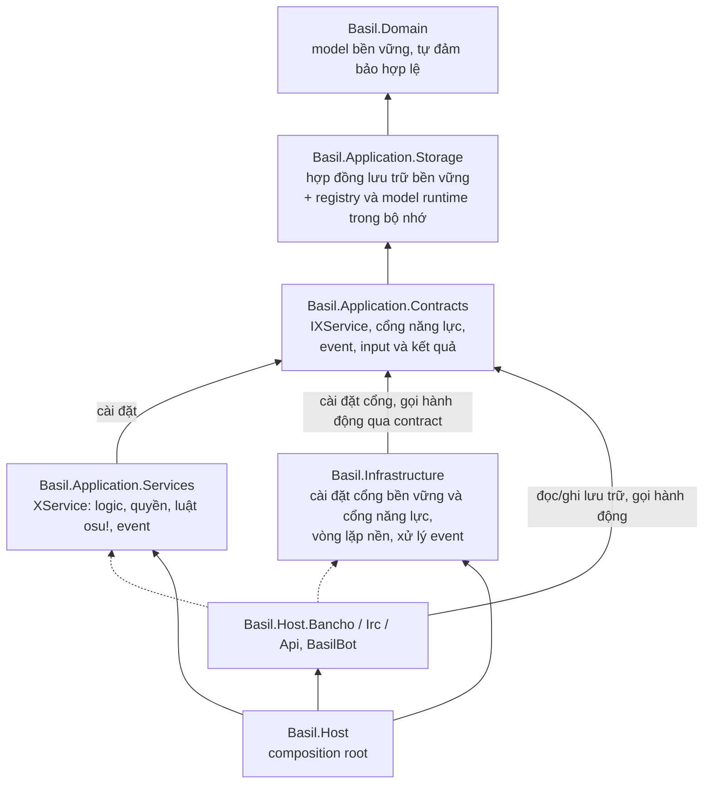
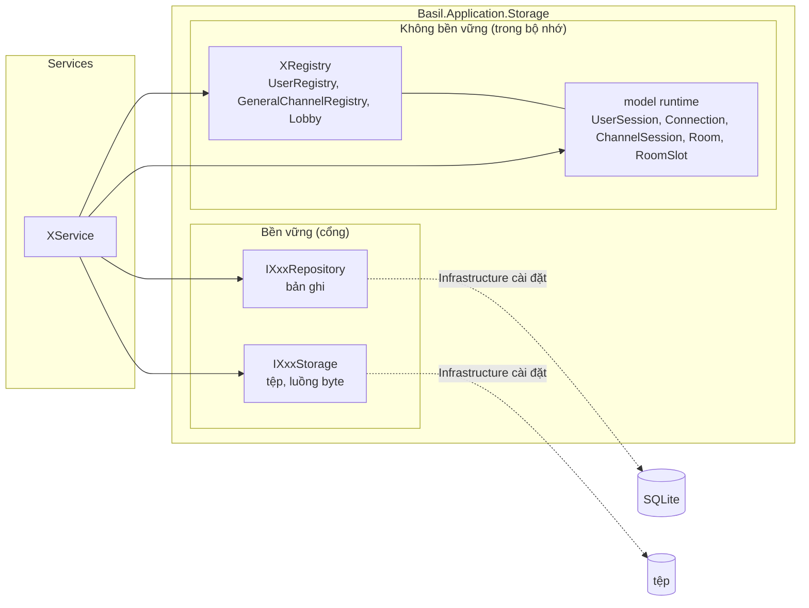
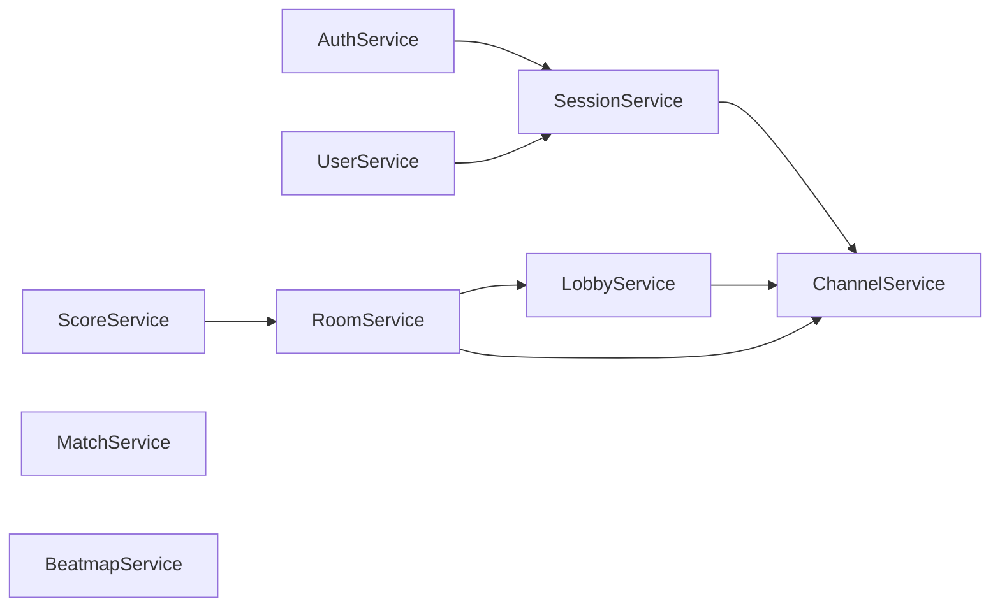
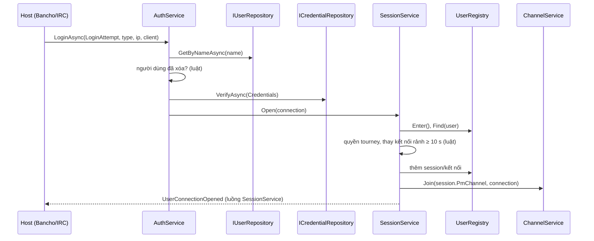
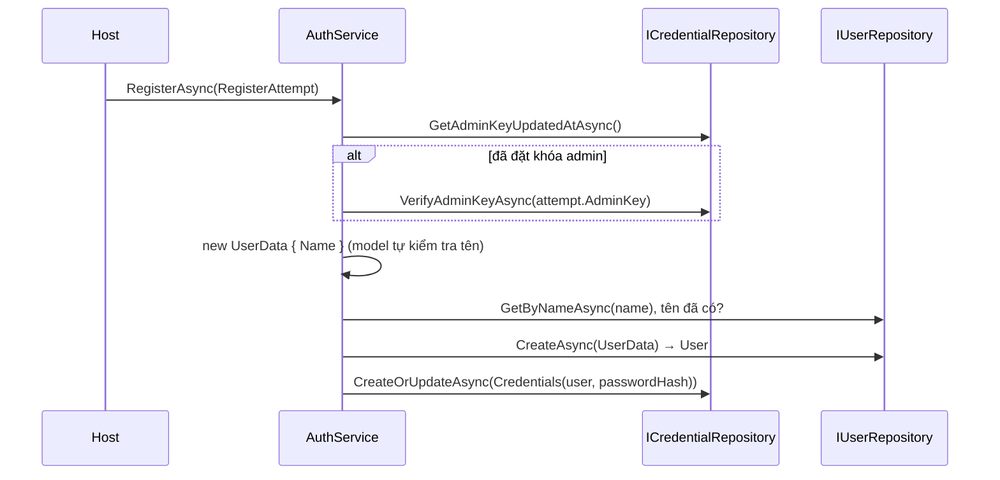
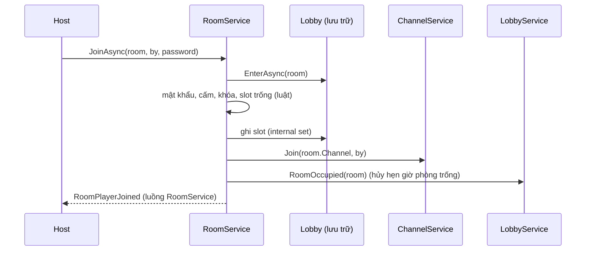

# Kế hoạch: tách Application thành lớp Lưu trữ, lớp Contracts và lớp Services

Ngày: 2026-10-03. Trạng thái: **đã duyệt hướng (2026-10-01); bổ sung Contracts/Services và kiểm kê chức năng
(2026-10-03); pha 1–6 đã triển khai (2026-10-04), xem [mục 13](#13-nhật-ký-triển-khai)**. Điều phối triển khai: [mục 11](#11-điều-phối-triển-khai). Kiểm kê chức năng:
[mục 12](#12-kiểm-kê-chức-năng).

Kế hoạch này thay phần "đối tượng runtime tự thực thi hành vi" của
[`application-environment-plan-20260930.md`](application-environment-plan-20260930.md). Các quyết định khác của kế hoạch
đó (đặt tên X / XSession / XRegistry, cây event, quy ước tên kênh, TimeProvider, nhận diện theo tham chiếu) vẫn giữ.

## 0. Tóm tắt

* `Basil.Application` tách thành ba project:
	* **`Basil.Application.Storage`**: nơi lưu trữ. Gồm hợp đồng lưu trữ bền vững (`IXxxRepository`, `IXxxStorage`) và
	  lưu trữ không bền vững trong bộ nhớ (các `XRegistry` cùng các model runtime chúng giữ). Chỉ chứa dữ liệu, tra
	  cứu và kiểm soát truy cập đồng thời. Không có luật nghiệp vụ, không phát event.
	* **`Basil.Application.Contracts`**: hệ thống cung cấp những năng lực nào, độc lập với cách cài đặt. Gồm contract
	  `IXService` của từng dịch vụ, cổng năng lực do Infrastructure cài đặt vì cần phụ thuộc ngoài
	  (`IBeatmapAnalyser`, `IBeatmapArchiveReader`, `IBeatmapAssets`, `IBeatmapMirror`), event, input và kết quả
	  của các thao tác. Phụ thuộc vào Storage.
	* **`Basil.Application.Services`**: cài đặt các `XService` mà cách làm đã xác định hoàn toàn trong Application,
	  chỉ dùng contract và thành phần nội bộ của Application. Mỗi service là một luồng event.
* Infrastructure chỉ cài đặt cổng bền vững và cổng năng lực cần phụ thuộc ngoài. Nó **không** tham chiếu
  `Basil.Application.Services`; dịch vụ được lấy qua DI theo contract. Host được tham chiếu Services, vì Services
  đứng song song với Infrastructure.
* Dịch vụ bản chất nền: Application định nghĩa một lần chạy (method của contract, cài trong Services);
  Infrastructure lo vòng lặp chạy liên tục (mục 2.6).
* Model (Domain và runtime) chỉ là biểu diễn. Model tự đảm bảo **nó hợp lệ** (giá trị field đúng miền). Service đảm bảo
  **nó có ý nghĩa** (không bị chỉnh sửa, đúng quyền, đúng thời điểm, đúng luật osu!).
* `Gateway` và `Registration` gộp thành `AuthService` (đăng nhập, đăng ký, khóa admin) cộng
  `SessionService` (vòng đời kết nối). `RegisterAttempt : LoginAttempt` mang `AdminKey` kiểu `Md5`.
* Repository dùng động từ `Create`, `CreateOrUpdate`, `Get`, `List`, `Delete`. `Save` chỉ dùng cho Storage (tệp, luồng
  byte). Mọi repository có đọc theo định danh, liệt kê và tìm kiếm có phân trang.
* Services chỉ là nơi thực hiện **hành động** (thao tác có luật, hệ quả hoặc event). Tầng ngoài (Infrastructure, các
  host, bot) truy cập lớp lưu trữ trực tiếp như bình thường: đọc, liệt kê, tìm kiếm, và ghi bản ghi bền vững khi việc
  ghi không kèm luật hay hệ quả. Trạng thái runtime chỉ đổi qua Services.

## 1. Vì sao phải đổi

Hiện trạng vi phạm triết lý ở gần như mọi mặt:

| Vấn đề                                     | Ví dụ hiện tại                                                                                                                                                                       |
|--------------------------------------------|--------------------------------------------------------------------------------------------------------------------------------------------------------------------------------------|
| Hành vi thực thi trên model runtime        | `Room.Join/Configure/Start/...` (≈1050 dòng), `ChannelSession.Join/Post`, `SpectatorChannelSession.Spectate`, `RoomSlots.Seat/Resize`, `RoomSlot.Occupy/MoveTo`                      |
| Nơi lưu trữ chứa logic                     | `UserRegistry.OpenConnection` (luật thay kết nối sau 10 giây rảnh, quyền tourney), `Lobby.OpenAsync` (luật mở phòng, hẹn giờ phòng trống), `GeneralChannelRegistry.JoinAutoChannels` |
| Object mang tên model nhưng là logic       | `Gateway` (đăng nhập), `Registration` (dịch vụ riêng, không nhất quán)                                                                                                               |
| Model Domain chứa kiểm tra ý nghĩa         | `Submission.Validate` (chống sửa điểm), `ClientFingerprint.MatchWith`, `MatchSettings.SwitchMode`, getter `UserData.Privilege` trả `None` khi đã xóa                                 |
| Repository chỉ ghi                         | `IScoreRepository` chỉ có `AddAsync`, `IReplayStorage` chỉ có `SaveAsync`, `IMatchRepository` chỉ có `AddAsync`                                                                      |
| Động từ sai                                | `Save` trên repository (`ICredentialRepository.SaveAsync`, `IBeatmapRepository.SaveAsync`...)                                                                                        |
| Khóa admin là `string`, nằm ngoài xác thực | `IAdminKeyRepository.VerifyAsync(string)`                                                                                                                                            |

## 2. Kiến trúc mới

### 2.1 Các lớp



| Project                       | Chứa                                                                                                                                                                                                                                                    | Tham chiếu được                                    | Cấm                                                         |
|-------------------------------|---------------------------------------------------------------------------------------------------------------------------------------------------------------------------------------------------------------------------------------------------------|----------------------------------------------------|-------------------------------------------------------------|
| `Basil.Application.Storage`   | cổng bền vững, `XRegistry`, model runtime, `PageRequest`, `Page<T>`, query record                                                                                                                                                                       | Domain                                             | Contracts, Services, Infrastructure                         |
| `Basil.Application.Contracts` | `IXService`; cổng năng lực do Infrastructure cài (mục 3); `Event`, `IEventPublisher<T>`, mọi record event; input và kết quả (`LoginAttempt`, `RegisterAttempt`, `LoginResult`, `LoginFailure`, `RegistrationFailure`, `ConnectionCloseReason`, `RoomResult`, `RoomSettingsChange`, kết quả kênh) | Storage                                            | Services, Infrastructure                                    |
| `Basil.Application.Services`  | `internal sealed class XService : IXService`, `RoomRules`, `Countdown`, `AddApplicationServices()` (đăng ký registry và service)                                                                                                                          | Contracts                                          | Infrastructure, package ngoài trừ `Microsoft.Extensions.*.Abstractions` |
| `Basil.Infrastructure`        | cài đặt cổng bền vững và cổng năng lực; vòng lặp nền; dispatcher event và handler                                                                                                                                                                      | Contracts, `Basil.Protocol.*`                      | **Services**                                                |
| `Basil.Host.*`                | transport                                                                                                                                                                                                                                               | Contracts, Services, Infrastructure, Protocol      | —                                                           |

Chiều phụ thuộc: `Domain ← Storage ← Contracts ← Services`; Infrastructure và host phụ thuộc Contracts. Hướng này
được kiểm bằng `ProjectReference` (sai là lỗi compile). Lớp cài đặt trong Services là `internal sealed`; host
tham chiếu Services chỉ để gọi `AddApplicationServices()`, mọi nơi lấy dịch vụ qua DI theo contract. Tầng ngoài dùng
lớp lưu trữ trực tiếp và gọi contract khi cần một hành động:

| Việc                                                                                                                             | Đi đâu                                                           |
|----------------------------------------------------------------------------------------------------------------------------------|------------------------------------------------------------------|
| Đọc, liệt kê, tìm kiếm (bản ghi, tệp, registry, model runtime)                                                                   | lớp lưu trữ, trực tiếp                                           |
| Ghi bản ghi bền vững không kèm luật hay hệ quả (admin đổi tên, đổi quốc gia, khóa/ẩn beatmap)                                    | repository, trực tiếp                                            |
| Hành động có luật, hệ quả hoặc event (đăng nhập, đăng ký, im lặng, vào phòng, post, nộp điểm, nhập beatmap, xóa set kèm archive) | contract `IXService`                                             |
| Đổi trạng thái runtime (session, kênh, phòng)                                                                                    | contract `IXService`; setter runtime là `internal`, tầng ngoài không ghi được |
| Năng lực cần phụ thuộc ngoài (phân tích beatmap, đọc archive, asset, mirror)                                                    | cổng năng lực trong Contracts, Infrastructure cài đặt            |

Luật hiển thị khi đọc (beatmap ẩn, trận riêng tư, người đã xóa) do bên gọi đặt trong tiêu chí truy vấn (`IncludeHidden`,
`IncludePrivate`, `IncludeDeleted`) theo quyền của người hỏi. Architecture tests kiểm tra:
không project nào ngoài `Basil.Application.Services` ghi vào model runtime.

### 2.2 Model: biểu diễn và tự đảm bảo hợp lệ

| Thuộc model (hợp lệ)                                                                                                                                 | Thuộc service (ý nghĩa)                                                           |
|------------------------------------------------------------------------------------------------------------------------------------------------------|-----------------------------------------------------------------------------------|
| Tên người dùng đúng luật osu!, tên trận không rỗng, `Round.Number > 0`, enum đã định nghĩa, mod hợp lệ với mode                                      | Bài nộp không bị chỉnh sửa (checksum, dấu vân tay máy, phiên bản client)          |
| Value type tự parse và in ra định dạng của mình (`Md5`, `ClientVersion`, `ClientFingerprint`, `GameMods.FromModString`, `Submission.Parse`)          | So khớp dấu vân tay hai máy (`MatchWith`) để phát hiện gian lận                   |
| Giá trị suy ra thuần từ dữ liệu của chính nó (`HitCounts.CalculateAccuracy`, `Room.Name => Match.Name`, `Beatmap.IsVisible()` gộp cờ của map và set) | Ai được làm gì (quyền, creator/referee/host), người bị xóa thì không có quyền     |
|                                                                                                                                                      | Khi nào (đang im lặng, thời gian chờ, hẹn giờ)                                    |
|                                                                                                                                                      | Hệ quả của thay đổi (đổi mode thì bỏ mod không hợp lệ, rời phòng thì chuyển host) |

Model runtime trong `Basil.Application.Storage` chỉ có thuộc tính, tập quan hệ và tra cứu. Thuộc tính có
`internal set`, tập quan hệ có thao tác thêm/bớt `internal`. `Basil.Application.Storage` khai báo
`[assembly: InternalsVisibleTo("Basil.Application.Services")]`, nên chỉ Services thay đổi được trạng thái runtime. Host và
Infrastructure chỉ đọc.

### 2.3 Lớp lưu trữ hoạt động thế nào



**Bền vững.** Hai loại cổng, cài đặt nằm ở Infrastructure:

* **Repository** lưu bản ghi model Domain. Động từ:

  | Động từ | Nghĩa |
    |---|---|
  | `CreateAsync(XData) → X` | thêm bản ghi mới; kho cấp định danh và trả về model có định danh |
  | `CreateOrUpdateAsync(X)` | ghi model đã có định danh: thêm nếu chưa có, ghi đè nếu đã có |
  | `GetAsync(id) → X?`, `GetByYAsync(y) → X?` | đọc một bản ghi theo định danh hoặc khóa duy nhất |
  | `ListAsync(XQuery, PageRequest) → Page<X>` | liệt kê và tìm kiếm; truy vấn rỗng nghĩa là liệt kê tất cả |
  | `DeleteAsync(X)` | xóa hẳn |

  Xóa mềm không phải động từ của kho: service đặt `DeletedAt` rồi gọi `CreateOrUpdateAsync`.
* **Storage** lưu nội dung nhị phân gắn với một model: `SaveAsync(x, Stream)`, `OpenAsync(x) → Stream?`,
  `DeleteAsync(x)`.

Kho chỉ lọc theo tiêu chí tường minh trong `XQuery` (ví dụ `IncludeHidden`, `IncludeDeleted`,
`IncludePrivate`). Bên gọi (host hoặc service) đặt giá trị các cờ đó theo quyền của người hỏi. Chuẩn hóa khóa tra cứu
(tên người dùng không phân biệt hoa thường và khoảng trắng) vẫn là việc của kho.

Phân trang dùng chung: `PageRequest(int Offset, int Limit)` và `Page<T>(IReadOnlyList<T> Items, int Total)`. Không dựng
lại hệ truy vấn tổng quát cũ (`Query<T>`, `SortOptions`, `ComparisonOperator`). Mỗi model có một record tiêu chí riêng
với đúng các field mà API và web osu! cần.

**Không bền vững.** Mỗi `XRegistry` là một tập trong bộ nhớ giữ các model runtime đang sống:

| Registry                 | Giữ                                                                                                                                                   | Tra cứu                                                |
|--------------------------|-------------------------------------------------------------------------------------------------------------------------------------------------------|--------------------------------------------------------|
| `UserRegistry`           | `UserSession` theo `User`; mỗi session giữ các `Connection` và `PmChannelSession` của nó; mỗi `BanchoConnection` giữ `SpectatorChannelSession` của nó | `Find(User)`, `Sessions`, `FindSpectating(Connection)` |
| `GeneralChannelRegistry` | `GeneralChannelSession` theo tên                                                                                                                      | `Find(name)`, `All`                                    |
| `Lobby`                  | `Room` theo room id, cùng tập `Watchers`; mỗi `Room` giữ `RoomSlots`, `RoomChannelSession`, `Referees`, `Banned`, `Observers`                         | `Find(id)`, `Rooms`, `RoomOf(BanchoConnection)`        |

Phần sở hữu (kênh PM của session, kênh spectator của kết nối, kênh và slot của phòng) nằm trong bản ghi của chủ và sống
chết theo chủ. Registry cấp định danh khi thêm (room id nhỏ nhất còn trống), giống kho bền vững cấp id.

Registry cung cấp **phạm vi độc quyền** cho thao tác đọc-rồi-ghi, như transaction của cơ sở dữ liệu:

* `Lobby.EnterAsync(Room) → IAsyncDisposable?`: khóa một phòng. Trả `null` khi phòng đã đóng. Thay
  `Room.EnterAsync()` hiện tại.
* `Lobby.Enter()`: khóa ngắn khi cấp room id và đếm phòng theo creator.
* `UserRegistry.Enter()`: khóa ngắn khi mở và đóng kết nối.

Lớp lưu trữ **không bao giờ**: quyết định luật, phát event, gọi service, tự hẹn giờ. Nó chỉ giữ handle hẹn giờ do
service tạo (`Room.CountdownTimer`, `Room.ClosingTimer`) để service hủy về sau.

### 2.4 Lớp Contracts và Services hoạt động thế nào

`IXService` (Contracts) khai báo mọi hành động liên quan đến X; `XService` (Services) cài đặt nó. Service phụ thuộc
vào lớp lưu trữ để truy cập dữ liệu và vào contract của service khác khi cần. Service không bọc lại thao tác đọc hay
ghi đơn thuần: không có `ScoreService.GetAsync` chuyển tiếp sang `IScoreRepository.GetAsync`. Quy tắc:

1. **Không giữ trạng thái**, trừ luồng event của chính nó. Mọi trạng thái nằm trong lớp lưu trữ.
2. **Mỗi service một luồng event**: `RoomService : IEventPublisher<RoomEvent>`. Infrastructure đăng ký một số luồng cố
   định lúc khởi động, không phải dò từng phòng hay kênh mới mở. Thứ tự chỉ được đảm bảo trong một luồng.
3. **Event vẫn thuộc object bị tác động.** `ChannelMemberJoined` vẫn mang kênh và nằm trong nhóm
   `ChannelEvent`. Service phát nó vì service đó sở hữu loại object bị tác động. Session và connection vẫn không giữ
   kênh, phòng hay quan hệ nào.
4. **Đối tượng bị tác động sở hữu tương tác**, viết lại cho kiến trúc mới: quan hệ lưu trên bản ghi của object bị tác
   động (`Room.Slots`, `ChannelSession.Members`). Thao tác nằm ở service của loại object đó
   (`ChannelService.Join(channel, by)`, `RoomService.JoinAsync(room, by, password)`). Actor chỉ gọi.
5. **Gọi chéo service chỉ để giữ bất biến của chính mình.** Phòng giữ thành viên kênh phòng khớp với người chơi, nên
   `RoomService` gọi `ChannelService.Join`. Phản ứng với sự việc của loại khác đi qua event do Infrastructure xử lý. Ví
   dụ: `UserConnectionClosed` thì Infrastructure gọi `RoomService.ReleaseAsync`,
   `LobbyService.Unwatch`, `ChannelService.PartAll`. Đồ thị phụ thuộc giữa các service không có chu trình.
6. **Quyền kiểm tra trong service** của object bị tác động, nhận actor `by`.
7. **Giữ phạm vi độc quyền** của phòng suốt một lần chuyển trạng thái, như quy tắc đồng thời hiện tại.
8. **Mỗi dịch vụ một contract.** `IXService` khai báo mọi hành động công khai và luồng event
   (`IRoomService : IEventPublisher<RoomEvent>`). Đây là ngoại lệ có chủ đích cho quy tắc "không interface một cài
   đặt": contract là danh sách năng lực của hệ thống, độc lập với cách cài đặt.
9. **Gọi chéo qua contract.** Phối hợp nội bộ không phải năng lực công khai (`LobbyService.RoomEmptied/RoomOccupied`,
   `RoomRules`, `SessionService.Open`) là thành viên `internal`, gọi qua lớp cụ thể trong Services. DI đăng ký lớp cụ
   thể là singleton và trỏ contract vào cùng instance.
10. **Registry, model runtime, query record không có interface.** Chúng không phải port. Không thêm `IUserRegistry`
    hay `ILobby`.
11. **Cổng năng lực** chỉ dành cho năng lực có nghĩa nghiệp vụ mà cách làm cần phụ thuộc ngoài; Infrastructure cài
    đặt. Hạ tầng thuần (log, diagnostics, metrics, SSE hub, TLS, mDNS, kiểm tra cập nhật, OpenAPI, envelope) không có
    contract.
12. **Tên contract trung lập với cơ chế.** Đổi cách làm (tệp sang mạng, thư viện này sang thư viện khác) thì tên
    không đổi: `ScanAsync`, không `ScanFileAsync`; `IBeatmapAssets.OpenAsync`, không `ReadFromDiskAsync`.
13. **Dịch vụ nền.** Contract khai báo một lần chạy (`CloseIdle()`, `ScanAsync()`); Services cài đặt; Infrastructure
    giữ vòng lặp, trigger, chu kỳ và cấu hình (mục 2.6). Hẹn giờ một lần sinh ra như hệ quả của một thao tác (phòng
    trống, countdown) vẫn ở Services qua `TimeProvider`.
14. **API hành động với tư cách BasilBot.** Route API (khóa admin, không có người dùng) gọi service với `by` là kết
    nối của BasilBot; `by` không bao giờ null. Kết nối bot mang quyền server: qua mọi kiểm quyền của phòng và kênh.
    Bot không thể bị kick, ban, làm referee. Bot offline thì route trả 503. Xem mục 2.7.
15. **Một bộ phân phối cho mỗi luồng event.** Mỗi item của `Channel<T>` chỉ đến một reader. Infrastructure có đúng một
    dispatcher đọc tuần tự luồng của mỗi service rồi chia cho các handler (dọn kết nối, bot spectate, hàng đợi round,
    ghi `MatchEvent`, SSE, gói tin). Không host hay handler nào khác đọc `Events` trực tiếp.

| Contract / cài đặt                   | Thay cho                                                                                                                                                                                                                | Phụ thuộc                                                                                                       | Luồng event                                              |
|--------------------------------------|-------------------------------------------------------------------------------------------------------------------------------------------------------------------------------------------------------------------------|-----------------------------------------------------------------------------------------------------------------|----------------------------------------------------------|
| `IAuthService` / `AuthService`       | `Gateway.ConnectAsync`, `Registration`                                                                                                                                                                                  | `IUserRepository`, `ICredentialRepository`, `ILoginRepository`, `SessionService`                                               | không                                                    |
| `ISessionService` / `SessionService` | `UserRegistry.OpenConnection/CloseConnection/SetStatus`, `Gateway.Disconnect`, gán `AwayMessage`, `LastActiveAt`                                                                                                        | `UserRegistry`, `IUserRepository`, `IChannelService`                                                                             | `UserEvent` (kết nối mở/đóng, đổi trạng thái)            |
| `IUserService` / `UserService`       | `UserRegistry.Silence`; xóa mềm người dùng (đặt `DeletedAt`, đóng kết nối đang mở)                                                                                                                                      | `IUserRepository`, `UserRegistry`, `ISessionService`                                                            | `UserEvent` (`UserSilenced`)                             |
| `IChannelService` / `ChannelService` | `ChannelSession.Join/Part/Post/Close/CanRead/CanWrite`, `PmChannelSession` (trả lời away), `SpectatorChannelSession.Spectate/StopSpectating/CantSpectate`, `GeneralChannelRegistry.Open/Close/JoinAutoChannels/PartAll` | `GeneralChannelRegistry`, `UserRegistry`, `IRelationshipRepository`                                             | `ChannelEvent`                                           |
| `ILobbyService` / `LobbyService`     | `Lobby.OpenAsync/CloseAsync/Watch/Unwatch`, vòng đời phòng trống                                                                                                                                                        | `Lobby`, `IMatchRepository`, `UserRegistry`, `IChannelService`, `RoomRules`                                     | `LobbyEvent`                                             |
| `IRoomService` / `RoomService`       | mọi thao tác của `Room`, `RoomSlots.Seat/Vacate/Resize`, `RoomSlot.Occupy/MoveTo/...`, `Countdown`, `Lobby.ReleaseAsync`                                                                                                | `Lobby`, `IChannelService`, `LobbyService`                                                                      | `RoomEvent`                                              |
| `IMatchService` / `MatchService`     | ghi lịch sử round theo thứ tự; đóng trận dở dang khi khởi động                                                                                                                                                          | `IMatchRepository`, `IRoundRepository`, `IMatchEventRepository`                                                 | không                                                    |
| `IScoreService` / `ScoreService`     | `ScoreSubmission`, `Submission.Validate`, `ClientFingerprint.MatchWith`                                                                                                                                                 | `IScoreRepository`, `IReplayStorage`, `IUserStatsRepository`, `ILoginRepository`, `Lobby`, `IRoomService`                      | `ScoreEvent` (`ScoreSubmitted`, thay `UserStatsChanged`) |
| `IBeatmapService` / `BeatmapService` | `BeatmapCatalog`; xóa set cùng beatmap và archive; đồng bộ thư viện                                                                                                                                                     | `IBeatmapRepository`, `IBeatmapsetRepository`, `IBeatmapArchiveStorage`, `IBeatmapAnalyser`, `IBeatmapArchiveReader` | `BeatmapsetEvent`                                   |

Hành động bổ sung từ kiểm kê (mục 12), ngoài các thao tác đã có ở mục 4:

| Contract          | Thêm                                                                                                                                                                                                                                                  |
|-------------------|-------------------------------------------------------------------------------------------------------------------------------------------------------------------------------------------------------------------------------------------------------|
| `IAuthService`    | `CheckRegistrationAsync(RegisterAttempt)` (chỉ kiểm tra, cho `check != 0` của form đăng ký), `CreateAccountAsync(UserData, Md5 passwordHash)` (admin tạo user, không cần khóa admin); `LoginAsync` ghi lịch sử đăng nhập qua `ILoginRepository`, luôn từ chối BasilBot (mục 2.7) |
| `ISessionService` | `OpenBotAsync()` (mục 2.7), `SetPmPrivate(UserSession, bool)`, `MarkActive(Connection)`, `CloseIdle()` [nền], `Announce(string text, IReadOnlyCollection<User>? to)`                                                                                       |
| `IUserService`    | `SetPrivilegeAsync(User, ClientPrivileges)` (đổi quyền là hành động có luật, không ghi thẳng repository); `DeleteAsync`, `SilenceAsync`, `SetPrivilegeAsync` từ chối BasilBot (mục 2.7)                                                               |
| `IChannelService` | `PostAsync` (bất đồng bộ vì đọc quan hệ): PM bị chặn, PM-privacy chỉ bạn bè, NOTICE không có trả lời away                                                                                                                                              |
| `IRoomService`    | `SeatAsync` (API ép xếp chỗ: bỏ qua mật khẩu và khóa, không bỏ qua cấm, rời phòng cũ trước), `ArrangeSlotsAsync` (API xếp lại toàn bộ slot trong một phạm vi), `Configure` thêm `IsPrivate`; `ReportClientFlagsAsync(BanchoConnection player, ClientFlags flags)` phát `RoomPlayerFlagged` khi người chơi đang ngồi trong phòng và cờ có dấu hiệu cheat (mục 8.13); route API truyền kết nối BasilBot làm `by`                |
| `IMatchService`   | `CloseUnfinishedAsync()` [khởi động]                                                                                                                                                                                                                  |
| `IScoreService`   | `SubmitAsync` gọi `IRoomService.ReportClientFlagsAsync` với cờ của bài nộp; đối chiếu bài nộp với lần đăng nhập mới nhất của người chơi trong `ILoginRepository` (phiên bản client, vân tay máy), từ chối trùng checksum, chỉ lưu replay của lần qua màn dài ít nhất 24 byte                                                                                                                                                               |
| `IBeatmapService` | `ImportAsync(Stream archive, int? beatmapsetId)` nhận archive thô (đọc qua `IBeatmapArchiveReader`, chọn set id), `DeleteAsync(Beatmapset)`, `ScanAsync()` [nền/khởi động]                                                                           |

Đồ thị phụ thuộc giữa các service:



`LobbyService` không gọi `RoomService`. Hai thao tác của sảnh cần luật phòng: `OpenAsync` xếp creator làm host đầu tiên,
`CloseAsync` kiểm tra `by` là creator hoặc referee. Luật đó nằm trong lớp tĩnh
`internal static class RoomRules` ở `Basil.Application.Services/Multiplayer` (`IsManager(room, user)`, chọn slot trống đầu tiên, xếp
người chơi vào slot). `LobbyService` và `RoomService` cùng dùng, không chép luật. Đóng phòng đuổi mọi người chơi trực
tiếp trên lớp lưu trữ và phát `LobbyRoomClosed(room, evicted)` như hiện nay. Dọn kết nối khỏi phòng (`ReleaseAsync`)
chuyển sang `RoomService`, vì đó là thao tác rời phòng.

Mỗi thao tác ở mục 4 chỉ gọi service mà đồ thị trên cho phép: `SessionService` và `LobbyService` gọi
`ChannelService` (kênh PM, kênh spectator, kênh phòng, bot vào kênh phòng); `RoomService` gọi
`ChannelService` và `LobbyService.RoomEmptied/RoomOccupied`; `ScoreService` gọi
`RoomService.RecordScoreAsync`; `UserService` gọi `SessionService.Close` khi xóa người dùng đang online.
`MatchService`, `BeatmapService` không gọi service nào.

`UserEvent` có hai nguồn: `SessionService` (kết nối) và `UserService` (im lặng). Đăng ký "cả nhóm
`UserEvent`" nghĩa là đọc cả hai luồng.

Mũi tên trong đồ thị là phụ thuộc vào contract, trừ hai chỗ dùng lớp cụ thể cho phối hợp nội bộ (quy tắc 9):
`RoomService → LobbyService` (`RoomEmptied/RoomOccupied`) và `AuthService → SessionService` (`Open`).

### 2.5 Các quy trình mẫu

**Đăng nhập.**



**Đăng ký.**



**Vào phòng.**



**Nộp điểm.** `ScoreService.SubmitAsync` tìm phòng và round của người chơi qua `Lobby.RoomOf`, kiểm tra bài nộp
(checksum, vân tay, phiên bản), gọi `IScoreRepository.CreateAsync`, `IReplayStorage.SaveAsync`, cập nhật
`IUserStatsRepository`, gọi `RoomService.RecordScoreAsync`, rồi phát `ScoreSubmitted`.

**Đóng kết nối.** `SessionService.Close` rời kênh PM, ngừng xem, đóng kênh spectator của kết nối, bỏ session khi người
dùng offline, rồi phát `UserConnectionClosed`. Infrastructure nhận event và gọi
`RoomService.ReleaseAsync`, `LobbyService.Unwatch`, `ChannelService.PartAll`. Các thao tác dọn này chạy lại nhiều lần
vẫn an toàn.

### 2.6 Dịch vụ nền

Application định nghĩa một lần chạy; Infrastructure quyết định khi nào và bao lâu chạy lại.

| Việc                                                       | Method (contract)                                                                    | Trigger ở Infrastructure                                                                   |
|------------------------------------------------------------|--------------------------------------------------------------------------------------|--------------------------------------------------------------------------------------------|
| Đóng kết nối im lặng quá 300 s, trừ bot (`TimedOut`)       | `ISessionService.CloseIdle()`                                                        | mỗi 100 s                                                                                  |
| Bot lên mạng (tự tạo user 0 nếu chưa có)                   | `ISessionService.OpenBotAsync()`                                                     | khởi động                                                                                  |
| Mở kênh chung                                              | `IChannelService.Open(GeneralChannel)`                                               | khởi động, từ `IChannelRepository.ListAsync()`                                             |
| Đóng trận và round dở dang sau khi server dừng đột ngột    | `IMatchService.CloseUnfinishedAsync()`                                               | khởi động                                                                                  |
| Ghi lịch sử round theo thứ tự                              | `IMatchService.RecordRoundAsync(Round)`                                              | hàng đợi có thứ tự đọc `RoomRound*` (128 phần tử, thử lại 3 lần, lùi 50·n ms)              |
| Ghi `MatchEvent` cho report                                | `IMatchEventRepository.CreateAsync` (ghi thuần, không cần service)                   | handler đọc `RoomEvent`, `LobbyEvent`                                                      |
| Nhập beatmap được thả vào thư viện                         | `IBeatmapService.ImportAsync`                                                        | watcher, debounce 2 s                                                                      |
| Đồng bộ thư viện (bỏ bản ghi mất archive)                  | `IBeatmapService.ScanAsync()`                                                        | khởi động                                                                                  |
| Dọn khi kết nối đóng                                       | `IRoomService.ReleaseAsync`, `ILobbyService.Unwatch`, `IChannelService.PartAll`      | handler `UserConnectionClosed`                                                             |
| Bot spectate người vừa đăng nhập (để có input cho SSE)     | `IChannelService.Spectate(host, bot)`                                                | handler `UserConnectionOpened`                                                             |
| GC thư mục `.deleted_`, migrate layout cũ, metrics, diagnostics, SSE, kiểm tra cập nhật, mDNS | không có (hạ tầng thuần)                                          | Infrastructure, host                                                                       |

Mọi handler nhận event qua dispatcher duy nhất của luồng đó (quy tắc 15).

### 2.7 BasilBot

BasilBot là một người dùng bình thường trong `IUserRepository`, với các ràng buộc riêng do Application giữ:

* **Định danh cố định.** BasilBot luôn là user id `0` (`SystemUserIds.BasilBot`). Kho không cấp id `0` cho người
  dùng mới.
* **Tự tạo khi khởi động.** `ISessionService.OpenBotAsync()` đọc user `0`; nếu chưa có thì tạo bằng
  `IUserRepository.CreateOrUpdateAsync` với dữ liệu mặc định (tên `BasilBot`, quốc gia và quyền theo dòng seed hiện
  có ở `001_base.sql`), rồi mở `BotConnection` và vào các kênh tự động. Infrastructure chỉ gọi method này lúc khởi
  động.
* **Sửa thông tin như người thường.** Tên và quốc gia sửa qua `IUserRepository` (route `PUT/PATCH /users/0` được
  phép cho các trường này), avatar qua `IAvatarStorage`. Cấu hình không còn `Basil:Bot:Name`, `Basil:Bot:Country`;
  trong file cấu hình chỉ còn `Basil:Bot:CommandPrefix`.
* **Không thao tác quản trị đặc biệt.** `IUserService.DeleteAsync`, `SilenceAsync`, `SetPrivilegeAsync` từ chối user
  `0`. `IRoomService` từ chối kick, ban, thêm referee cho bot.
* **Không đăng nhập bằng client.** `IAuthService.LoginAsync` từ chối user `0` trước khi kiểm mật khẩu, với cùng lỗi
  như sai thông tin đăng nhập, cho mọi loại kết nối (osu!, tourney, IRC). Mật khẩu lưu trong kho, kể cả khi bị sửa
  thẳng trong DB, không bao giờ cho đăng nhập.
* **Tư cách server cho API.** Route API gọi service với kết nối bot làm `by` (quy tắc 14).

## 3. Hợp đồng lưu trữ mới

| Cổng                     | Hiện tại                                                    | Mới                                                                                                                                                                                    |
|--------------------------|-------------------------------------------------------------|----------------------------------------------------------------------------------------------------------------------------------------------------------------------------------------|
| `IUserRepository`        | `FindByNameAsync`, `AddAsync`                               | `CreateAsync(UserData)`, `GetAsync(id)`, `GetByNameAsync(name)`, `ListAsync(UserQuery, PageRequest)`, `CreateOrUpdateAsync(User)`                                                      |
| `ICredentialRepository`  | `VerifyAsync`, `SaveAsync`                                  | `VerifyAsync(Credentials)`, `CreateOrUpdateAsync(Credentials)`, `VerifyAdminKeyAsync(Md5)`, `GetAdminKeyUpdatedAtAsync()`, `CreateOrUpdateAdminKeyAsync(Md5)`, `DeleteAdminKeyAsync()` |
| `IAdminKeyRepository`    | `VerifyAsync(string)`, `GetLastChangedAsync`, `UpdateAsync` | **bỏ**, gộp vào `ICredentialRepository`                                                                                                                                                |
| `IMatchRepository`       | `AddAsync`                                                  | `CreateAsync(MatchData)`, `CreateOrUpdateAsync(Match)`, `GetAsync(id)`, `ListAsync(MatchQuery, PageRequest)`                                                                           |
| `IRoundRepository`       | (chưa có)                                                   | `CreateOrUpdateAsync(Round)`, `ListAsync(Match)`                                                                                                                                       |
| `IScoreRepository`       | `AddAsync`                                                  | `CreateAsync(ScoreData)`, `GetAsync(id)`, `ListAsync(ScoreQuery, PageRequest)`                                                                                                         |
| `IReplayStorage`         | `SaveAsync`                                                 | `SaveAsync(Score, Stream)`, `OpenAsync(Score)`                                                                                                                                         |
| `IUserStatsRepository`   | `LoadAsync`, `UpdateAsync`                                  | `GetAsync(User, GameMode)`, `CreateOrUpdateAsync(UserStats)`                                                                                                                           |
| `IBeatmapRepository`     | `SaveAsync`, `RetainAsync`                                  | `CreateOrUpdateAsync(Beatmap)`, `GetAsync(id)`, `GetByHashAsync(Md5)`, `ListAsync(Beatmapset)`, `ListAsync(BeatmapQuery, PageRequest)`, `RetainAsync(Beatmapset, keep)`                |
| `IBeatmapsetRepository`  | `GetAsync`, `SaveAsync`                                     | `GetAsync(id)`, `CreateOrUpdateAsync(Beatmapset)`, `ListAsync(BeatmapQuery, PageRequest)` (các set có ít nhất một beatmap khớp), `DeleteAsync(Beatmapset)`                                                                |
| `IBeatmapArchiveStorage` | `SaveAsync`                                                 | `SaveAsync(Beatmapset, Stream)`, `OpenAsync(Beatmapset)`, `DeleteAsync(Beatmapset)`                                                                                                    |
| `IScoreRepository.CreateAsync` | (chưa kiểm trùng)                                     | trả `Score?`: `null` khi đã có điểm cùng checksum. Ràng buộc duy nhất nằm ở kho; service không giữ khóa                                                                               |
| `ILoginRepository`       | (chưa có; Infra cũ có `IngameLogins`, `ClientHashes`)       | `CreateAsync(Login)`, `ListAsync(LoginQuery, PageRequest)` (mới nhất trước): lịch sử đăng nhập kèm client và vân tay máy; `ScoreService` đối chiếu khi kiểm tra bài nộp |
| `IRelationshipRepository` | (chưa có; Domain có `Relationship`)                        | `CreateOrUpdateAsync(Relationship)`, `DeleteAsync(Relationship)`, `ListAsync(User)`: friends và chặn                                                                                  |
| `IChannelRepository`     | (chưa có; Infra cũ đọc bảng `Channels`)                     | `ListAsync()`: các kênh chung được cấu hình (`#osu`, `#lobby`)                                                                                                                         |
| `IServerSettingsRepository` | (chưa có; Infra cũ dùng bảng `Settings`)                 | `GetAsync()`, `CreateOrUpdateAsync(ServerSettings)`: MOTD, menu icon, endpoint mirror                                                                                                  |
| `IMenuBannerRepository`  | (chưa có; Domain có `MenuBanner`)                           | `CreateOrUpdateAsync`, `GetAsync(Uri image)`, `ListAsync`, `DeleteAsync`                                                                                                                |
| `IMatchEventRepository`  | (chưa có; Domain có `MatchEvent`)                           | `CreateAsync(MatchEvent)`, `ListAsync(Match)`: sự kiện trong report trận                                                                                                               |
| `IAvatarStorage`         | (chưa có)                                                   | `SaveAsync(User, Stream)`, `OpenAsync(User)`, `DeleteAsync(User)`                                                                                                                      |
| `IMenuBannerImageStorage`, `IMenuIconStorage` | (chưa có)                              | `SaveAsync`, `OpenAsync`, `DeleteAsync` cho ảnh banner (theo banner) và ảnh icon                                                                                                       |
| `ISeasonalBackgroundStorage` | (chưa có)                                               | `ListAsync()`, `SaveAsync(name, Stream)`, `OpenAsync(name)`, `DeleteAsync(name)`, `RenameAsync(name, newName)`                                                                          |
| `IFaqStorage`            | (chưa có)                                                   | `ListAsync()`, `SaveAsync(entry, Stream)`, `OpenAsync(entry)`, `DeleteAsync(entry)`; tên mục lồng nhau `a:b:c`                                                                          |

Tiêu chí truy vấn, chỉ gồm các field mà API và web osu! dùng (kể cả cú pháp tìm kiếm mà Infra cũ hỗ trợ):

* `UserQuery(string? Name, string? Country, ClientPrivileges? Privilege, bool IncludeDeleted)`: danh sách admin và
  `/users/search` (`country=`, `privilege=` chứa đủ bit).
* `MatchQuery(bool? Ended, bool IncludePrivate)`: `/matches?status=`.
* `LoginQuery(User? User)`: lịch sử đăng nhập của một người, cho tra cứu và kiểm tra bài nộp.
* `ScoreQuery(User? Player, Md5? BeatmapHash, Match? Match)`: `/scores`, bảng điểm theo beatmap.
* `BeatmapQuery(string? Text, GameMode? Mode, bool IncludeHidden, ...khoảng giá trị)`: `/beatmapsets/search`,
  `osu-search.php`.
* `BeatmapsetQuery` gộp vào `BeatmapQuery` (2026-10-03, pha 1): kho beatmapset liệt kê các set có ít nhất một beatmap khớp `BeatmapQuery`; `/beatmapsets` dùng truy vấn rỗng.

Cú pháp tìm kiếm kiểu osu!web bị xóa khỏi Application ở `d9b6620d`; Infra cũ và API vẫn dùng nên khôi phục, nhưng
không dựng lại hệ truy vấn tổng quát. `BeatmapQuery` thêm khoảng giá trị cho `stars`, `ar`, `cs`,
`od`, `hp`/`dr`, `bpm`, `length`, `keys`, `circles`, `sliders`, `created`, `updated` và trường văn bản `creator`,
`artist`, `title`, `difficulty`, `status`. Mỗi record có `Parse(string)` cho cú pháp đó: toán tử `: = < <= > >=`,
giá trị trong ngoặc kép được chứa khoảng trắng, khóa lạ hoặc giá trị không parse được thành từ khóa. Một kiểu khoảng
tối thiểu thay `ComparableFilter<T>` và `DateQuery` cũ. Nguồn port: phụ lục C.

`UserStats` chưa có bản ghi thì `GetAsync` trả bản ghi rỗng (như `LoadAsync` hiện nay). Infra cũ upsert ở lần chơi
đầu và không tạo sẵn dòng stats khi tạo người dùng (chỉ seed cho bot), nên phương thức ghi là `CreateOrUpdateAsync`
(chốt 2026-10-03). Stats ghi kiểu đọc-rồi-ghi. Giả định: mỗi người chỉ có một kết nối osu! và client nộp từng lần
một, nên hai bài nộp của cùng người không chạy song song. Code ghi chú
`ponytail: get-then-write per user; add an atomic increment to the contract if one user's submissions can overlap`.

Model đầu vào xác thực, nằm ở `Basil.Application.Contracts/Users`:

```csharp
public record LoginAttempt(string Username, Md5 PasswordHash);
public sealed record RegisterAttempt(string Username, Md5 PasswordHash, Md5? AdminKey)
    : LoginAttempt(Username, PasswordHash);
```

Luật khóa admin nằm ở `AuthService`: chưa đặt khóa thì chấp nhận; đã đặt thì `AdminKey` phải có và khớp. Kho chỉ so
khớp. Host tự băm MD5 khóa nhận từ client nếu client gửi bản rõ, giống mật khẩu.

### 3.1 Cổng năng lực trong Contracts

Infrastructure cài đặt vì cách làm cần thư viện hay tài nguyên ngoài. Tên không nói cách làm (quy tắc 12).

| Contract                | Năng lực                                                                                                                           | Dùng bởi                                               |
|-------------------------|------------------------------------------------------------------------------------------------------------------------------------|--------------------------------------------------------|
| `IBeatmapAnalyser`      | độ khó và số đối tượng của một difficulty theo mode và mod (trước đây định chuyển sang Services; nay là cổng vì dùng ruleset osu!) | `BeatmapService`, API difficulty, `/difficulty-rating` |
| `IBeatmapArchiveReader` | đọc một archive: metadata của set, từng difficulty (id online, version, mode, nội dung), tên tệp asset                            | `BeatmapService`                                       |
| `IBeatmapAssets`        | mở asset của beatmap hoặc set: tệp difficulty, nền, audio, video, storyboard, audio preview, archive có hoặc không video            | host osu web, `b.`, `assets.`                          |
| `IBeatmapMirror`        | tìm kiếm trên mirror (`null` khi mirror lỗi), vị trí tải về của một set                                                             | host `osu-search.php`, `/d/`                           |

Không thêm contract cho: giải mã bài nộp Rijndael, mã hóa gói tin, đọc IP từ header (giao thức, thuộc host); băm mật
khẩu và khóa admin (nằm sau `ICredentialRepository`); GeoIP (không có; quốc gia lấy từ DB).

### 3.2 Domain bổ sung

* `ServerSettings` (`Motd`, `MenuIconUrl`, `MenuIconImage: Uri?` khi ảnh nằm ngoài, `MirrorDownloadEndpoint`,
  `MirrorSearchEndpoint`): dữ liệu bền vững của server, không phải cấu hình host.
* `Message.IsNotice`: NOTICE của IRC không có trả lời away và bot không chạy lệnh.
* `ScoreRejection.Duplicate`.
* Hàm suy ra thuần chọn người hoặc đội thắng của một round từ điểm của nó: metric theo win condition (score, accuracy,
  combo; ScoreV2 tính như score), cộng theo đội khi team type có đội, hòa thì không ai thắng. Tên chốt ở pha 5.

## 4. Chuyển logic: hiện tại → chỗ mới

### 4.1 Domain

| Hiện tại                                                                                                                                                                                                                        | Mới                                                                                                                                                                                                                                                                                                                              |
|---------------------------------------------------------------------------------------------------------------------------------------------------------------------------------------------------------------------------------|----------------------------------------------------------------------------------------------------------------------------------------------------------------------------------------------------------------------------------------------------------------------------------------------------------------------------------|
| `Submission.Validate(...)`                                                                                                                                                                                                      | `ScoreService` (riêng tư)                                                                                                                                                                                                                                                                                                        |
| `ClientFingerprint.MatchWith`                                                                                                                                                                                                   | `ScoreService` (riêng tư)                                                                                                                                                                                                                                                                                                        |
| `MatchSettings.SwitchMode`                                                                                                                                                                                                      | `RoomService.Configure`. Setter `Mode` thành `public` và từ chối mode mà `Mods` hiện tại không hợp lệ, nên model không bao giờ giữ cặp sai. Service gán `Mods = Mods.RemoveInvalidMods(newMode)` trước (tập con của tập mod hợp lệ vẫn hợp lệ với mode cũ, vì luật chỉ bỏ bit khi hai mod cùng có mặt), rồi gán `Mode = newMode` |
| getter `UserData.Privilege` trả `None` khi `DeletedAt` có giá trị                                                                                                                                                               | thuộc tính thường; `AuthService` từ chối người đã xóa, service khác kiểm tra `DeletedAt` khi cần                                                                                                                                                                                                                                 |
| Kiểm tra field trong setter/init, `Parse`/`ToString` của value type, `Submission.Parse`, `CalculateAccuracy`, `IsLocked()`, `IsVisible()`, `MenuBanner.IsCurrent`, `ClientPrivileges.Has`, `GameMods.IsValid/RemoveInvalidMods` | **giữ** (hợp lệ, định dạng, giá trị suy ra thuần)                                                                                                                                                                                                                                                                                |
| `Geolocation.ParseIpAddress(headers)`                                                                                                                                                                                           | ngoài phạm vi: đọc header HTTP là việc của host; chuyển khi migrate host                                                                                                                                                                                                                                                         |

### 4.2 Users và Sessions

| Hiện tại                                                               | Lưu trữ (`Basil.Application.Storage`)                                                                                    | Logic (`Basil.Application.Services`)                                                                          |
|------------------------------------------------------------------------|--------------------------------------------------------------------------------------------------------------|---------------------------------------------------------------------------------------------------|
| `Gateway.ConnectAsync`                                                 |                                                                                                              | `AuthService.LoginAsync`                                                                          |
| `Gateway.Disconnect` (bỏ qua logout trong 1 giây)                      |                                                                                                              | `SessionService.Close`                                                                            |
| `Registration.RegisterAsync`                                           |                                                                                                              | `AuthService.RegisterAsync(RegisterAttempt)`                                                      |
| `UserRegistry.OpenConnection/CloseConnection/SetStatus`                | `UserRegistry`: `Sessions`, `Find`, `FindSpectating` (đổi tên từ `Watching`), thêm/bớt `internal`, `Enter()` | `SessionService.Open/Close/SetStatus`                                                             |
| `UserRegistry.Silence`                                                 |                                                                                                              | `UserService.SilenceAsync` (ghi `SilenceEndsAt` qua `IUserRepository`; hiện chỉ đổi trong bộ nhớ) |
| `UserRegistry.ReportStatsChanged`                                      |                                                                                                              | bỏ; `ScoreService` phát `ScoreSubmitted`                                                          |
| `UserSession.AwayMessage { set; }`, `Connection.LastActiveAt { set; }` | `internal set`                                                                                               | `SessionService.SetAway`, `SessionService.MarkActive`                                             |
| `BanchoConnection(login, utcOffset, time)`                             | constructor `internal`, không cần `TimeProvider`                                                             | `AuthService` tạo                                                                                 |
| `ConnectionType.AllowsMany()` (chỉ Tourney được nhiều kết nối)         | `ConnectionType` chỉ còn enum                                                                                | `SessionService` (riêng tư)                                                                       |

### 4.3 Chat

| Hiện tại                                                                        | Lưu trữ                                                                                    | Logic                                                 |
|---------------------------------------------------------------------------------|--------------------------------------------------------------------------------------------|-------------------------------------------------------|
| `ChannelSession.Join/Part/Post/Close`                                           | `ChannelSession`: `Channel`, `Name`, `Members`, `IsClosed`, thêm/bớt thành viên `internal` | `ChannelService.Join/Part/Post/Close`                 |
| `CanRead/CanWrite`, `PostRequiresMembership`, `AcceptsMessages` (mọi loại kênh) |                                                                                            | `ChannelService` (riêng tư, theo loại kênh)           |
| `PmChannelSession` trả lời away                                                 | `PmChannelSession.Owner`                                                                   | `ChannelService.Post`                                 |
| `SpectatorChannelSession.Spectate/StopSpectating/CantSpectate`                  | `SpectatorChannelSession.Host`, `Spectators`                                               | `ChannelService.Spectate/StopSpectating/CantSpectate` |
| `GeneralChannelRegistry.Open/Close/JoinAutoChannels/PartAll`                    | `GeneralChannelRegistry`: `All`, `Find`, thêm/bớt `internal`                               | `ChannelService`                                      |

### 4.4 Multiplayer

| Hiện tại                                                                            | Lưu trữ                                                                                                                                              | Logic                                                                                                   |
|-------------------------------------------------------------------------------------|------------------------------------------------------------------------------------------------------------------------------------------------------|---------------------------------------------------------------------------------------------------------|
| `Lobby.OpenAsync/CloseAsync`, `RoomEmptied/RoomOccupied`, hẹn giờ                   | `Lobby`: `Rooms`, `Find`, `RoomOf`, `Watchers`, `Add(Func<int, Room>)` cấp id, `Remove`, `Enter()`, `EnterAsync(room)`                               | `LobbyService.OpenAsync/CloseAsync/RoomEmptied/RoomOccupied`                                            |
| `Lobby.Watch/Unwatch`                                                               | thêm/bớt `Watchers` `internal`                                                                                                                       | `LobbyService.Watch/Unwatch`                                                                            |
| `Lobby.ReleaseAsync`                                                                |                                                                                                                                                      | `RoomService.ReleaseAsync`                                                                              |
| `Room.Join ... RecordScore` (≈30 thao tác), `PassHostFrom`, các hàm riêng của round | `Room`: dữ liệu, thuộc tính chuyển tiếp, `Password`, `CountdownEndsAt`, `CountdownTimer`, `ClosingTimer`, cờ đã báo AllLoaded/AllSkipped, `IsClosed` | `RoomService` (một phương thức cho mỗi thao tác)                                                        |
| `Room.IsManager`, `Room.SeatCreator`                                                |                                                                                                                                                      | `RoomRules` (dùng chung cho `LobbyService` và `RoomService`); `RoomService.IsManager` công khai cho bot |
| `Room.EnterAsync()`                                                                 | `Lobby.EnterAsync(room)`                                                                                                                             |                                                                                                         |
| `RoomSlots.Seat/Vacate/Resize`, `RoomSlot.Occupy/Clear/MoveTo/Set*`                 | `RoomSlots`: `Find`, `At`, chỉ mục; `RoomSlot`: thuộc tính `internal set`                                                                            | `RoomService` (riêng tư)                                                                                |
| `Countdown`                                                                         |                                                                                                                                                      | `Basil.Application.Services/Multiplayer/Countdown`                                                                  |
| `RoomSettingsChange`, `RoomResult`, các event                                       |                                                                                                                                                      | `Basil.Application.Contracts/Multiplayer` (một phần của contract `IRoomService`)                       |
| `Room.UrlEmbed` (định dạng chat)                                                    |                                                                                                                                                      | chuyển sang bot khi migrate bot; `Room.Url` giữ                                                         |

Ghi lịch sử round giữ thiết kế đã có trong `multiplayer.md`: ghi ngoài phạm vi khóa phòng, theo thứ tự trong từng trận,
có thử lại. Infrastructure đọc `RoomRoundStarted/Completed/Aborted` từ luồng
`RoomService` và gọi `MatchService.RecordRoundAsync` trên hàng đợi có thứ tự. Đóng trận ghi `EndedAt` qua
`LobbyService` → `IMatchRepository.CreateOrUpdateAsync`.

### 4.5 Scores và Beatmaps

| Hiện tại                      | Logic mới                                                           |
|-------------------------------|---------------------------------------------------------------------|
| `ScoreSubmission.SubmitAsync` | `ScoreService.SubmitAsync`                                          |
| `Room.RecordScore`            | `RoomService.RecordScoreAsync`                                      |
| `BeatmapCatalog.ImportAsync`  | `BeatmapService.ImportAsync(Stream archive, int? beatmapsetId)`: đọc archive qua `IBeatmapArchiveReader`; chọn set id theo thứ tự khớp hash một beatmap đã có → id gợi ý (tên tệp) nếu set đó tồn tại → id online trong tệp difficulty → id local mới (≥ 1 000 000 000); set frozen thì từ chối |
| (chưa có)                     | `BeatmapService.DeleteAsync` (xóa set, beatmap và archive cùng lúc; set frozen thì từ chối) |
| (chưa có)                     | `BeatmapService.ScanAsync` (bỏ bản ghi set mà archive không còn)    |

Đọc điểm, mở replay, tìm beatmap, mở archive, khóa/ẩn beatmap: tầng ngoài gọi thẳng `IScoreRepository`,
`IReplayStorage`, `IBeatmapRepository`, `IBeatmapsetRepository`, `IBeatmapArchiveStorage`. Asset và mirror: tầng
ngoài gọi `IBeatmapAssets`, `IBeatmapMirror`. osu!direct ghép mirror và fallback local ngay ở host.

### 4.6 Nội dung và quản trị

| Chức năng                                                | Chỗ mới                                                                                            |
|----------------------------------------------------------|----------------------------------------------------------------------------------------------------|
| MOTD, menu icon, endpoint mirror (seed từ cấu hình một lần) | `IServerSettingsRepository`, ghi thẳng; seed ở Infrastructure                                    |
| Menu banner, seasonal, FAQ, avatar                       | repository và storage ở mục 3, ghi thẳng                                                           |
| Khóa admin (thời điểm đổi, đặt, xóa để vào chế độ bypass) | `ICredentialRepository`, ghi thẳng                                                                |
| Thông báo popup tới người online                         | `ISessionService.Announce` → event `UserNotificationSent`                                          |
| Admin tạo, sửa, xóa người dùng                            | `IAuthService.CreateAccountAsync`; sửa tên/quốc gia ghi thẳng `IUserRepository` (kể cả BasilBot); đổi quyền qua `IUserService.SetPrivilegeAsync`; `IUserService.DeleteAsync` |
| Friends (thêm, bỏ, danh sách khi đăng nhập)              | `IRelationshipRepository`, ghi thẳng; PM-privacy là `ISessionService.SetPmPrivate`                 |

## 5. Các quy tắc AGENTS.md phải viết lại

| Quy tắc hiện tại                                                                      | Quy tắc mới                                                                                                                   |
|---------------------------------------------------------------------------------------|-------------------------------------------------------------------------------------------------------------------------------|
| Domain giữ model bền vững và tự đảm bảo hợp lệ                                        | Giữ. Bổ sung: model đảm bảo nó hợp lệ, service đảm bảo nó có ý nghĩa (bảng 2.2)                                               |
| Application giữ object runtime và event chúng phát                                    | `Basil.Application.Storage` giữ model runtime và registry (chỉ dữ liệu); `Basil.Application.Contracts` giữ contract, event, input và kết quả; `Basil.Application.Services` giữ logic |
| "Application models an environment": object sở hữu trạng thái tự thi hành luật của nó | Service của loại object đó thi hành luật trong cùng thao tác, không dựa vào hook có thể chưa cài                              |
| Đối tượng bị tác động sở hữu tương tác: lưu quan hệ **và phát event**                 | Lưu quan hệ trên bản ghi của object bị tác động; thao tác ở service của nó; event thuộc nhóm của nó (mục 2.4, quy tắc 4)      |
| Mỗi object quản lý cái nó sở hữu, phản ứng qua event                                  | Mỗi service quản lý loại của nó; phản ứng qua event ở Infrastructure; gọi chéo chỉ để giữ bất biến của mình                   |
| Mỗi object runtime là một nguồn event qua `Channel<T>` riêng                          | Mỗi service là một nguồn event; lớp lưu trữ không phát event                                                                  |
| Setter chỉ gán và kiểm tra; thay đổi có hệ quả là phương thức trên object             | Setter Domain gán và kiểm tra hợp lệ; setter runtime là `internal set` chỉ gán; thay đổi có hệ quả là phương thức của service |
| `Room.EnterAsync()`, phòng sở hữu khóa của nó                                         | `Lobby.EnterAsync(room)`; registry sở hữu phạm vi độc quyền                                                                   |
| Thao tác có luật quyền kiểm tra quyền trong `Room`                                    | Kiểm tra trong `RoomService`                                                                                                  |
| Sessions/Chat/Multiplayer phải cùng một assembly vì `internal`                        | Cụm đó nằm chung trong `Basil.Application.Storage`; Services ghi qua `InternalsVisibleTo`                                                 |
| Repository khai báo đúng thao tác Application cần                                     | Đúng thao tác mà Services và tầng ngoài cần, gồm đọc, liệt kê và tìm kiếm; động từ theo bảng 2.3                              |
| (chưa có)                                                                             | Tầng ngoài truy cập lớp lưu trữ trực tiếp; Services chỉ cho hành động, không bọc đọc/ghi đơn thuần                            |
| Đặt tên X / XSession / XRegistry                                                      | Giữ; thêm `IXService` (contract) và `XService` (cài đặt)                                                                       |
| (chưa có)                                                                             | Ba project và bảng tham chiếu ở mục 2.1; Infrastructure không tham chiếu `Basil.Application.Services`                         |
| (chưa có)                                                                             | Quy tắc 8–15 ở mục 2.4 (một contract mỗi dịch vụ, gọi chéo qua contract, không interface cho registry, cổng năng lực, tên trung lập cơ chế, dịch vụ nền, API hành động với tư cách BasilBot, một dispatcher mỗi luồng) |
| "queries … do not belong in Application"                                              | Query record (tiêu chí lọc của kho, kèm `Parse` cú pháp tìm kiếm) thuộc Storage; handler và route truy vấn vẫn ở ngoài          |
| "host/storage configuration … do not belong in Application"                           | `ServerSettings` là dữ liệu bền vững trong Domain; cấu hình host (cổng, TLS, đường dẫn dữ liệu) vẫn ở ngoài                    |

Các quy tắc khác (tên event, tên kênh, một khái niệm một tên, so sánh theo tham chiếu, `ConcurrentSet`
cho quan hệ, không pp) giữ nguyên.

## 6. Các pha triển khai

Cách làm: tách logic khỏi model **trong cùng project `Basil.Application`** trước, theo từng feature, mỗi pha đều build
được. Lý do: Sessions, Chat và Multiplayer tham chiếu lẫn nhau, nên không dời từng feature sang project khác được khi
logic còn nằm trên model.

Trong pha 2–5, contract mới tạo ngay ở `src/Basil.Application/Contracts/<Feature>/` (namespace
`Basil.Application.Contracts.<Feature>`), cài đặt ở `src/Basil.Application/Services/<Feature>/` (namespace
`Basil.Application.Services.<Feature>`). Khi model đã chỉ còn dữ liệu, pha 6 tạo ba project: hai thư mục trên dời
nguyên vào project cùng tên, không đổi namespace; phần còn lại dời vào Storage (namespace
`Basil.Application.Storage.<Feature>`), riêng event, input và kết quả dời vào Contracts.

| Pha | Việc                                                                                                                                                                                                                                                                                                       | Kiểm chứng                                                                                                                                                       |
|-----|------------------------------------------------------------------------------------------------------------------------------------------------------------------------------------------------------------------------------------------------------------------------------------------------------------|------------------------------------------------------------------------------------------------------------------------------------------------------------------|
| 1   | Cập nhật AGENTS.md theo mục 5 (kể cả danh sách feature folder và ghi chú migration trỏ sang kế hoạch này). Thêm `PageRequest`, `Page<T>`, các `XQuery` kèm `Parse`. Đổi cổng theo mục 3: động từ, đọc, tìm kiếm, gộp khóa admin vào `ICredentialRepository`, `IRoundRepository`, `OpenAsync` cho storage, các cổng mới từ kiểm kê. Domain: `ServerSettings`, `Message.IsNotice`, `ScoreRejection.Duplicate` | build `Basil.Application`; grep không còn `SaveAsync` trên repository, không còn `IAdminKeyRepository`; kịch bản phụ lục A                                      |
| 2   | `IAuthService`, `ISessionService`, `IUserService` và cài đặt; `LoginAttempt`, `RegisterAttempt`. Bỏ `Gateway`, `Registration`. `UserRegistry`, `UserSession`, `Connection` chỉ còn dữ liệu (`LastActiveAt` lên `Connection`). Bổ sung từ kiểm kê: lịch sử đăng nhập, `OpenBotAsync` (tự tạo user 0), từ chối đăng nhập BasilBot, `SetPrivilegeAsync`, `CloseIdle`, `Announce`, `SetPmPrivate`, `CheckRegistrationAsync`, `CreateAccountAsync` | build; kịch bản: thay kết nối sau 10 s rảnh, logout trong 1 s bị bỏ qua, quyền tourney, đăng ký có/không khóa admin, tên trùng, `CloseIdle` 300 s, BasilBot không đăng nhập được với mọi mật khẩu, tự tạo user 0 |
| 3   | `IChannelService` (gồm spectate). Cây `ChannelSession` và `GeneralChannelRegistry` chỉ còn dữ liệu. Bổ sung: PM bị chặn, PM-privacy, NOTICE                                                                                                                                                              | build; kịch bản: thứ tự từ chối khi post, trả lời away, cắt 2000 ký tự, chặn, notice, spectate/stop, đóng kênh spectator khi chủ rời                             |
| 4a  | `ILobbyService`; `Lobby` chỉ còn dữ liệu, `Lobby.EnterAsync(room)`; `IRoomService` phần thành viên và quyền (join, leave, kick, ban, ref, host, observer, invite, `ReleaseAsync`, `ReportClientFlagsAsync`); route API truyền kết nối BasilBot làm `by`; bot không bị kick, ban, làm referee                                                                              | build; kịch bản phòng: mở, đóng, chuyển host, phòng trống 15/5 phút, API qua kết nối bot                                                                            |
| 4b  | `IRoomService` phần cài đặt và slot (`Configure` thêm `IsPrivate`, slot, đội, mod, ready, có map, `SeatAsync`, `ArrangeSlotsAsync`); `MatchSettings.SwitchMode` bỏ                                                                                                                                      | build; kịch bản freemod, đổi mode bỏ mod, resize theo số lượng, ép xếp chỗ, xếp lại slot                                                                         |
| 4c  | `IRoomService` phần round và countdown; `Countdown` sang Services; `Room`, `RoomSlots`, `RoomSlot` chỉ còn dữ liệu                                                                                                                                                                                       | build; kịch bản round: AllLoaded, AllSkipped, round không người chơi, countdown bắt đầu round                                                                    |
| 5   | `IScoreService` (nhận `Validate`, `MatchWith`; đối chiếu lần đăng nhập trong `ILoginRepository`; trùng checksum; luật replay), `IBeatmapService` (`ImportAsync` từ archive, `DeleteAsync`, `ScanAsync`), `IMatchService` (`CloseUnfinishedAsync`); cổng năng lực mục 3.1; hàm chọn người thắng; getter `Privilege` thành thuộc tính thường                | build; kịch bản nộp điểm: beatmap lạ, vân tay sai, trùng, replay ngắn, ghi vào round của phòng; chọn set id; frozen; đóng trận dở dang; người thắng               |
| 6   | Tạo ba project theo mục 2.1 (Rider move); `InternalsVisibleTo("Basil.Application.Services")` trên Storage; `AddApplicationServices()`; cập nhật `Basil.slnx`                                                                                                                                            | build ba project; grep: Storage không tham chiếu Contracts/Services, không còn `public set` hay phương thức logic trên model runtime; `ProjectReference` đúng mục 2.1 |
| 7   | Viết lại `architecture.md`, `multiplayer.md`, `chat.md`, `working-scopes.md` (friends); cập nhật bộ nhớ dự án; review cuối toàn bộ diff theo mục 5                                                                                                                                                       | đọc lại từng dòng                                                                                                                                                |

Thực thi: mục 11.

## 7. Kiểm chứng

Kịch bản kiểm tra (phụ lục A, FakeTimeProvider) chạy ở `c356291b` trước khi sửa code. Từ pha 2 kịch bản dựng service
qua `new ServiceCollection().AddApplicationServices()` cùng repository giả, giữ nguyên các kiểm tra; chạy sau mỗi pha.
Mỗi pha thêm kịch bản cho phần nó dời và cho các dòng kiểm kê (mục 12) gắn với pha đó. Hành vi quan sát được (kết quả
trả về, event và thứ tự event trong một luồng, thời điểm hẹn giờ) phải giống trước khi tách, trừ các thay đổi đã ghi
trong kế hoạch này:

* `UserStatsChanged` thay bằng `ScoreSubmitted`.
* `UserService.SilenceAsync` ghi `SilenceEndsAt` vào kho.
* Event phát từ luồng của service thay vì luồng của từng object.
* Các luật khôi phục từ kiểm kê (mục 12).

## 8. Quyết định đã chọn (có thể đổi)

1. Tên project: `Basil.Application.Storage`, `Basil.Application.Contracts`, `Basil.Application.Services` (chốt
   2026-10-03, thay `Basil.Storage`/`Basil.Services`).
2. Khóa phòng chuyển từ `Room` sang `Lobby.EnterAsync(room)`, vì khóa là kiểm soát truy cập kho, không phải hành vi của
   model.
3. (Đã chốt) Tầng ngoài truy cập lớp lưu trữ trực tiếp; Services chỉ cho hành động. Ghi bền vững đơn thuần đi thẳng
   repository; trạng thái runtime chỉ đổi qua Services.
4. `MatchService` nhận ghi lịch sử round qua hàng đợi có thứ tự ở Infrastructure, giữ thiết kế hiện tại.
5. Không dựng lại hệ truy vấn tổng quát; mỗi model một record tiêu chí, kèm `Parse` cho cú pháp tìm kiếm.

Chốt ngày 2026-10-03:

6. Cổng bền vững (`IXxxRepository`, `IXxxStorage`) ở Storage; Contracts chỉ chứa contract dịch vụ, cổng năng lực,
   event, input và kết quả.
7. Host được tham chiếu Services (Services song song với Infrastructure). Chỉ Infrastructure bị cấm. Lớp cài đặt
   trong Services là `internal sealed`; host tham chiếu Services chỉ để gọi `AddApplicationServices()`.
8. Hẹn giờ một lần (phòng trống, countdown) ở Services qua `TimeProvider`; việc chạy liên tục ở Infrastructure.
9. Năng lực nghiệp vụ nào cũng có contract, kể cả khi Infrastructure cài đặt hoàn toàn; hạ tầng thuần thì không.
10. Tên contract trung lập với cơ chế.
11. Thao tác từ API (khóa admin) dùng kết nối BasilBot làm `by`, mang quyền server (thay `by = null` cùng ngày).
12. Giữ friends, chặn, PM-privacy; sửa `working-scopes.md`.
13. Verified là trạng thái riêng của bancho.py ("đã đăng nhập in-game ít nhất một lần"), không phải bit của osu!
    nên bỏ. Bỏ mọi cơ chế tự động chặn: chặn phần cứng, từ chối adapter rỗng. Không theo dõi đa tài khoản. Vẫn lưu
    lịch sử đăng nhập (kèm client và vân tay máy) qua `ILoginRepository`, để tra cứu và để `ScoreService` đối chiếu
    khi kiểm tra bài nộp. Cờ anticheat chỉ cảnh báo, không chặn: khi client (`lastfm.php`) hoặc bài nộp báo dấu hiệu
    cheat mà người chơi đang ngồi trong phòng, `IRoomService.ReportClientFlagsAsync` phát `RoomPlayerFlagged`; bot
    (Infrastructure) gửi cảnh báo vào chat phòng và nhắn riêng cho referee và creator đang online. Dấu hiệu cheat:
    mọi cờ legacy có tên trong bài nộp, cộng `HqAssembly`, `HqFile`, `RegistryEdits` từ `lastfm.php` (như `main`).
14. `IUserStatsRepository` ghi bằng `CreateOrUpdateAsync`.
15. BasilBot là người dùng bình thường trong `IUserRepository` với id cố định 0, tự tạo khi khởi động nếu chưa có; tên
    và quốc gia sửa qua repository (cấu hình chỉ còn `Basil:Bot:CommandPrefix`); không xóa, im lặng, đổi quyền hay
    đăng nhập bằng client được, kể cả khi mật khẩu bị sửa thẳng trong DB (mục 2.7).
16. `Basil.Host` có tùy chọn `--reset-admin-key` để xóa khóa admin lúc khởi động (mục 12.9).

## 9. Ngoài phạm vi

* Migrate Infrastructure, các host, bot và test sang kiến trúc mới (làm sau, theo mục 12 và phụ lục B).
* Lệnh bot (`!mp`, `!help`, `!roll`, `!where`, `!faq`), chuỗi trả lời, định dạng chat, SSE: không thuộc Application
  theo AGENTS.md; bot và Infrastructure gọi contract.

## 10. Đối chứng với trạng thái hiện tại

Đối chứng ngày 2026-10-03, trên `develop` tại `c356291b` (khác `c89ac6ae` chỉ ở plan). Bảng dưới là đối chứng
ngày 2026-10-01 trên `94d96e6b`, vẫn đúng.

**Thay đổi của người dùng làm sau `94d96e6b`**, đã commit ở `c89ac6ae` để làm nền cho đợt này:

| Thay đổi | Kế hoạch xử lý |
|---|---|
| `Common/Events/Event.cs`, `IEventPublisher.cs` dời sang `Events/` (namespace `Basil.Application.Events`), 12 file đổi `using` theo | Giữ. Pha 1 sửa danh sách feature folder trong AGENTS.md (`Common/` không còn). Pha 6 dời thành `Basil.Application.Contracts/Events` |
| `IAdminKeyRepository` thêm `GetLastChangedAsync()`, `UpdateAsync(string)` | Pha 1 gộp vào `ICredentialRepository`: `GetAdminKeyUpdatedAtAsync()` (theo quy tắc `UpdatedAt`), `CreateOrUpdateAdminKeyAsync(Md5)`, thêm `DeleteAdminKeyAsync()` cho `DELETE /adminkey` |
| `IUserStatsRepository.SaveAsync` → `UpdateAsync`, `ScoreSubmission` gọi theo | Pha 1 đổi thành `CreateOrUpdateAsync` và `LoadAsync` → `GetAsync` (chốt, mục 3) |
| `Registration.cs`: dời `RegistrationFailure` xuống cuối file | Pha 2 bỏ `Registration`; `RegistrationFailure` (`InvalidName`, `NameTaken`, `WrongAdminKey`) dời sang `Basil.Application.Contracts/Users` |
| `Lobby.cs`: xuống dòng khai báo lớp | Không ảnh hưởng |

**Build và hành vi tại `c89ac6ae`:**

* `dotnet build src/Basil.Application/Basil.Application.csproj`: 0 lỗi; cảnh báo CS1574 (cref `Empty`) ở
  `Scores/IUserStatsRepository.cs:17`, sửa ở pha 1 khi đổi chữ ký.
* Kịch bản ở phụ lục A: 31/31 PASS. Đây là mốc hành vi để so sau mỗi pha.

**Đối chiếu với code:** các thành viên nêu ở mục 4 khớp với code hiện tại (`Room` ≈1050 dòng, ≈30 thao tác
công khai; `UserRegistry.Watching`, `ConnectionType.AllowsMany()`, `ChannelSession.PostRequiresMembership` và
`AcceptsMessages`, `RoomSlots.Seat/Vacate/Resize`, `Lobby.ReleaseAsync`). Các tiêu chí truy vấn ở mục 3 lấy từ
các route hiện có trong `Basil.Host.Api` (`/users`, `/users/search`, `/matches?status=`, `/scores`,
`/beatmapsets`, `/beatmapsets/search`) và `osu-search.php`, `osu-osz2-getscores.php`, `osu-getreplay.php`.

## 11. Điều phối triển khai

Claude điều phối và review; OpenCode viết code. Tên session làm việc: `storage-services-split-plan-20261003`.

1. Đọc `AGENTS.md`, kế hoạch này, bộ nhớ dự án (`MEMORY.md`). Nền là `c356291b` trên `develop`; nếu `git log` có
   commit mới hơn, đối chứng lại mục 10.
2. Dựng lại kịch bản phụ lục A trong scratchpad của session, **ngoài repo**: `Directory.Packages.props` ở gốc repo
   bật quản lý package tập trung, xung đột với `#:package`. Chạy `dotnet run check.cs`, phải 31/31 PASS trước khi
   bắt đầu.
3. Mỗi pha giao một hoặc vài tác vụ OpenCode trên server của người dùng, chạy song song khi không đụng cùng file:

   ```text
   opencode run --server http://127.0.0.1:4096 -m opencode-go/<model> --auto \
     --title "storage-services-split-plan-20261003 · pha <N> · <việc>" "<prompt>"
   ```

   * Việc máy móc (pha 1 đổi cổng, pha 6 dời project và namespace): `deepseek-v4-flash`, `qwen3.7-plus`,
     `minimax-m3`.
   * Việc nhạy thiết kế (pha 2–5): `kimi-k2.7-code`, `glm-5.2`, xen kẽ để chia quota. Không dùng model hiếm
     (`kimi-k3`, `glm-5.3`, `grok-4.x`, `qwen3.8-max`, `deepseek-v4-pro`, `mimo-v2.5-pro`) trừ khi model rẻ đã thất bại.
4. Prompt đủ đặc tả, không để lựa chọn mở: file, chữ ký, tài liệu XML, luồng điều khiển, luật, event; trích nguồn
   port ở phụ lục C và con số ở phụ lục B. Bắt dùng `codegraph_explore`, Rider MCP (`rename_refactoring`,
   `move_type_to_namespace`, `safe_delete`, `extract_interface`, `change_api_signature`, `get_file_problems`,
   `reformat_file`) và skill .NET; chỉ sửa tay khi Rider không làm được. Cấm sửa Infrastructure, host, test, docs.
   Lệnh kiểm chứng: `dotnet build src/Basil.Application/Basil.Application.csproj` (pha 6: ba project).
5. Review từng dòng kết quả theo mục 5, quy tắc 8–15 ở mục 2.4 và mục "Final verification" của AGENTS.md: hành vi
   theo đặc tả và luật osu!, đồng thời (phạm vi phòng, check-then-act), edge case (rỗng, đã đóng, chạy lại), payload
   event. Build và grep chỉ là cổng vào. Chạy kịch bản mốc. Mỗi pha một commit trên `develop`.
6. Dự phòng: OpenCode làm không đạt sau hai lượt sửa thì giao subagent Sonnet (việc nhạy thiết kế) hoặc Haiku (việc
   máy móc) với cùng prompt. Claude chỉ tự sửa khi cả hai không đạt chất lượng.
7. Chỉ `Basil.Domain` và các project Application build được trong suốt đợt này; Infrastructure, host và test vẫn ở
   mô hình cũ (mục 9).

## 12. Kiểm kê chức năng

Mục đích: Application mới không làm mất chức năng đã từng có. Nguồn: `main` (`f00bee54`, tổ tiên trực tiếp của
`develop`, không có commit riêng), code Infrastructure và host cũ trên `develop` (sửa lần cuối ở `6931bd32`),
Application trước `d9b6620d` (commit xóa handler, notification, lệnh bot, cấu hình và query parser). Chi tiết và con
số ở phụ lục B. Ký hiệu: **S** Storage, **C** contract, **Sv** Services, **I** Infrastructure, **H** host, **D**
Domain.

### 12.1 Phiên và người dùng

| Chức năng                                                                                   | Chỗ mới                                                                 | Pha  |
|---------------------------------------------------------------------------------------------|-------------------------------------------------------------------------|------|
| Đăng nhập osu!, tourney, IRC; sai tên, sai mật khẩu, tài khoản đã xóa                       | Sv `AuthService.LoginAsync`                                             | 2    |
| Đăng nhập lại: thay kết nối cùng loại đã rảnh ≥ 10 s, nếu không thì từ chối                 | Sv `SessionService` (đã có)                                             | 2    |
| osu!tourney cần quyền                                                                       | Sv `SessionService` (luật hiện tại theo `ClientPrivileges`)             | 2    |
| Ghi lịch sử đăng nhập (IP, client, vân tay máy)                                             | S `ILoginRepository`; Sv `AuthService`                                  | 1, 2 |
| Bot (user 0) lên mạng lúc khởi động, vào các kênh tự động                                   | Sv `SessionService.OpenBotAsync` (tự tạo user 0 nếu chưa có); I gọi lúc khởi động | 2    |
| BasilBot không đăng nhập bằng client (osu!, tourney, IRC) với bất kỳ mật khẩu nào         | Sv `AuthService.LoginAsync` từ chối user 0 trước khi kiểm mật khẩu      | 2    |
| Đóng kết nối im lặng quá 300 s, quét mỗi 100 s, trừ bot                                     | Sv `CloseIdle`; I vòng lặp                                              | 2    |
| Bỏ qua logout trong 1 s đầu sau đăng nhập (`develop` thêm)                                  | Sv `SessionService.Close`                                               | 2    |
| Trạng thái, away, chỉ nhận PM từ bạn bè                                                     | Sv `SetStatus`, `SetAway`, `SetPmPrivate`                               | 2    |
| Đăng ký in-game: kiểm tra (`check != 0`) và tạo; khóa admin trong ô email; quyền mặc định   | Sv `CheckRegistrationAsync`, `RegisterAsync`                            | 2    |
| Admin tạo người dùng (tên, mật khẩu, quốc gia, quyền)                                       | Sv `CreateAccountAsync`                                                 | 2    |
| Admin sửa tên, quốc gia (kể cả BasilBot); đổi quyền (không áp cho BasilBot)                 | S `IUserRepository` ghi thẳng; Sv `UserService.SetPrivilegeAsync`        | 1, 2 |
| Xóa mềm, im lặng người dùng; không áp cho BasilBot                                                    | Sv `UserService.DeleteAsync`, `SilenceAsync`                            | 2    |
| Im lặng: chặn chat, mở và vào phòng                                                         | Sv `UserService.SilenceAsync`; kiểm ở Channel, Lobby, Room              | 2–4  |
| Thông báo popup tới người online, không gửi bot                                             | Sv `SessionService.Announce` → `UserNotificationSent`                   | 2    |
| Cờ anticheat (`lastfm.php`, bài nộp) khi đang chơi multiplayer: cảnh báo vào chat phòng, nhắn referee và creator | Sv `RoomService.ReportClientFlagsAsync` → `RoomPlayerFlagged`; I bot gửi tin | 4a, 5 |
| Friends: thêm, bỏ, danh sách khi đăng nhập                                                  | S `IRelationshipRepository`, ghi thẳng; H gửi danh sách                 | 1    |
| Avatar: tải lên, xóa, lấy; ảnh mặc định                                                     | S `IAvatarStorage`; H ảnh mặc định                                      | 1    |
| Khóa admin: thời điểm đổi, đặt, xóa (về chế độ bypass)                                      | S `ICredentialRepository`                                               | 1    |
| MOTD; ẩn người bị hạn chế với người khác; token phiên; `!where`                             | S `IServerSettingsRepository`; H; bot đọc `IUserRepository`             | 1    |

### 12.2 Chat

| Chức năng                                                                                   | Chỗ mới                                                                 | Pha  |
|---------------------------------------------------------------------------------------------|-------------------------------------------------------------------------|------|
| Vào và rời kênh theo quyền; kênh tự động; bỏ qua `#highlight`, `#userlog`                   | Sv `ChannelService`; H bỏ qua tên                                       | 3    |
| Seed kênh chung (`#osu` tự động, `#lobby`)                                                  | S `IChannelRepository`; I khởi động gọi `Open`                          | 1, 3 |
| Post: người bị im lặng bị bỏ, cần là thành viên và có quyền ghi, cắt 2000 ký tự             | Sv `PostAsync` (đã có)                                                  | 3    |
| PM: người nhận đang im lặng, trả lời away, người nhận offline                               | Sv `PostAsync` (đã có)                                                  | 3    |
| PM bị chặn, PM-privacy chỉ nhận từ bạn bè                                                   | Sv `PostAsync` + `IRelationshipRepository`                              | 3    |
| NOTICE của IRC: không trả lời away, không chạy lệnh                                         | D `Message.IsNotice`; Sv; bot bỏ qua                                    | 1, 3 |
| Alias `#multiplayer`, `#spectator`                                                          | H                                                                       | —    |
| Spectate, ngừng, không spectate được, kênh `#spec_{id}`, tải lại map                        | Sv `ChannelService` (đã có)                                             | 3    |
| Topic kênh phòng theo tên phòng                                                             | Sv `RoomService.Configure`                                              | 4b   |
| Lệnh bot, chuỗi lệnh `;`/`&&`, phạm vi `!mp in`, chia dòng 2000 ký tự                       | bot (I) gọi contract; ngoài Application theo AGENTS.md                  | sau  |

### 12.3 Multiplayer (`!mp`, gói client, API trận)

| Chức năng                                                                                                   | Chỗ mới                                                                       | Pha   |
|-------------------------------------------------------------------------------------------------------------|-------------------------------------------------------------------------------|-------|
| Mở phòng in-game, `!mp make`, API (không creator); tối đa 4 phòng giải mỗi creator                          | Sv `LobbyService.OpenAsync`                                                   | 4a    |
| Join (cấm, im lặng, quyền, phòng khác, observer, mật khẩu; Moderator bỏ qua mật khẩu), leave, chuyển host   | Sv `RoomService`                                                              | 4a    |
| Kick, ban/unban (không áp referee, creator), invite, addref/removeref (chỉ creator), host/clearhost         | Sv `RoomService`; API dùng kết nối bot                                            | 4a    |
| Observer osu!tourney (vào kênh phòng, xem thông tin trận)                                                   | Sv `RoomService`                                                              | 4a    |
| Đóng phòng; phòng thường đóng khi trống; phòng giải báo lúc trống và lúc còn 5 phút, đóng sau 15 phút        | Sv `LobbyService` (đã có)                                                     | 4a    |
| Cài đặt: tên, map, mode, mod, freemod, team type, win condition, mật khẩu, size, private                    | Sv `RoomService.Configure`                                                    | 4b    |
| Slot: đổi, move, khóa slot, khóa phòng, đội, ready, có map, mod riêng                                       | Sv `RoomService`                                                              | 4b    |
| API ép xếp chỗ (`force`), xếp lại toàn bộ slot (`PUT /slots`)                                               | Sv `SeatAsync`, `ArrangeSlotsAsync`                                           | 4b    |
| Start, abort, load, skip, fail, complete; round không người chơi kết thúc ngay                              | Sv `RoomService`                                                              | 4c    |
| Countdown `!mp start N`, `!mp timer`, hủy                                                                   | Sv `RoomService` + `Countdown`                                                | 4c    |
| Ghi round theo thứ tự; ghi điểm vào round                                                                   | Sv `MatchService.RecordRoundAsync`, `RoomService.RecordScoreAsync`; I hàng đợi | 4c, 5 |
| Sự kiện trận (Created, RefAdded, RefRemoved, HostGranted, PlayerJoined, PlayerLeft, Kicked, Closed)         | S `IMatchEventRepository`; I handler                                          | 1     |
| Report trận: round, điểm, người hoặc đội thắng                                                              | D hàm chọn người thắng; H đọc repository                                      | 5     |
| Đóng trận và round dở dang khi khởi động                                                                    | Sv `CloseUnfinishedAsync`                                                     | 5     |
| Danh sách trận online/offline/all; trận riêng tư chỉ admin thấy                                             | S `MatchQuery` + `Lobby.Rooms`                                                | 1     |
| Chat phòng qua API (nói bằng bot)                                                                           | Sv `ChannelService.PostAsync` với kết nối bot; H trả 503 khi bot offline      | 3     |
| SSE trận, slot, score, input, chat; snapshot và merge-patch                                                 | I/H đọc event và registry                                                     | sau   |

### 12.4 Điểm và beatmap

| Chức năng                                                                                                   | Chỗ mới                                                                               | Pha  |
|-------------------------------------------------------------------------------------------------------------|---------------------------------------------------------------------------------------|------|
| Nộp điểm: beatmap lạ, kiểm tra toàn vẹn (đối chiếu lần đăng nhập mới nhất), ghi round và đội                | Sv `ScoreService.SubmitAsync` + S `ILoginRepository`                                      | 5    |
| Từ chối nộp trùng checksum                                                                                  | S `CreateAsync` trả `null`; D `ScoreRejection.Duplicate`                              | 1, 5 |
| Replay chỉ lưu cho lần qua màn và dài ít nhất 24 byte                                                       | Sv `ScoreService` (khôi phục luật của `main`)                                         | 5    |
| Stats: tổng điểm, ranked score, số lần chơi                                                                 | Sv `ScoreService`; S `IUserStatsRepository.CreateOrUpdateAsync`                       | 1, 5 |
| `osu-getreplay.php`, `/scores`, `/scores/{id}`, tải replay                                                  | S đọc thẳng                                                                           | 1    |
| `osu-osz2-getscores.php`: trạng thái map, cập nhật mode và mod của người chơi                               | S đọc; Sv `SessionService.SetStatus`                                                  | —    |
| Nhập `.osz` (upload API, thả vào thư viện): chọn set id, phân tích, bỏ difficulty cũ                        | Sv `BeatmapService.ImportAsync` + C `IBeatmapArchiveReader`, `IBeatmapAnalyser`        | 5    |
| Xóa set (cấm khi frozen), thay set                                                                          | Sv `DeleteAsync`, `ImportAsync`                                                       | 5    |
| Frozen, private                                                                                             | S `IBeatmapsetRepository`, ghi thẳng                                                  | 1    |
| Đồng bộ thư viện khi khởi động                                                                              | Sv `ScanAsync`; I trigger                                                             | 5    |
| Tìm kiếm local (cú pháp osu!web), osu!direct qua mirror có fallback local                                   | S query + `Parse`; C `IBeatmapMirror`; H ghép fallback                                | 1, 5 |
| `/d/{id}[n]`, chuyển hướng mirror, 503 cho id local                                                         | C `IBeatmapAssets`, `IBeatmapMirror`; H                                               | 5    |
| Asset: tệp `.osu`, nền, cover, thumbnail, audio, video, storyboard, preview 10 s                            | C `IBeatmapAssets`; H resize ảnh                                                      | 5    |
| Độ khó theo mod (API; `/difficulty-rating` ghi lại SR NoMod)                                                | C `IBeatmapAnalyser`; S ghi thẳng                                                     | 5    |
| Endpoint mirror lưu DB, seed từ cấu hình một lần, `GET/PUT /settings/mirror`                                | S `IServerSettingsRepository`; I seed                                                 | 1    |

### 12.5 Nội dung, IRC, stub

* **Nội dung**: FAQ (`!faq`, `/faqs`), seasonal (`osu-getseasonal.php`, `/menu/seasonals`, đổi tên), menu banner
  (`/menu-content.json`, `/menu/banners`), menu icon (`/menu/icon`): S repository và storage ở mục 3, ghi thẳng, pha 1.
* **IRC gateway**: đăng ký PASS/NICK, CAP, keepalive PING 60 s, outbox 64 tin là H. JOIN, PART, PRIVMSG, NOTICE đi qua
  Sv `ChannelService`; AWAY qua Sv `SetAway`. WHO, WHOIS, LIST, NAMES (kênh phòng và spectator chỉ hiện cho thành
  viên), TOPIC và MODE chỉ đọc, MOTD, LUSERS, ISON, VERSION, TIME, numeric lỗi là H đọc registry và
  `IServerSettingsRepository`.
* **Stub tương thích** (H, không Application): `osu-screenshot.php` (400), `osu-getfavourites.php`,
  `osu-addfavourite.php`, `osu-rate.php` (`not ranked`), `osu-comment.php`, `osu-getbeatmapinfo.php`,
  `osu-markasread.php`, `bancho_connect.php`, `check-updates.php`.

### 12.6 Khác biệt có chủ đích giữa `develop` và `main`

Giữ theo `develop` (người dùng xác nhận 2026-10-03).

| `main`                                                       | `develop` (giữ)                                                            |
|--------------------------------------------------------------|----------------------------------------------------------------------------|
| Ranked score chỉ cộng cho điểm nằm trong round               | mọi lần qua màn đều cộng (mọi set báo Approved)                            |
| Phòng từ chối map server không có                            | phòng được chọn map server không có (quyết định 2026-09-30)                |
| Private nghĩa là cần invite hoặc staff mới vào được          | private nghĩa là ẩn lịch sử trận                                           |
| Lỗi toàn vẹn bài nộp chỉ ghi log                             | từ chối với `ScoreRejection`                                               |
| Phòng trống cảnh báo sau 10 phút, đóng sau 15                | báo khi trống và lúc còn 5 phút, đóng sau 15                               |
| Không bỏ qua logout sau đăng nhập                            | bỏ qua logout trong 1 s đầu                                                |
| Quyền server (Verified, Whitelisted, Staff…)                 | `ClientPrivileges`; Verified bỏ (mục 8.13)                                 |
| Phiên IRC thứ hai của cùng tài khoản nhận 433                | thay kết nối IRC đã rảnh ≥ 10 s, nếu không thì từ chối                     |

### 12.7 Không port

Lỗi hoặc không ai dùng: `ILeaderboardStore` (rank trên `main` là user id), `IUserLogRepository`,
`PresenceFilter`/`ReceiveUpdates` (đặt nhưng không đọc), `Stealth`, URL menu icon sai lúc đăng nhập, khóa admin ghi sai
tên setting, route storyboard bỏ sót set đã migrate, `NewMatch` lộ mật khẩu cho lobby.

Bỏ theo quyết định 2026-10-03 (mục 8.13): chặn phần cứng, từ chối adapter rỗng, bit
Verified. Lịch sử đăng nhập vẫn giữ.

### 12.8 Hạ tầng thuần (Infrastructure, host; không contract)

Transport Bancho/IRC/HTTP, envelope, OpenAPI, docs site, CORS, log (Serilog), diagnostics và metrics, SSE hub,
ImageSharp, TLS/Kestrel, mDNS, kiểm tra cập nhật, Velopack, migration DB, cache, Docker, load test.

### 12.9 Ghi chú cho host (làm khi migrate host)

* Thêm tùy chọn dòng lệnh `--reset-admin-key` cho `Basil.Host`, cạnh `-u/--update`, `-v/--version`, `-h/--help`.
  Khi có tùy chọn này, lúc khởi động host gọi `ICredentialRepository.DeleteAdminKeyAsync()` trước khi nhận request:
  server về chế độ bypass (không có khóa admin) và ghi cảnh báo như khi khởi động không có khóa. Người vận hành sau đó
  đặt khóa mới qua `PUT /settings/adminkey`. Dùng khi quên khóa admin.

## 13. Nhật ký triển khai

Pha 1–6 đã xong trên `develop` (2026-10-03 → 2026-10-04); Application build được dưới dạng ba project. Infrastructure,
host và test chưa migrate. Kịch bản mốc (phụ lục A, mở rộng theo từng pha) PASS sau mỗi commit.

| Pha | Commit |
|---|---|
| 1 | `999584d7` |
| 2 | `d071df6e` |
| 3 | `d117e0ec` |
| 4 (gộp 4a, 4c) | `0e3f3e7c` |
| 4b | `b93dc3f8`, sửa `e1df33f0` |
| 5 | `c08c73be`, sửa `9791ba3f` |
| 6 | `baaab73f` |

Khác với kế hoạch ở trên (bản này thắng khi mâu thuẫn):

* **Pha 4a và 4c gộp thành một commit**, vì `Room`, `RoomSlots`, `RoomSlot` phải chỉ còn dữ liệu cùng lúc mới build
  được. 4b làm riêng sau.
* **Bỏ `IMatchService.RecordRoundAsync`.** Ghi round đã kết thúc là ghi thuần, Infrastructure gọi thẳng
  `IRoundRepository.CreateOrUpdateAsync` từ hàng đợi có thứ tự (mục 2.6, 4.4 và 12.3 cũ nhắc tới method này).
  `IMatchService` chỉ còn `CloseUnfinishedAsync`.
* **Cờ anticheat ở `RoomService`, không ở `SessionService`.** `IRoomService.ReportClientFlagsAsync` phát
  `RoomPlayerFlagged` (một `RoomAccessEvent`) mang các cờ thuộc `RoomService.CheatSigns`: các cờ cũ có tên, thêm
  `HqAssembly`, `HqFile`, `RegistryEdits`. Không có `UserConnectionFlagged`.
* **Bỏ chặn phần cứng (D9).** Theo quyết định "bỏ tự động ban/flag, không quan tâm multi-account", `MatchWith` bị
  xóa thay vì dời vào `ScoreService`. `ILoginRepository` vẫn giữ để lưu lịch sử đăng nhập và đối chiếu bài nộp.
* **`SeatAsync` chặt hơn mục 2.4.** Chỉ kéo người chơi khỏi phòng khác khi người gọi cũng quản lý phòng đó (BasilBot
  luôn được); im lặng và quyền `Player` vẫn áp dụng như khi join; người chơi đang ở phòng mà người gọi không quản lý →
  `InAnotherRoom`. Kiểm tra chạy trước khi rời phòng cũ.
* **`ArrangeSlotsAsync`** nhận `SlotArrangement(Index, Player, Team, Locked)` và phát `RoomSlotsArranged`; slot không
  liệt kê trở thành trống và giữ khóa.
* **Đóng phòng giữa round** báo round bị hủy trong `LobbyRoomClosed.AbortedRound`; creator được xếp chỗ khi mở phòng
  chỉ được báo qua `LobbyRoomOpened` (không có `RoomPlayerJoined`).
* **Domain:** `Beatmapset.Creator` là tên mapper (`string`); `ScoreData.Team`; `RoundResult.Decide` so accuracy không
  làm tròn (main nhân 1000 rồi cắt, nên hai accuracy chỉ khác ở chữ số thứ tư bị tính hòa); một điểm duy nhất thắng
  kèm đội của nó.
* **Xóa user gỡ mọi quyền.** `UserData.Privilege` thành thuộc tính thường, nên `UserService.DeleteAsync` ghi
  `ClientPrivileges.None` cùng `DeletedAt`. **Khi migrate Infrastructure:** bản ghi user đã xóa trước đó vẫn lưu quyền
  cũ; migration phải đặt quyền của chúng về `None` (hoặc mọi chỗ đọc user đã xóa phải bỏ qua quyền).
* **`IBeatmapAnalyser.Analyze` giữ đồng bộ**; `IBeatmapService.ImportAsync` chọn set id theo thứ tự: set của beatmap
  đã lưu cùng hash → id được nêu khi set đó tồn tại → id archive khai báo → id local ≥ 1 000 000 000.
* **Lỗi có sẵn được sửa:** công thức checksum bài nộp chuyển `string.Empty` thành `Md5` khi beatmap không có storyboard
  hash, nên ném lỗi với mọi bài nộp như vậy. Nay nối chuỗi rỗng như trên `main`.
* `DependencyInjection.AddApplication` đổi thành `ServiceCollectionExtensions.AddApplicationServices` trong
  `Basil.Application.Services`.
* Kịch bản mốc lưu ở [`storage-services-split-baseline.cs`](storage-services-split-baseline.cs) (139 kiểm tra, PASS sau 13.1; trước đó 132 tại
  `baaab73f`); chạy ngoài repo, chuyển thành test khi migrate các project test.
* **Pha 7 hoãn viết lại `architecture.md`, `multiplayer.md`, `chat.md`** tới khi migrate Infrastructure và host: các
  tài liệu này mô tả cả phần chưa migrate, và AGENTS.md quy định chỉ viết lại tài liệu khi code nó mô tả đã migrate.
  `working-scopes.md` (friends, chặn, PM chỉ từ bạn bè) và ghi chú migration trong AGENTS.md đã cập nhật.

### 13.1 Sửa sau review hai trục (2026-10-04)

Review Standards (AGENTS.md) và Spec (kế hoạch này) trên toàn bộ commit của kế hoạch; các sửa đổi:

* **Lỗi:** `ChannelSession.Enter()` tạo lock mới mỗi lần gọi nên kênh chat không loại trừ lẫn nhau; nay một lock mỗi
  kênh.
* **Phạm vi phòng:** `LobbyService.OpenAsync` xếp chỗ creator trước khi phòng hiện ra trong lobby; `CloseAsync` kiểm
  quyền trong scope; `SeatAsync` kiểm còn slot trống và không phải observer trước khi kéo người chơi khỏi phòng cũ.
* **Một thao tác một event, hiểu theo từng luồng service:** một thao tác phát đúng một event trên luồng của service
  thực hiện nó; event của service khác do chính service đó phát (ví dụ `LobbyRoomClosingAnnounced` khi phòng giải trống
  sau `RoomPlayerLeft`). Cụ thể: `ChannelClosed` mang danh sách thành viên; `ChannelMemberJoined.Replaced`;
  `ChannelMessagePosted.AwayReply`; `LobbyRoomOpened.ClosesAt`; tiến trình round sau khi một người rời đi nằm trong
  event rời đi (`RoomRoundProgress` trong `RoomPlayerLeft`, `RoomPlayerKicked`, `RoomSlotLockChanged`,
  `RoomPlayerJoined`), nên `RoomRoundAllLoaded/AllSkipped/Completed.Slot` không còn null; thay ghế đã đóng của cùng user
  là một `RoomPlayerJoined(Replaced: ...)` và người mới nhận đúng slot cũ; round không người chơi chỉ phát
  `RoomRoundStarted` (round đã kết thúc); countdown bắt đầu round chỉ phát `RoomRoundStarted(ByCountdown: true)`.
* **Mỗi service chỉ quản lý loại của mình:** `SessionService` không còn gọi `StopSpectating`, `RoomService.ReleaseAsync`
  không còn gọi `Unwatch`, `ScoreService` không còn báo cờ anticheat. **Khi migrate Infrastructure/host:** handler
  `UserConnectionClosed` gọi `IRoomService.ReleaseAsync`, `ILobbyService.Unwatch`, `IChannelService.StopSpectating`,
  `IChannelService.PartAll`; host Bancho gọi `IRoomService.ReportClientFlagsAsync` với cờ của bài nộp và của
  `lastfm.php`.
* **Ghi `Match`:** như round, Infrastructure ghi `room.Match` qua `IMatchRepository.CreateOrUpdateAsync` khi nhận
  `LobbyRoomClosed` (`EndedAt`) và `RoomSettingsChanged` (tên, riêng tư). Thay mục 4.4 ("Đóng trận ghi `EndedAt` qua
  `LobbyService`").
* **Spec bổ sung:** mốc countdown theo B.4 (bắt đầu round: 60, 30, 10, 5, 4, 3 s và mỗi phút dưới tổng, bỏ bội số 60
  trong vòng 5 s của tổng; timer: 60, 30, 10, 5 s); tick không phát cho countdown đã hủy hoặc bị thay; đổi beatmap,
  mode, mod, freemod, team type hoặc win condition hủy countdown bắt đầu round (`RoomSettingsChanged.CountdownCancelled`);
  thứ tự từ chối PM: chặn hoặc PM chỉ bạn bè → `Blocked`, rồi mới tới người nhận bị im lặng; nhập beatmap dùng lại phân
  tích cũ khi cùng hash và SR > 0, phân tích lỗi lưu SR 0 và đối tượng rỗng, và dựng xong mọi beatmap trước khi lưu;
  `TotalScore` cộng mọi lượt chơi, `RankedScore` chỉ khi qua màn.
* **Giữ có chủ đích:** BasilBot bỏ qua chặn và PM chỉ bạn bè, vì tin của bot là thông báo của server (ví dụ cảnh báo
  anticheat gửi referee). `IMenuBannerRepository` không có `CreateAsync`: banner được nhận diện bằng URI ảnh, không do
  kho cấp id (sửa mục 3).
* **Gọn code:** `IRoomService.IsManager` thay bằng `Room.IsManagedBy`; topic kênh phòng là tên trận (`RoomChannel`
  chuyển tiếp `Match.Value.Name`); `RoundMechanics`, `RoomRules.IsCreatorOrBot`, `RoomSlotState`, `Paging.ListAllAsync`;
  `SubmitAsync` nhận `BeatmapChecksums` và `SubmittedClient` thay cho tuple; `RoomService` tách thành các file partial.

## Phụ lục A. Kịch bản mốc hành vi

Script file-based (.NET 10, `dotnet run check.cs`) chạy trên API hiện tại (`Room`, `Lobby`, `UserRegistry`). Pha 2
trở đi viết lại các lời gọi sang service tương ứng, giữ nguyên các kiểm tra.

```csharp
#:project V:/Code/cs/osuBasil/src/Basil.Application/Basil.Application.csproj
#:package Microsoft.Extensions.TimeProvider.Testing@9.9.0
using System.Net;
using Basil.Application.Events;
using Basil.Application.Multiplayer;
using Basil.Application.Multiplayer.Events;
using Basil.Application.Sessions;
using Basil.Domain.Auth;
using Basil.Domain.Mechanics;
using Basil.Domain.Multiplayer;
using Basil.Domain.Users;
using Basil.Domain.Utilities;
using Microsoft.Extensions.Time.Testing;

var failures = 0;
void Check(string name, bool ok) { Console.WriteLine($"{(ok ? "PASS" : "FAIL")} {name}"); if (!ok) failures++; }
List<T> Drain<T>(System.Threading.Channels.ChannelReader<T> r) { var l = new List<T>(); while (r.TryRead(out var e)) l.Add(e); return l; }

var time = new FakeTimeProvider(DateTimeOffset.Parse("2026-10-01T00:00:00Z"));
var users = new UserRegistry(time);
var lobby = new Lobby(new Matches(), users, time);
var nextUser = 1;
User NewUser(string name) => new() { Id = nextUser++, Value = new UserData { Name = name } };
BanchoConnection Online(User u) { var c = new BanchoConnection(new Login { User = u, Ip = IPAddress.Loopback, Timestamp = time.GetUtcNow() }, 0, time); Check($"login {u.Value.Name}", users.OpenConnection(c) is null); return c; }
async Task<RoomResult> Do(Room room, Func<RoomResult> op) { await using var scope = await room.EnterAsync(); return scope is null ? (RoomResult)255 : op(); }

// S1: tournament room opened empty: announced at 15 min left, again at 5 min left, closed at 15 min
var referee = NewUser("Referee");
var opened = time.GetUtcNow();
var (t1, r1) = await lobby.OpenAsync(referee, null, "T1", "", isTournament: true, isPrivate: false);
var ev = Drain(lobby.Events);
Check("S1 announced on open (15 min left)", r1 == RoomResult.Ok && ev.OfType<LobbyRoomClosingAnnounced>().SingleOrDefault()?.ClosesAt == opened + TimeSpan.FromMinutes(15));
time.Advance(TimeSpan.FromMinutes(9));
Check("S1 nothing before 10 min", Drain(lobby.Events).Count == 0);
time.Advance(TimeSpan.FromMinutes(1));
ev = Drain(lobby.Events);
Check("S1 announced at 5 min left", ev.OfType<LobbyRoomClosingAnnounced>().SingleOrDefault()?.ClosesAt == opened + TimeSpan.FromMinutes(15) && lobby.Find(t1!.Id) is not null);
time.Advance(TimeSpan.FromMinutes(5));
ev = Drain(lobby.Events);
Check("S1 closed at 15 min", ev.OfType<LobbyRoomClosed>().Count() == 1 && lobby.Find(t1.Id) is null);

// S2: a join after the second warning cancels the close; emptying again restarts at 15 min
var (t2, _) = await lobby.OpenAsync(referee, null, "T2", "", true, false);
var alice = NewUser("Alice"); var aliceConn = Online(alice);
time.Advance(TimeSpan.FromMinutes(11));
Drain(lobby.Events);
Check("S2 alice joins", await Do(t2!, () => t2!.Join(aliceConn, "")) == RoomResult.Ok);
time.Advance(TimeSpan.FromMinutes(10));
Check("S2 room still open, no announcement", lobby.Find(t2.Id) is not null && Drain(lobby.Events).Count == 0);
var left = time.GetUtcNow();
await Do(t2, () => t2.Leave(aliceConn));
ev = Drain(lobby.Events);
Check("S2 emptied again: announced at 15 min left", ev.OfType<LobbyRoomClosingAnnounced>().SingleOrDefault()?.ClosesAt == left + TimeSpan.FromMinutes(15));
time.Advance(TimeSpan.FromMinutes(15));
Check("S2 closed 15 min after emptying", lobby.Find(t2.Id) is null);

// S3: normal room closes as soon as its last player leaves
var bob = NewUser("Bob"); var bobConn = Online(bob);
var (n1, rn) = await lobby.OpenAsync(bob, bobConn, "N1", "", false, false);
Check("S3 creator seated as host", rn == RoomResult.Ok && ReferenceEquals(n1!.Host, bobConn));
Check("S3 open in game while playing elsewhere refused", (await lobby.OpenAsync(bob, bobConn, "N2", "", false, false)).Result == RoomResult.AlreadyInRoom);
await Do(n1, () => n1.Leave(bobConn));
Check("S3 closed when empty", lobby.Find(n1.Id) is null);

// S4: a closed seat is only replaced after every check passes
var carol = NewUser("Carol"); var carol1 = Online(carol);
var (t4, _) = await lobby.OpenAsync(referee, null, "T4", "pw", true, false);
Check("S4 carol joins", await Do(t4!, () => t4!.Join(carol1, "pw")) == RoomResult.Ok);
carol1.LastActiveAt = time.GetUtcNow() - TimeSpan.FromMinutes(1);
var carol2 = Online(carol); // replaces carol1 (idle); carol1 is now closed but still seated
Check("S4 old connection closed", !carol1.IsOpen);
Check("S4 wrong password refused", await Do(t4, () => t4.Join(carol2, "nope")) == RoomResult.WrongPassword);
Check("S4 old seat kept after refusal", t4.Slots.Find(carol1) is not null);
Check("S4 right password replaces seat", await Do(t4, () => t4.Join(carol2, "pw")) == RoomResult.Ok && t4.Slots.Find(carol1) is null && t4.Slots.Find(carol2) is not null);

// S5: a player leaving mid-load completes the "all loaded" set; last completion ends the round
var dave = NewUser("Dave"); var daveConn = Online(dave);
var erin = NewUser("Erin"); var erinConn = Online(erin);
var (t5, _) = await lobby.OpenAsync(referee, null, "T5", "", true, false);
var refConn = Online(referee);
await Do(t5!, () => t5!.Join(daveConn, "")); await Do(t5, () => t5.Join(erinConn, ""));
Check("S5 configure map", await Do(t5, () => t5.Configure(refConn, new RoomSettingsChange(Beatmap: new BeatmapReference(new Md5(new byte[16]), 1, "map", GameMode.Standard, null)))) == RoomResult.Ok);
Drain(t5.Events);
Check("S5 empty configure is no-op", await Do(t5, () => t5.Configure(refConn, new RoomSettingsChange())) == RoomResult.Ok && Drain(t5.Events).Count == 0);
Check("S5 start", await Do(t5, () => t5.Start(refConn)) == RoomResult.Ok);
await Do(t5, () => t5.MarkLoaded(daveConn));
Drain(t5.Events);
await Do(t5, () => t5.Leave(erinConn));
var re = Drain(t5.Events);
Check("S5 all loaded announced after leave", re.OfType<RoomRoundAllLoaded>().SingleOrDefault() is { Slot: null });
await Do(t5, () => t5.Complete(daveConn));
re = Drain(t5.Events);
Check("S5 round completed", re.OfType<RoomRoundCompleted>().Count() == 1 && !t5.InProgress);

// S6: a round nobody plays ends at once
await Do(t5, () => t5.SetHasMap(daveConn, false));
Drain(t5.Events);
await Do(t5, () => t5.Start(refConn));
re = Drain(t5.Events);
Check("S6 unplayed round ends", re.OfType<RoomRoundStarted>().Count() == 1 && re.OfType<RoomRoundCompleted>().Count() == 1 && !t5.InProgress);

// S7: clearing the beatmap, then start is refused
Check("S7 clear beatmap", await Do(t5, () => t5.Configure(refConn, new RoomSettingsChange(ClearBeatmap: true))) == RoomResult.Ok && t5.Beatmap is null);
Check("S7 start without map refused", await Do(t5, () => t5.Start(refConn)) == RoomResult.NoBeatmap);

Console.WriteLine(failures == 0 ? "ALL PASS" : $"{failures} FAILED");

sealed class Matches : IMatchRepository
{
	private int _next = 1;
	public Task<Match> AddAsync(MatchData data, CancellationToken cancellationToken = default) =>
		Task.FromResult(new Match { Id = _next++, Value = data });
}
```

## Phụ lục B. Kiểm kê chi tiết

Rút gọn từ hai báo cáo kiểm kê ngày 2026-10-03: `main` (đọc qua `git show main:`) và code Infrastructure/host cũ trên
`develop` (đối chiếu Application tại `6931bd32`). Giữ nguyên con số, chuỗi và giới hạn mà prompt các pha và việc
migrate Infrastructure sau này cần. Đường dẫn `main` viết tắt: `A/` = `src/Basil.Application/`, `I/` =
`src/Basil.Infrastructure/`, `W/` = `src/Basil.Web/`, `D/` = `src/Basil.Domain/`, `P/` = `src/Basil.Protocol/`.

### B.1 Đăng nhập và phiên

* Body đăng nhập: `user\npwmd5\nversion|utcoffset|displaycity|clienthashes|pmprivate`. Body hỏng: token
  `invalid-request` hoặc `invalid-adapters`, thông báo "Please restart your osu! and try again".
* (Bỏ, mục 8.13) Adapter rỗng: `empty-adapters`, trừ khi chạy dưới Wine (khi đó chỉ so `uninstall id` lúc tìm phần cứng trùng).
* Đăng nhập lại: từ chối "User already logged in." (token `user-already-logged-in`) nếu phiên cũ gửi gói tin chưa tới
  10 s; quá 10 s thì đá phiên cũ qua toàn bộ pipeline logout.
* Sai tên, sai mật khẩu, tài khoản đã xóa: `incorrect-credentials` ("Incorrect credentials…"). Mật khẩu: bcrypt của
  MD5 hex do client gửi; Infra cũ cache SHA-256 sau lần verify thành công.
* Tourney: `main` cần Donator (Supporter|Premium) và Unrestricted, sai thì token `no`. `develop` dùng
  `ClientPrivileges` (giữ).
* (Bỏ, mục 8.13) Chặn phần cứng: tài khoản chưa verified, phần cứng trùng (adapters MD5, uninstall MD5, disk signature; bỏ qua disk
  signature bằng md5("0")) với tài khoản bị hạn chế → token `contact-staff`, "Please contact staff directly to create
  an account".
* Ghi khi thành công (giữ, qua `ILoginRepository`): một dòng `IngameLogins` (user, IP, ngày phiên bản client, stream) và upsert `ClientHashes`
  (osu path md5, adapters, uninstall id, disk serial, số lần gặp).
* Gói tin trả về khi đăng nhập (H, thứ tự): ProtocolVersion 19; LoginReply(userId); BanchoPrivileges luôn OR thêm
  Supporter (để osu!direct chạy); MOTD dạng Notification nếu có; ChannelInfo của mọi kênh tự động đọc được trừ
  `#lobby` (cũng gửi cho người khác); ChannelInfoEnd; MainMenuIcon; FriendsList; SilenceEnd; presence và stats của
  mình; presence và stats của mọi người online không bị hạn chế. Stats: rank hiển thị là user id, accuracy cố định
  100, trường cuối 727. Người không bị hạn chế được broadcast tới mọi người; bị hạn chế nhận AccountRestricted.
* Token phiên: `osu-{guid}`, IRC `irc-{guid}`, bot `bancho-bot-session`.
* Ghost disconnect: mỗi 100 s, đóng phiên game và IRC im lặng quá 300 s, trừ bot; một lỗi không dừng cả lượt quét.
* Logout: rời phòng, ngừng spectate, bỏ bot khỏi kênh spectate của người đó, rời mọi kênh (gửi đúng một QUIT khi đó là
  phiên cuối của người dùng), bỏ khỏi registry, broadcast Logout nếu không bị hạn chế.
* Bot (hành vi cũ): user id 0 phải có trong DB, tên và quốc gia đồng bộ từ `Basil:Bot` (`Name` mặc định BasilBot,
  `Country` mặc định vn, `CommandPrefix` bắt buộc), vào mọi kênh tự động; spectate mọi người vừa đăng nhập để client
  gửi SpectateFrames (nguồn input cho `/users/{id}/live`). Kế hoạch mới (mục 2.7): tự tạo user 0 nếu thiếu, tên và
  quốc gia sửa qua repository, cấu hình chỉ còn `CommandPrefix`.
* Restricted (không có bit Unrestricted): ẩn với người khác, chỉ một số gói được xử lý (`AllowedWhenRestricted`),
  không multiplayer ("Multiplayer is not available while restricted."), nhận AccountRestricted.
* Silence: lấy `SilenceEnd` từ DB lúc đăng nhập; chat bị bỏ im lặng; không mở hay vào phòng ("Multiplayer is not
  available while silenced."). `main` không có đường nào ghi `SilenceEnd`.

### B.2 Đăng ký và quản trị người dùng

* `POST /users` (osu.): trường `user[username]`, `user[user_email]`, `user[password]`, `check`. Chỉ `check == "0"`
  tạo tài khoản; giá trị khác chỉ kiểm tra từng trường. Ô email phải chứa khóa admin trừ chế độ bypass. Lỗi dạng
  `{form_error:{user:{…}}}`, status 400 hoặc 409.
* Luật tên: 3–15 ký tự, chữ, số, khoảng trắng và `_ - [ ]`; không khoảng trắng đầu, cuối hay kép; không toàn số.
* Tài khoản mới: quốc gia `xx`, quyền Unrestricted | Verified | Supporter (19 trên `main`); mật khẩu bcrypt(md5).
* Admin API: `POST /users {name, password, country, privilege}` (409 khi trùng tên); `PUT/PATCH /users/{id}` (tên,
  quốc gia, quyền; bot id 0 bị từ chối 400 — kế hoạch mới cho sửa tên và quốc gia của bot, vẫn cấm đổi quyền); `DELETE /users/{id}` xóa mềm (đặt `DeletedAt`, quyền về 0; bot bị từ
  chối); avatar `PUT/DELETE/GET /users/{id}/avatar` (multipart `file`; GET trả tệp gốc, không ảnh mặc định).
* Khóa admin: bcrypt của khóa, 1–72 byte trên `main` (plan mới: host băm MD5 khóa rồi so qua
  `ICredentialRepository`); không có khóa = bypass (mọi request là admin); `GET /settings/adminkey`
  `{hasAdminKey, lastChanged}`, `PUT {key}`, `DELETE` về bypass.
* `!where <user>`: "{name} is in {Country}", quốc gia lấy từ DB. Không có GeoIP. IP lấy từ `CF-Connecting-IP`, rồi
  `X-Forwarded-For`, rồi `X-Real-IP`.

### B.3 Chat và IRC

* Post vào kênh: cần là thành viên và có quyền ghi; cắt 2000 ký tự; `#multiplayer`/`#spectator` trỏ tới kênh thật
  của người gửi (chỉ client game); tin kênh phòng đẩy sang SSE chat; sau đó mới thử chạy như lệnh bot.
* PM: PM tới bot chạy như lệnh, tiền tố không bắt buộc. Người nhận chặn người gửi → UserDmBlocked; người nhận bật
  PmPrivate và người gửi không phải bạn → UserDmBlocked; người nhận đang im lặng → TargetSilenced; người nhận AFK có
  away message → tự trả lời; người nhận offline → bỏ, không có thư offline.
* NOTICE: cùng luật giao, không chạy lệnh, không trả lời away.
* Bot gửi: chia dòng tại 2000 ký tự theo ranh giới từ, bỏ dòng trống.
* Kênh seed: `#osu` (tự động, đọc 1, ghi 2), `#lobby` (đọc 1, ghi 2). Bỏ qua `#highlight`, `#userlog` khi join.
* Spectate: kênh `#spec_{hostId}`, hiện là `#spectator`; tạo khi có người xem đầu tiên (chủ cũng vào), hủy khi người
  xem cuối rời. Gói SpectatorJoined cho chủ, FellowSpectatorJoined/Left cho người xem. Spectate lại cùng chủ = tải
  lại map, gửi lại thông báo. CantSpectate báo chủ và người xem khác.
* IRC: TCP thường cổng `Basil:Irc:Port` (mặc định 6667), không TLS; bind lỗi thì ghi log và tắt IRC. Đăng ký bằng PASS
  và NICK theo thứ tự bất kỳ; USER, PONG, AUTHENTICATE bị bỏ qua. Trước đăng ký: PING → PONG, `CAP LS/LIST` trả danh
  sách rỗng, `CAP REQ` → NAK, QUIT đóng, còn lại 451; NICK rỗng 432. Mật khẩu IRC là bản rõ, host băm MD5 rồi
  verify; sai 464. Phiên IRC thứ hai: `main` 433 (plan giữ luật thay kết nối rảnh ≥ 10 s của `develop`). Lệnh viết
  hoa, phân biệt hoa thường.
* IRC sau đăng ký: welcome 001–004, 005 (`CHANTYPES=# PREFIX=(o)@ NETWORK={name} CASEMAPPING=ascii`), rồi vào kênh
  tự động kèm 332 và 353/366. PRIVMSG/NOTICE (403/404), JOIN (403 kênh lạ, 473 bị từ chối), PART, LIST (321/322/323;
  kênh phòng chỉ hiện cho referee và người chơi; kênh spectator không bao giờ hiện), NAMES, TOPIC (đặt → 482), MODE
  (`+nt`, thêm `s` khi kênh cần quyền đọc; đặt → 482), WHO (352 với H/G và tiền tố, 315), WHOIS
  (311/319/312/301/317/318 hoặc 401), ISON (303), MOTD (375/372/376 hoặc 422), VERSION (351), TIME (391), LUSERS
  (251/254/255), AWAY, PING; NICK/PASS/USER lại → 462 "Changing nickname is not supported"; lệnh lạ 421; thiếu
  tham số 461. PING mỗi 60 s; outbox 64 tin, bỏ tin cũ nhất. Tiền tố `nick!{userId}@basil`. Tiền tố thành viên `@`
  (referee trong phòng, staff ở nơi khác), `+` (được ghi). Đổi tên phòng gửi TOPIC từ BasilBot tới thành viên IRC.

### B.4 Lệnh bot (bot ở Infrastructure, gọi contract)

* Tiền tố `Basil:Bot:CommandPrefix`; lệnh lạ không phải `!mp` bị bỏ qua. Trả lời: trong kênh thì vào kênh; `!help`,
  `!mp help` luôn DM; DM tới bot trả lời kèm tiền tố `[#dbId]` và bản sao không tiền tố trong kênh phòng; lệnh `!mp`
  có phạm vi gửi từ kênh khác chuyển sang DM kèm bản sao; trả lời nhiều dòng tách thành nhiều tin.
* Chuỗi lệnh: `;` (luôn chạy), `&&` (chỉ chạy khi lệnh trước thành công); `"…"` và `\"`, `\\` bảo vệ dấu phân cách.
  Chỉ referee của phạm vi được chuỗi, mọi đoạn phải là `!mp <sub>`; không chuỗi `help`, `make`, `makeprivate`, `in`,
  `join`; không chuỗi trong `#lobby`.
* `#lobby` chỉ cho `!mp make` và `!mp makeprivate`. Phạm vi: `!mp in` → kênh phòng nơi gửi → phòng của người gửi
  (chỉ DM).
* `!help` (DM), `!roll [max]` (mặc định 100, 0..max, "{name} rolls {n} point(s)"), `!where <user>`,
  `!faq <entry>|list` (tên không chứa `\` hay `..`).
* `!mp make [name]`/`makeprivate`: tên mặc định "{sender}'s match", cắt 50 ký tự; người gửi thành creator, được đặt
  phạm vi; client game chưa ở phòng nào thì được xếp chỗ. `!mp join <id> [password]`; `!mp in [id]` (chỉ DM).
* Quyền: chỉ đọc cho mọi người trong phạm vi (`settings`, `listrefs`, `banlist`, `private` không tham số); còn lại cần
  referee; creator luôn là referee; `addref`/`removeref` chỉ creator; host không có quyền `!mp`.
* Subcommand: `settings`, `lock`/`unlock`, `private [0|1]`, `size <1-16>` (khóa slot trống vượt size), `move <user>
  <slot 1-16>` (đích phải Open), `host <user>`, `clearhost`, `name <text>` (cắt 50, đồng bộ topic),
  `password [text]`, `invite <user>`, `addref`/`removeref` (người đích phải online; bot không làm referee; không bỏ
  referee cuối hay creator), `listrefs`, `banlist`, `team <user> <red|blue>`, `map <id> [mode]` (bỏ ready mọi người;
  mode phòng theo map), `mods <acronyms…>|Freemod|None` (NF EZ TD HD HR SD DT RX HT NC FL AU SO AP PF FI RN CN TP V2
  MR 1K–9K CO; tổ hợp sai bị lọc), `set <teammode 0-3> [scoremode 0-3] [size]` (chế độ đội chia đỏ/xanh làm hai
  nửa), `start [seconds]`, `timer [seconds]` (mặc định 30), `aborttimer`, `abort`, `kick`, `ban`, `unban` (không áp
  referee hay bot), `close`.
* Countdown: `!mp start` báo ở 60, 30, 10, 5, 4, 3 s và mỗi 60 s dưới tổng (bỏ bội số 60 trong vòng 5 s của tổng);
  `!mp timer` báo ở 60, 30, 10, 5 s. Chuỗi: "Queued the match to start in N seconds" / "Started a N-second
  countdown.", "Match starts in N seconds" / "N seconds remaining", "Good luck, have fun!" / "Countdown finished".
  Đổi cài đặt ảnh hưởng gameplay hủy auto-start: "Match start cancelled — room settings changed."
* Chuỗi trả lời nằm ở `src/Basil.Host/Data/Localizations/bot.en.json`, `mp.en.json`, `irc.en.json` (develop).

### B.5 Multiplayer

* Join theo thứ tự (`main`): bot, đã ở phòng, client tourney, bị cấm, phòng khóa; phòng private cần staff hoặc
  invite; mật khẩu (staff bỏ qua); còn slot trống. `develop`: cấm, im lặng, quyền Player, phòng khác, observer, mật
  khẩu (Moderator bỏ qua), slot trống.
* Host rời: host chuyển cho slot có người đầu tiên. Vào phòng ở chế độ đội: cân bằng đỏ/xanh (bằng nhau thì đỏ).
* Freemod: mod đổi tốc độ (DT, NC, HT) ở phòng, mod khác theo slot. Không freemod: chỉ host đặt mod phòng.
* Đổi team type: client đặt mọi slot về Neutral (HeadToHead, TagCoop) hoặc Red; `!mp set` và API chia đôi đỏ/xanh.
* MatchComplete: khi không còn slot đang chơi, bỏ ready, reset cờ loaded, kết thúc round, ghi `EndedAt` qua hàng đợi;
  điểm nộp muộn vẫn gắn vào round vừa xong.
* MatchLoadComplete → AllPlayersLoaded khi mọi slot đang chơi đã load; Skip → MatchSkip khi mọi slot đang chơi đã
  skip; Failed → MatchPlayerFailed(slot). MatchScoreUpdate: relay, ghi đè byte 11 bằng slot id.
* Tourney (Donator, match id ≥ 0): 93 TournamentMatchInfoRequest (UpdateMatch không mật khẩu), 108 vào kênh phòng
  (bỏ qua nếu đang ngồi trong phòng), 109 rời kênh.
* Kênh phòng `#mp_{dbId}` hiện là `#multiplayer`, topic = tên phòng; 16 slot; URL `osump://{id}/{password}`.
* Phòng trống (`develop`): báo khi trống và lúc còn 5 phút, đóng sau 15 phút; người vào hủy đóng. Phòng thường đóng
  khi người cuối rời. Tối đa 4 phòng giải mỗi creator.
* Sự kiện trận lưu DB: Created, RefAdded, RefRemoved, HostGranted, PlayerJoined, PlayerLeft, Kicked (detail "Kicked"
  hoặc "Banned"), Closed.
* Report (`MatchReportService`): metric theo win condition là score, accuracy×1000 hoặc max combo; ScoreV2 tính như
  score; chế độ đội cộng theo đội, còn lại theo người; hòa thì không thắng, chênh 0; một người hoặc một đội thì
  thắng với chênh 0.
* Khôi phục khi khởi động: trận và round còn mở bị đóng là aborted, kèm sự kiện "Server shutdown recovery"/Closed.
* Hàng đợi ghi round: 128 phần tử, đầy thì từ chối; mỗi lần ghi thử 3 lần, lùi 50·n ms, rồi ghi log thiếu dữ liệu;
  `DrainAsync(matchId)` chờ ghi xong của một trận.
* API trận: `GET /matches?status=online|offline|all` (mới nhất trước; trận live private chỉ admin thấy);
  `POST /matches` (tên mặc định "New match", size mặc định 16, không host, không creator, không referee; map id lạ →
  400); `GET /matches/{id}` (report); `/settings` GET/PUT/PATCH (không trả mật khẩu, chỉ `hasPassword`;
  `freemod:true` bỏ qua `mods`); `/hosts` (PUT `{userId}` phải online và ngồi trong phòng, DELETE); `/refs` (PUT thay
  toàn bộ, mọi id phải online; 409 nếu không còn referee hoặc bỏ creator; PATCH thêm; DELETE `{userIds}`); `/ban` (id
  không cần online; không cấm referee hay creator; người đang ngồi bị kick); `/slots` (GET luôn 16 mục, đánh số
  1..16; PUT mọi người đang ngồi xuất hiện đúng một lần; POST `{userIds, force}` mời, hoặc `force` rời phòng cũ rồi
  xếp chỗ, bỏ qua mật khẩu, private và khóa, không bỏ qua cấm; DELETE `{userId}` kick, từ chối referee và bot);
  `/timer` (GET `{running, secondsRemaining, autoStart, startedAt, endsAt}`, POST `{seconds, autoStart}`, 409 khi
  đang chơi, không map hoặc không người chơi; DELETE, 409 khi không có countdown); `POST /abort` (409 khi không
  chơi); `POST /close`; `GET /chat/live` (admin, gộp và đẩy tối đa mỗi giây, không lưu); `POST /chat {text}` (nói
  bằng bot, mỗi dòng một tin, chia 2000 ký tự; 503 khi bot offline).

### B.6 Điểm

* `POST /web/osu-submit-modular-selector.php`: multipart; trường `score` là điểm mã hóa, phần tệp cùng tên là replay;
  đọc `s`, `iv`, `osuver`, `pass`, `c1`, `sbk`, `bmk`, `st`, `ft`. Giải mã Rijndael-256 CBC PKCS7, khóa
  `osu!-scoreburgr---------` + osuver (H). Trả `text/html` theo cú pháp osu!.
* Thứ tự kiểm tra (`6931bd32`): beatmap md5 lạ → BeatmapNotFound; người chơi không online → PlayerNotFound; lỗi toàn
  vẹn chỉ ghi log (`develop` từ chối). Trùng checksum (khóa theo checksum) → DuplicateSubmission. Đổi mode thì cập
  nhật trạng thái mode và mod. Round và đội lấy theo phòng lúc nộp (Neutral lưu null).
* Replay chỉ giữ cho điểm qua màn và dài ít nhất 24 byte. Tệp `Data/Replays/{scoreId}.osr` dựng lại header `.osr` đầy
  đủ quanh dữ liệu replay.
* Trả lời thành công: chart với rank beatmap luôn 1, pp 0, URL `https://osu.{domain}/s/{setId}` và
  `https://{domain}/u/{id}`, `onlineScoreId`. Thất bại hoặc trùng: `error: no`; beatmap lạ: `error: beatmap`; lỗi
  xác thực: body rỗng.
* `osu-getreplay.php` (`u`, `h`, `c`): `application/x-osu-replay` hoặc 404. `osu-osz2-getscores.php` (`us`, `ha`,
  `c`, `m`, `mods`): xác thực, cập nhật và broadcast mode/mod, trả `{status}|false` (Approved 3 cho md5 đã biết,
  NotSubmitted -1), không có bảng điểm.
* (Giữ, chỉ cảnh báo; mục 8.13) `lastfm.php` (`b`, `us`, `ha`): chỉ giá trị bắt đầu bằng `a` là cờ; HqAssembly, HqFile, RegistryEdits gây báo cáo
  (bot nói trong phòng và DM mọi referee; ngoài phòng thì không làm gì; không hạn chế); trả `-3` để client ngừng gửi
  hoặc rỗng.

### B.7 Beatmap

* Lưu trữ (`develop`): mỗi set là một tệp `"{id} {Artist} - {Title}.osz"` giữ vĩnh viễn; thư mục giải nén cũ vẫn
  nhận diện tới khi migrate; tệp `.osu` lẻ bị bỏ qua. Watcher không đệ quy trên `Data/Beatmapsets`, tệp `.osz` ở gốc
  tạo/đổi/xóa → reconcile, debounce 2 s; GC xóa thư mục `.deleted_` mỗi 10 phút (thư mục bị khóa thử lại lượt sau);
  migrate thư mục cũ sang `.osz` một lần lúc khởi động.
* Chọn set: khớp hash một beatmap đã có → id đầu tên tệp nếu set đó tồn tại → id set online trong `.osu` → id local mới
  `max(1 000 000 000, maxId + 1)`. Mỗi beatmap giữ id đã có, nếu không thì id online. Bỏ phân tích khi md5 không đổi
  và SR > 0; phân tích lỗi lưu SR 0. Nền và audio của set lấy từ beatmap id nhỏ nhất. Giải nén có chống zip-slip.
* Độ khó (hiển thị): ruleset osu!lazer; CS/AR/OD/HP theo mod, BPM và độ dài theo tốc độ, SR làm tròn 2 chữ số; số
  đối tượng theo mode, max combo. Mọi set báo Approved (không lưu trạng thái).
* Tìm kiếm local: LIKE trên artist, title, creator; chỉ set công khai; set id giảm dần; 100 mỗi trang. osu!direct:
  100 mỗi trang, dòng đếm là 101 khi trang đầy; `Newest`, `Top Rated`, `Most Played` nghĩa là không lọc văn bản; ký
  tự `|` thay bằng `I`; trạng thái gửi 2. Mirror: `GET {SearchEndpoint}?amount=&offset=&query=&mode=`; lỗi thì
  fallback local.
* `/d/{setId}[n]`: có set local thì dựng `.osz` (`n` bỏ video, thêm " [no video]" vào tên); không có mirror → "Beatmap
  downloads are not available on this server."; có mirror → 302 tới `{DownloadEndpoint}/{id}?n=0|1`; id local
  (≥ 1 000 000 000) → 503.
* Asset: thumbnail 80×60 và 160×120 (`b./thumb/{id}[l].jpg`); preview mp3 10 s, 128 kbps, từ PreviewTime, mờ dần 1 s
  cuối, cache trên đĩa, lỗi trích → 503 (`b./preview/{id}.mp3`, `assets./beatmapsets/{sid}/audiopreview`); cover
  1920×360, card 400×140, list 200×110, slimcover 240×120 (crop); tệp `.osu`, nền, audio, video (lấy từ `[Events]`),
  storyboard (`.osb` đầu tiên), archive (`noVideo=1`). Set private: 404 khi không phải admin. Chế độ mirror: thiếu tệp
  local → 503, id ppy thật chuyển hướng `b.ppy.sh`.
* Admin: `POST /beatmapsets` (`.osz`, 201 `{beatmapsProcessed}`), `PUT /beatmapsets/{id}` (409 khi frozen, 202),
  `DELETE` (409 khi frozen hoặc tệp đang dùng, 202), `PATCH {frozen?, private?}` (được sửa cả khi frozen).
  `GET /beatmapsets/{sid}/{bid}/difficulty?mode&mods` (mode 0–3, lọc tổ hợp mod sai). `POST /difficulty-rating?b=&mods=`
  trả `{beatmap_id, mods, rating}`, ghi lại SR NoMod.
* Cú pháp tìm kiếm (`/beatmapsets/search`): từ khóa khớp artist, title, creator; bộ lọc `key<op>value` với op
  `: = < <= > >=` cho `stars`/`star`, `ar`, `hp`/`dr`, `cs`, `od`, `bpm`, `length` (hậu tố s/m/h/ms), `keys`/`key`,
  `circles`, `sliders`, `creator`, `artist`, `title`, `difficulty`, `status` (khớp tiền tố
  ranked/approved/qualified/loved/pending/graveyard), `created`/`submitted`, `updated` (năm, năm-tháng hoặc ngày
  đủ); giá trị trong ngoặc kép; khóa lạ thành từ khóa; luôn bỏ set private. Người dùng (`/users/search?q=`): khớp id
  chính xác hoặc chuỗi con của tên (không phân biệt hoa thường, khoảng trắng); `country=<cc…>` (nhiều mã nối liền
  là OR), `privilege=<mask>` (chứa đủ bit).

### B.8 Nội dung

* MOTD: `GET /settings/motd`, `PUT {text}` (trống thì xóa). FAQ: `Data/Faqs/**/*.txt`, tên lồng nhau `a:b:c`;
  `GET /faqs/`, `GET /faqs/{entry}`, `POST` (multipart `file`, `text/plain*`, 409 khi đã có), `PUT` (404 khi chưa
  có), `DELETE`.
* Seasonal: `Data/Menu/Seasonals`; `osu-getseasonal.php` trả mảng JSON `https://assets.{domain}/menu/seasonals/{file}`;
  API POST (409), PUT (404), PATCH đổi tên (404 hoặc 409), DELETE.
* Menu banner: bảng `MenuBanners`; `/menu-content.json` trả `{images:[{image, url, IsCurrent, begins, expires}]}`;
  API POST/PUT/PATCH/DELETE, multipart `image` (tệp hoặc URL http(s)), `url`, `begins`, `expires` (trống là không
  giới hạn); trùng tên thêm `-N` trước hậu tố mật độ kiểu `@2x`.
* Menu icon: setting `MenuIcon:Path`, `MenuIcon:Url`, tệp `Data/Menu/Icon.*`; `GET /menu/icon` trả `{image, url}`;
  PUT/PATCH (`image` png/jpg/jpeg/gif hoặc URL; `url` có mà trống thì xóa); DELETE cả hai; `DELETE /menu/icon/image`
  chỉ xóa ảnh; áp dụng từ lần đăng nhập sau.
* Mirror: setting `Mirror:DownloadEndpoint`, `Mirror:SearchEndpoint`, seed một lần từ `Basil:Mirror` (đánh dấu
  `Mirror:Seeded`, người vận hành xóa thì không seed lại); `GET/PUT /settings/mirror`; có download endpoint = chế độ
  online.
* Thông báo: `POST /announce {text, userIds?}` gửi popup tới mọi người online hoặc danh sách id, luôn bỏ bot và người
  offline; trả `{deliveredCount, text}`.

### B.9 Cấu hình và hạ tầng (để migrate Infrastructure/host sau)

* `Basil:Server` {Domain (bắt buộc, phải là FQDN có dấu chấm, không `localhost`, không IP), Port 443, CertPath,
  CertPassword, AdvertiseDomain true}; `Basil:Update` {CheckOnStartup, Source}; `Basil:Mirror`; `Basil:Bot` (kế hoạch mới: chỉ còn `CommandPrefix`);
  `Basil:Irc` {Name mặc định Basil, Port 6667}; `Basil:Logging:MinimumLevel`. Nguồn cấu hình chỉ
  `Data/appsettings.json`, `Data/appsettings.{env}.json` và dòng lệnh.
* DB SQLite `Data/Basil.db` (WAL, foreign key, busy timeout 5 s, migration DbUp nhúng). Cache bộ nhớ 10 000 mục, TTL
  5 phút cho user, beatmap, beatmapset, setting. Cache ImageSharp 30 ngày phía server, 7 ngày phía trình duyệt, avatar
  `max-age=300`.
* Host: nhóm bancho (`c`, `ce`, `c4`, `c5`, `c6`), `osu`, `b`, `a`, `api`, `assets`, mỗi nhóm trên cả `ppy.sh` và
  domain cấu hình. Envelope `{success, code, message, data, meta, errors, timestamp}`; phân trang mặc định page 1,
  pageSize 50. SSE: snapshot đầu rồi JSON merge-patch; buffer 64 mỗi subscriber (chat và input 32), bỏ cũ nhất kèm
  dấu gap; retry 5 s. Diagnostics `/diagnostic/*` (admin) mỗi giây khi có người xem. mDNS quảng bá domain; kiểm tra
  cập nhật lúc khởi động (timeout 15 s, chỉ ghi log).

## Phụ lục C. Nguồn để port

Logic khôi phục lấy từ code cũ thay vì thiết kế lại. Prompt các pha trích các nguồn này.

| Logic                                                   | Nguồn                                                                                                                                                                                                                        |
|---------------------------------------------------------|------------------------------------------------------------------------------------------------------------------------------------------------------------------------------------------------------------------------------|
| Cú pháp tìm kiếm beatmap, beatmapset, user              | `git show d9b6620d^:src/Basil.Application/Beatmaps/BeatmapQuery.Parser.cs`, `.../Beatmaps/BeatmapsetQuery.Parser.cs`, `.../Users/UserQuery.Parser.cs` (thay `ComparableFilter<T>` và `DateQuery` bằng một kiểu khoảng tối thiểu) |
| Chọn người hoặc đội thắng                               | `git show main:src/Basil.Application/Services/Multiplayer/MatchReportService.cs`                                                                                                                                             |
| Mirror                                                  | `git show d9b6620d^:src/Basil.Application/Beatmaps/IMirrorClient.cs`, `src/Basil.Infrastructure/Beatmaps/HttpMirrorSearchClient.cs`                                                                                          |
| Nhập beatmap, chọn set id                               | `src/Basil.Infrastructure/Beatmaps/BeatmapIngestionService.cs` (develop)                                                                                                                                                      |
| Ghi lịch sử đăng nhập                                   | `src/Basil.Infrastructure/Auth/LoginService.cs`, `src/Basil.Infrastructure/Auth/SqliteLoginRepository.cs` (develop)                                                                                                                         |
| Nộp điểm (trùng checksum, replay, stats)                | `git show 6931bd32:src/Basil.Application/Scores/ScoreSubmissionService.cs`                                                                                                                                                   |
| Đóng trận dở dang                                       | `git show 6931bd32:src/Basil.Application/Multiplayer/MatchRecoveryService.cs`                                                                                                                                                 |
| Ghost disconnect                                        | `src/Basil.Infrastructure/Shared/Sessions/GhostDisconnectService.cs` (develop)                                                                                                                                                |
| Bot bootstrap                                           | `git show 6931bd32:src/Basil.Application/Bot/BotBootstrapService.cs`                                                                                                                                                          |
| Luật PM (chặn, PM-privacy, away)                        | `git show 6931bd32:src/Basil.Application/Chat/ChatDispatchService.cs`                                                                                                                                                         |
| Cờ anticheat (luật cảnh báo)                            | `git show 6931bd32:src/Basil.Application/Auth/ClientIntegrityService.cs`                                                                                                                                                      |
